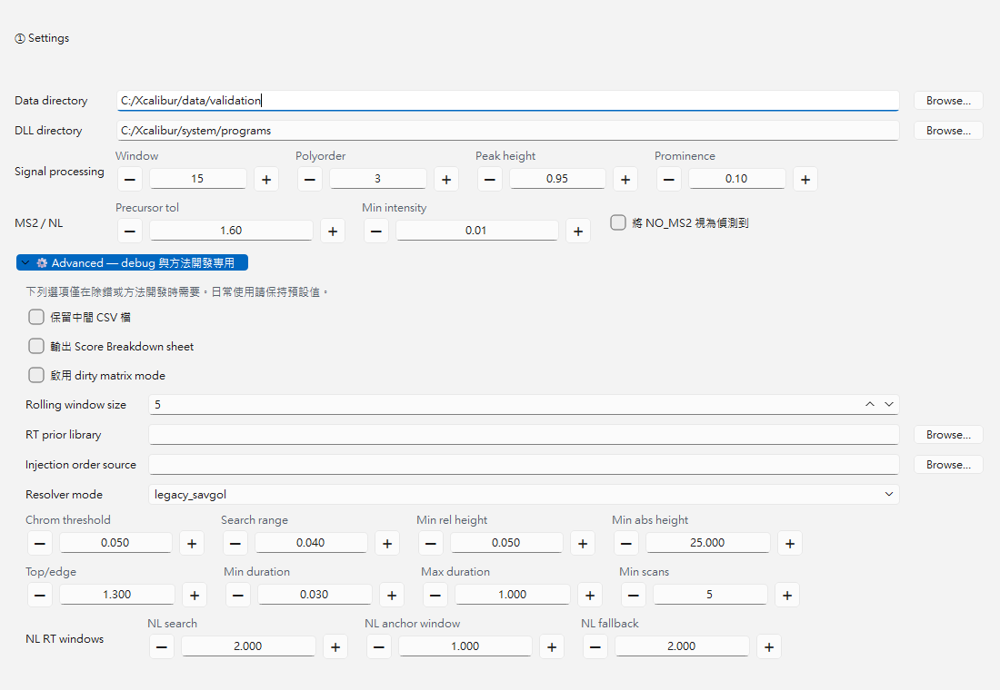

# XIC Extractor

質譜分析 XIC（Extracted Ion Chromatogram）提取與報告工具。

XIC Extractor 會從 Thermo Xcalibur `.raw` 檔案批次提取多目標化合物的 MS1 XIC，寫出 apex RT、raw apex intensity、raw integrated area、peak boundary，並做 MS2 neutral-loss confirmation、peak confidence scoring 與 diagnostics 報告。

---

## 下載與執行（一般使用者）

1. 前往 [Releases](../../releases) 下載最新版 `XIC_Extractor-Windows-vX.Y.Z.zip`
2. 解壓縮到任意資料夾
3. 雙擊 `XIC_Extractor.exe` 執行（不需自行安裝 Python）
4. 首次啟動時，GUI 會載入打包內的 `config/settings.example.csv` 與 `config/targets.example.csv` 作為初始範本；按下 Save 或 Run 後才會建立可編輯的 runtime `config/settings.csv` 與 `config/targets.csv`

系統需求：Windows 10/11、已安裝 .NET 6+ runtime，以及 Thermo Xcalibur / RawFileReader DLL。

---

## 使用說明

### Settings

`config/settings.csv` 是 GUI 與 CLI 共用的 runtime 設定來源；未建立 runtime 檔前，GUI 會先讀取 `.example.csv` 範本作為初始畫面。
GUI 會把常用欄位放在基本區；進階設定預設摺疊，除錯或方法開發者需要時再展開。
打包版本內含 `config/settings.example.csv` 與 `config/targets.example.csv`；這兩份是範本，不是 runtime working copy。GUI 與 CLI 都可在 runtime 檔不存在時讀取範本預設值；使用 GUI Save/Run 後才會建立可編輯的 runtime `config/settings.csv` 與 `config/targets.csv`。



基本設定：

| key | 說明 |
| --- | --- |
| `data_dir` | `.raw` 檔案所在資料夾 |
| `dll_dir` | Thermo DLL 路徑，例如 `C:\Program Files (x86)\Thermo\Foundation` |
| `smooth_window` | Savitzky-Golay smoothing window，必須為奇數且 >= 3 |
| `smooth_polyorder` | Savitzky-Golay polynomial order，必須小於 `smooth_window` |
| `peak_rel_height` | scipy peak boundary 的 relative height |
| `peak_min_prominence_ratio` | peak prominence 門檻，使用 smoothed apex 的比例 |
| `resolver_mode` | 峰切割 profile：`legacy_savgol` 或 `local_minimum`；預設仍是 `legacy_savgol` |
| `resolver_*` | resolver profile 參數；GUI 會依目前模式顯示對應控制，並可用 `Apply Local Minimum Preset` 明確套用 local minimum 預設 |
| `ms2_precursor_tol_da` | MS2 precursor matching tolerance（Da） |
| `nl_min_intensity_ratio` | NL product ion intensity floor，相對 base peak 的比例 |
| `count_no_ms2_as_detected` | 是否將 `NO_MS2` 視為偵測到 |

進階設定：

| key | 說明 |
| --- | --- |
| `keep_intermediate_csv` | 保留中間 CSV 檔，主要供除錯使用 |
| `emit_score_breakdown` | 輸出 `Score Breakdown` worksheet |
| `emit_review_report` | 輸出 optional static Review Report HTML（預設關閉） |
| `dirty_matrix_mode` | 啟用複雜基質 scoring 參數 |
| `rolling_window_size` | ISTD RT prior 的滾動視窗半徑 |
| `rt_prior_library_path` | 外部 RT prior library CSV 路徑 |
| `injection_order_source` | 注射順序來源檔；留空時使用 RAW mtime fallback |
| `nl_rt_anchor_search_margin_min` | NL anchor 搜尋半徑（min） |
| `nl_rt_anchor_half_window_min` | 找到 NL anchor 後的 XIC 半寬（min） |
| `nl_fallback_half_window_min` | 找不到 NL anchor 時的 fallback XIC 半寬（min） |

舊版 `smooth_points` 會自動 migrate 成 `smooth_window`；`smooth_sigma` 已不再使用。
`legacy_savgol` 是目前 trusted default，與既有人工積分結果最接近。`local_minimum` 是 opt-in profile，定位為複雜基質、低豐度、多峰區間的方法開發入口；它不會自動取代 legacy path。
`local_minimum` preset 會保留較寬鬆的 MZmine-style local-minimum 起點：`resolver_min_search_range_min=0.08`、`resolver_min_relative_height=0.0`、`resolver_min_ratio_top_edge=1.7`、`resolver_peak_duration_min=0.0`、`resolver_peak_duration_max=10.0`。切換 resolver profile 不會覆蓋另一個 profile 已調整的參數，只有按下 preset button 才會套用預設值。

### Targets

在 Targets 表格中設定每個目標化合物：

| 欄位 | 說明 |
| --- | --- |
| `label` | 化合物標籤，會成為 CSV / Excel 欄位前綴 |
| `mz` | 目標 m/z 值 |
| `rt_min` / `rt_max` | 保留時間搜尋範圍（分鐘） |
| `ppm_tol` | MS1 m/z 容差（ppm） |
| `neutral_loss_da` | 中性丟失質量（Da）；空白表示不做 NL 驗證 |
| `nl_ppm_warn` / `nl_ppm_max` | NL warning / fail 閾值（ppm） |
| `is_istd` | 是否為 internal standard |
| `istd_pair` | analyte 對應的 ISTD label |

### 執行流程

1. 填寫 Settings 並儲存
2. 設定 Targets 並儲存
3. 點擊 Run 開始 extraction
4. Results 區會顯示每個 target 的 detection count、NL `✓/⚠/✗/—` counts、Median Area 與 Diagnostics count
5. Excel 報告自動儲存於 `output/`；CSV 中間檔只有在 `keep_intermediate_csv=true` 或 CLI `--skip-excel` 時保留

---

## Peak Resolver 與 Scoring

### Resolver profiles

| Mode | 狀態 | 用途 |
| --- | --- | --- |
| `legacy_savgol` | Default | 以 Savitzky-Golay smoothing 和既有 peak boundary 邏輯為主；目前是日常定量的保守預設 |
| `local_minimum` | Opt-in | 使用 local minimum region 切割多峰 XIC；適合方法開發與複雜基質案例評估 |

兩個 mode 共用同一份 `settings.csv`，但 GUI 會分開顯示 profile-specific controls。切換 mode 只切換使用哪套 resolver，不會自動覆蓋另一套參數。

### Confidence and Reason

每個 detected peak 會經過 tier-based scoring，輸出 `Confidence` 與 `Reason`。Scoring 會整合峰形、local S/N、NL support、RT prior、RT centrality、noise shape、peak width、ISTD confidence 與 candidate quality flags。

`local_minimum` candidate 會額外產生 ADAP-like trace quality evidence：

| Flag | 意義 | 行為 |
| --- | --- | --- |
| `low_scan_support` | peak region 支撐 scans 太少 | 加入 `Reason`，並以小權重影響同級候選峰排序 |
| `low_trace_continuity` | 區間內 chromatographic trace 不夠連續，可能像零散 spike | 加入 `Reason`，並以小權重影響同級候選峰排序 |
| `poor_edge_recovery` | peak edge 沒有合理回到 local baseline / valley | 加入 `Reason`，並以小權重影響同級候選峰排序 |

這些 ADAP-like signals 是 soft evidence，不是硬性 `ND` gate。乾淨強峰不應被改判；弱但連續的峰仍可被檢出；spike-like candidate 會在 selection tie-break 和 `Reason` 中被標示。舊有 hard/legacy quality flags 仍會計入 `quality_penalty`；ADAP-like flags 只以小權重影響同級候選峰排序，避免直接取代 NL、ISTD 或 RT evidence。

Reason 可能出現例如：

```text
concerns: low trace continuity (minor); poor edge recovery (minor)
```

## 輸出檔案

預設輸出只有一個 timestamped workbook：`output/xic_results_YYYYMMDD_HHMM.xlsx`。
日常審閱以 workbook 為準；CSV 是 debug / downstream 相容用的中間檔，需在 GUI Advanced 展開後啟用 `keep_intermediate_csv`，或在 CLI 使用 `--skip-excel`。
`emit_review_report=true` 時會額外輸出同 timestamp 的 static HTML companion：`output/review_report_YYYYMMDD_HHMM.html`，用於快速瀏覽 review workload、target health 與 detection / flag heatmap；Excel 仍是主要交付檔。

### Excel workbook

| Sheet | 內容 |
| --- | --- |
| `Overview` | workbook 開啟時的 landing sheet；提供 sample/target/review/diagnostics counts，以及需要優先檢查的 targets/samples |
| `Review Queue` | 人工審閱 worklist；每個需要檢查的 sample-target 只列一列，欄位包含 `Priority`、`Status`、`Why`、`Action`、`Issue Count` 與 `Evidence` |
| `XIC Results` | row-based sample-target review table；預設顯示 `RT`、`Area`、`NL`、`Confidence`、`Reason`，`Int`、`PeakStart`、`PeakEnd`、`PeakWidth` 以 Excel outline hidden 作為 advanced info |
| `Summary` | one row per target，包含 `Flagged Rows`、`Flagged %`、`MS2/NL Flags`、`Low Confidence Rows`、`Detection %`、Mean RT、Median Area (detected)、QC-only Area / ISTD ratio mean±SD / CV% (paired detected)、NL counts、RT delta、confidence counts |
| `Targets` | 本次使用的 target table snapshot，方便回溯輸入設定；`Expected product m/z` 是 nominal target product，strict NL 以實際 MS2 precursor-product observed loss 判斷 |
| `Diagnostics` | issue rows；不會再自動成為 active sheet，避免打斷主要審閱動線 |
| `Run Metadata` | 重現性 metadata，至少包含 `config_hash`、`app_version`、`generated_at`、`resolver_mode`、smoothing 與 scoring 相關設定 |

`Detected %` 回答 target 是否產生可用 RT / Area rows；`Flagged %` 回答 rows 有多少需要人工檢查。兩者不同：target 可以高度檢出，同時也因 MS2/NL、confidence 或 diagnostics 被頻繁標記。

`Overview` / `Review Queue` 是日常審閱入口，`XIC Results` / `Summary` 是查詢與 target health，`Targets` / `Diagnostics` / `Run Metadata` 是技術追溯。`emit_score_breakdown=true` 時會額外加入 `Score Breakdown` sheet；它是 scoring signals、severity、confidence、quality penalty、prior source 與 selected reason 的 technical audit sheet，不應被當成主要人工審閱 queue。

### Debug CSV outputs

`keep_intermediate_csv=true` 時會額外保留以下 CSV：

#### `output/xic_results.csv`

Legacy wide-format export。每列是一個 sample，每個 target 會輸出：

| 欄位 | 意義 |
| --- | --- |
| `{label}_RT` | smoothed peak apex 的 RT（分鐘） |
| `{label}_Int` | apex scan 的 raw intensity |
| `{label}_Area` | 主要定量指標；使用 raw intensity 在 scipy peak boundary 內積分 |
| `{label}_PeakStart` / `{label}_PeakEnd` | peak integration boundary，主要供診斷使用 |
| `{label}_NL` | `OK`、`WARN_12.3ppm`、`NL_FAIL` 或 `NO_MS2`；無 NL target 不會有 `_NL` 欄位 |

`ND` 代表沒有可用 peak；`ERROR` 代表該 raw file 發生 file-level error。

#### `output/xic_results_long.csv`

Row-based primary review table。每列是一個 sample-target result：

| 欄位 | 意義 |
| --- | --- |
| `SampleName` | sample name |
| `Group` | 由 sample name 推斷的 `Tumor`、`Normal`、`Benignfat` 或 `QC` |
| `Target` | target label |
| `Role` | `Analyte` 或 `ISTD` |
| `ISTD Pair` | analyte 對應的 ISTD label |
| `RT` | smoothed peak apex 的 RT（分鐘） |
| `Area` | 主要定量指標；Excel 內以科學記號顯示 |
| `NL` | `OK`、`WARN_12.3ppm`、`NL_FAIL`、`NO_MS2`；無 NL target 為空白 |
| `Int` | apex scan 的 raw intensity，屬於 advanced info；Excel 內以科學記號顯示 |
| `PeakStart` / `PeakEnd` | peak integration boundary，屬於 advanced info |
| `PeakWidth` | `abs(PeakEnd - PeakStart)`，單位與 RT 相同（分鐘），屬於 advanced info |
| `Confidence` | `HIGH`、`MEDIUM`、`LOW` 或 `VERY_LOW`；代表 detected peak 的整體可信度 |
| `Reason` | human-readable scoring explanation；可能包含 NL / RT / S/N / peak shape / ADAP-like trace quality concerns |

#### `output/xic_diagnostics.csv`

記錄非 OK 的 sample-target issue：

| 欄位 | 意義 |
| --- | --- |
| `SampleName` | sample name |
| `Target` | target label |
| `Issue` | `PEAK_NOT_FOUND`、`NO_SIGNAL`、`WINDOW_TOO_SHORT`、`NL_FAIL`、`NO_MS2` 或 `FILE_ERROR` |
| `Reason` | 可操作的原因說明 |

`emit_score_breakdown=true` 且保留 CSV 時，會再輸出 `output/xic_score_breakdown.csv`。

---

## CLI

GUI 與 CLI 都呼叫同一條 Python pipeline。

```powershell
uv run python -m scripts.run_extraction --base-dir .
```

安裝 entry point 後也可使用：

```powershell
uv run xic-extractor-cli --base-dir .
```

常用參數：

| 參數 | 說明 |
| --- | --- |
| `--base-dir` | 專案資料夾，底下需有 `config/` 與 `output/` |
| `--data-dir` | 本次 run 覆寫 `.raw` 來源資料夾，不回寫 `config/settings.csv`；日常 real-data smoke 建議指向 validation subset |
| `--parallel-mode` | 覆寫本次 run 的執行後端：`serial` 或 `process`；預設仍是 `serial` |
| `--parallel-workers` | 覆寫本次 run 的 process worker 數量；只在 `--parallel-mode process` 時用於平行處理 `.raw` |
| `--skip-excel` | 只輸出 CSV，跳過 Excel workbook；等同本次 run 保留 `keep_intermediate_csv` debug outputs |
| `--excel` | 保留作相容旗標；Excel conversion 是預設行為 |

GUI 可在 Settings 的 Advanced 區塊調整 `parallel_mode` 與 `parallel_workers`。
process mode 目前是 opt-in；預設設定仍保留 serial，確保既有 workflow 不會自動改變。

`scripts/01_extract_xic.ps1` 已不再是支援的 extraction entry point。

---

## 常見錯誤

| 訊息類型 | 處理方式 |
| --- | --- |
| `settings.csv` / `targets.csv` 格式錯誤 | 依錯誤訊息中的 file、row、column 修正設定 |
| `data_dir` 不存在 | 到 Settings 指向含 `.raw` 檔案的資料夾 |
| `dll_dir` 不存在或缺 Thermo DLL | 到 Settings 指向含 `ThermoFisher.CommonCore.Data.dll` 與 `ThermoFisher.CommonCore.RawFileReader.dll` 的資料夾 |
| 缺 pythonnet / .NET runtime | 重新安裝 packaged app，或在開發環境使用 Python 3.10-3.13 執行 `uv sync --extra dev`；Python 3.14 目前不支援 pythonnet |
| 單一 `.raw` 無法讀取 | pipeline 會繼續處理其他檔案，並在 Diagnostics 寫入 `FILE_ERROR` |
| 需要檢查中間 CSV | 到 GUI Settings 展開 Advanced，啟用 `keep_intermediate_csv`；CLI 可用 `--skip-excel` 做 CSV-only debug run |
| 需要逐項檢查 scoring 判斷 | 到 GUI Settings 展開 Advanced，啟用 `emit_score_breakdown`，輸出 workbook 會多一張 `Score Breakdown` technical audit sheet |

---

## 開發者安裝

```powershell
git clone https://github.com/Chao-hu-Lab/XIC_Extractor.git
cd XIC_Extractor

uv venv --python 3.13
uv sync --extra dev

uv run python -m gui.main
uv run pytest
```

Migration validation（merge-time only）：

```powershell
uv run python scripts\validate_migration.py `
  --old-worktree ..\validation-old-reference `
  --new-worktree . `
  --raw-file local_raw_samples\TumorBC2312_DNA.raw `
  --strict
```

此 validation workbook 是開發者 merge gate，不會出現在一般 GUI workflow。

---

## 專案架構

```text
XIC_Extractor/
├── assets/                      # 應用程式圖示
├── config/
│   ├── settings.example.csv     # 預設設定範本（版控）
│   └── targets.example.csv      # 目標清單範本（版控）
├── gui/
│   ├── config_io.py             # 設定檔讀寫與 first-run migration
│   ├── main_window.py           # 主視窗
│   ├── sections/                # Settings / Targets / Run / Results
│   └── workers/                 # PipelineWorker
├── scripts/
│   ├── run_extraction.py        # Python CLI entry point
│   ├── csv_to_excel.py          # CSV → Excel 報告
│   └── validate_migration.py    # developer-only migration gate
├── xic_extractor/
│   ├── config.py                # typed config loading / migration / validation
│   ├── raw_reader.py            # Thermo RawFileReader wrapper
│   ├── signal_processing.py     # peak detection and area integration
│   ├── neutral_loss.py          # MS2 NL confirmation
│   └── extractor.py             # shared extraction orchestrator
├── tests/
├── xic_extractor.spec
└── pyproject.toml
```

---

## 版本紀錄

詳見 [GitHub Releases](../../releases)。
