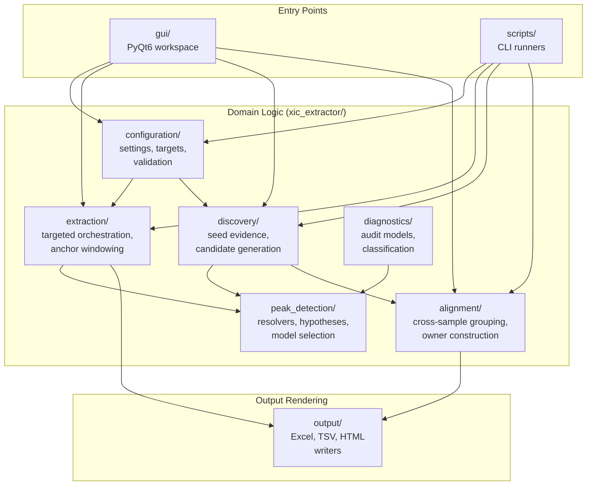

# Architecture Contract

This document owns XIC Extractor's durable code-organization and responsibility
rules. `AGENTS.md` keeps only the high-priority guardrails; this file carries the
longer architecture contract and known decomposition targets.

## Design Principles

- Make logic, dependencies, and data flow obvious.
- Prefer explicit interfaces over hidden coupling or global context.
- Keep one reason to change per module. Split by responsibility, not by fashion.
- Keep high-level domain behavior independent from IO, GUI, workbook rendering,
  process backends, and CLI wrappers.
- Use orchestration modules to coordinate focused submodules; do not let the
  orchestrator become the permanent home for every implementation detail.
- Add abstraction only when it reduces real coupling, duplication, or cognitive
  load. Avoid both monoliths and many tiny indistinguishable modules.
- Preserve public contracts unless an approved plan says otherwise.

## System Overview

**Data flow — targeted:**
`.raw` files + target list → `configuration/` → `extraction/` → `peak_detection/` → `output/` → Excel workbook

**Data flow — untargeted:**
`.raw` files + preset → `configuration/` → `discovery/` → `peak_detection/` → `alignment/` → `output/` → TSV matrix + HTML gallery

## Dependency Direction

- Domain algorithms may use arrays, config, typed context objects, and small
  models.
- Domain algorithms must not import GUI, workbook builders, CLI scripts, process
  backends, report renderers, or RAW/CSV adapters.
- IO/rendering/adapters depend inward on domain helpers.
- Public entry points and compatibility facades should stay thin. Move behavior
  into focused modules while keeping old imports working when they are public.

## Ownership Map

Use this map when adding or moving package code. `docs/project-layout.md` owns
where files live; this section owns the reason each package changes.

| Surface | Owns | Should not own |
| --- | --- | --- |
| `xic_extractor/alignment/` | Cross-sample alignment, owner construction, backfill, matrix identity, primary consolidation, and alignment-side diagnostics | GUI, workbook rendering, RAW adapters, targeted extraction orchestration |
| `xic_extractor/discovery/` | Untargeted feature discovery and seed generation | Cross-sample matrix consolidation or targeted target-list policy |
| `xic_extractor/extraction/` | Targeted extraction orchestration, target jobs, anchor windowing, drift handling, and backend coordination | Workbook rendering, GUI, alignment matrix decisions |
| `xic_extractor/peak_detection/` | Trace models, hypotheses, resolver implementations, boundary selection, baseline/integration audit, and region logic | Cross-sample ownership, workbook output, GUI, RAW IO orchestration |
| `xic_extractor/configuration/` | Settings schema, config/target CSV loading, validation, and normalization into typed runtime settings | Extraction behavior or output rendering |
| `xic_extractor/output/` | Workbook sheet rendering, TSV/HTML/XLSX writers, and output schema presentation | Domain evidence recomputation or RAW scanning |
| `xic_extractor/diagnostics/` | Reusable diagnostic models, summaries, and classification helpers used by diagnostic CLIs | CLI argument parsing, one-off file-system orchestration, production behavior changes |
| Root facades such as `extractor.py`, `signal_processing.py`, and `peak_scoring.py` | Public compatibility imports and thin orchestration while behavior is migrated | Permanent home for new implementation detail |

If a change appears to fit multiple rows, keep the low-level domain behavior in
the package that owns the concept and put only orchestration at the caller. Do
not add a new package just to avoid choosing an existing owner.

Boundary ownership note:

- `ChromPeakSegment` / segment-native projection owns active Gaussian15
  chromatographic boundary promotion for selected peaks.
- `selected_full_envelope` owns diagnostic and fallback envelope evidence. It
  must not remain a permanent product gate when a segment-native boundary is
  available.
- Targeted extraction may orchestrate both, but boundary selection logic belongs
  in `xic_extractor/peak_detection/`.
- `xic_extractor/extraction/rt_windows.py` owns paired-target candidate-search
  windowing. It may use a target-specific MS2/NL anchor as support, but paired
  ISTD fallback references must be resolved before `peak_detection` enumerates
  Gaussian15/ChromPeakSegment candidates.

## Dataset-Agnostic Evidence Architecture

This repo is an LC-MS evidence and model-selection system, not a single-dataset
or CID-NL-only tool.

- 8RAW and 85RAW are validation fixtures and stress oracles. They are not the
  architecture boundary.
- CID-NL, HCD-PI, Delta Mass, MS1 isotope/adduct pattern, RT/iRT, shape, clean
  standards, library matches, and future learned models are evidence providers.
- Evidence providers should enter through `EvidenceVector`, `PeakHypothesis`,
  model selection, and `AuditTrail` before any matrix/export mutation.
- A new evidence source must state whether it is `audit_only`, hypothesis
  enumeration, model-selection calibration, production candidate, or retirement.
- Direct matrix writes require an explicit activation/export contract, expected
  diff, and focused output tests.

Naming rule:

- Permanent package modules and CLI entry points should be named by product role
  or evidence role, not by the validation fixture that first exposed the need.
  Avoid new names that bake in `8raw`, `85raw`, a specific batch, or a phase code
  when the behavior is really a reference-alignment gate, activation bridge,
  evidence adapter, or review queue.
- Existing fixture-shaped names may remain as compatibility or archival
  surfaces, but new work should prefer role-named successors instead of extending
  the fixture name into product architecture.
- Opaque phase codes such as `p1`, `p2`, `p2b`, `p2c`, and `p7` need a behavior
  name in docs, summaries, and PR descriptions. The code can stay for historical
  artifacts, but it is not an acceptable standalone explanation of behavior.

Before implementing non-trivial diagnostics, RAW-backed evidence, preset
performance optimization, matrix activation, HCD-PI, Delta Mass, CID-NL
expansion, or other evidence-provider work, use
`.codex/skills/xic-architecture-preflight/SKILL.md` to name the existing owner,
reuse target, call-cost model, public contract risk, validation gate, and stop
rule.

### Shared Decision Semantics Positioning

`xic_extractor/evidence_semantics.py` is the shared, **role-neutral** decision
layer. It is genuinely load-bearing, not a tiebreaker afterthought, and it serves
two distinct consumers:

- **Candidate selection** — `decision_class` ranks scored candidates in
  `peak_detection/candidate_selection.py`.
- **Targeted product authority** — the selected hypothesis's
  `decision_semantics` is consumed by `selection_decision_from_hypothesis`
  (`peak_detection/selection_decision.py`) and by the projection builder
  (`extraction/result_assembly.py:_targeted_product_projection`) to produce the
  `TargetedProductProjection`, which is the authority for counts and matrix
  presence.

Invariant: the shared layer stays role-neutral. Targeted-only, role-aware policy
(ISTD plausible-dropout, paired-analyte downgrades) lives in the projection
builder in `result_assembly.py`, **not** in `evidence_semantics.py`. The shared
layer may say `review` with `plausible_nl_dropout_review`; it must never decide
"this ISTD is present" or "this row is counted". Do not let targeted role policy
leak into the shared semantics, and remember `evidence_semantics.py` is also on
the untargeted alignment path (`common_evidence_from_aligned_cell`), so a change
there has cross-path blast radius.

The end-to-end `Confidence` / `Reason` / counted-detection resolution order is
documented in `docs/confidence-reason-precedence-contract.md`; the authority
migration now lives in `docs/product/alignment.md` and
`docs/product/evidence-spine.md` after the dated evidence-chain spec was reduced
to a migration/history stub.

## Diagnostics Contract

Treat `tools/diagnostics/` as maintained product-adjacent code.

- Diagnostic CLIs should parse, validate, and orchestrate only.
- Reusable loading, classification, models, summaries, plotting, and writers
  belong in focused package modules.
- Diagnostic writers render TSV/JSON/HTML/XLSX/plots only. They must not
  recompute domain evidence or re-scan RAW files.
- Pass typed summaries from the code path where trace context already exists.
- Gate diagnostics must emit machine-readable status/reason fields plus a short
  human summary with the blocker and next action.
- Missing inputs, missing columns, stale artifacts, and unsupported schemas
  should name the expected file/column and how to regenerate or bypass the
  artifact.
- Optional diagnostics should use sidecar artifacts. Do not silently change
  established TSV/workbook schemas unless an approved contract says so.
- Architecture reviews for large diagnostics PRs should start from the shared
  helper and public-contract blast radius, not from an even line-by-line pass
  over every writer. Check package-neutral helpers, matrix identity/value-delta
  surfaces, RAW-access fallback behavior, and diagnostic-vs-production claims
  before treating mechanical TSV writer churn as low risk.

Before any PR that adds, removes, or renames a CLI entry point in
`tools/diagnostics/`, read `tools/diagnostics/INDEX.md` and cite which existing
entries were considered. Every PR that changes the set of entry points must
update `INDEX.md` in the same diff. Full lifecycle rules live in
this Diagnostics Contract plus `docs/agent/architecture-public-contracts.md`;
the dated lifecycle spec is retained only as a migration/history stub.

## Refactor And Test Discipline

- Move behavior before changing behavior.
- Do not mix structural refactors with scoring thresholds, peak selection rules,
  neutral-loss matching, or area integration changes.
- Add characterization tests before moving behavior that is not already covered.
- Tests should live in `tests/`, keep the repo's flat test layout, and normally
  use `tests/test_<module>_<behavior>.py` naming. Prove behavior or public
  contracts with small deterministic fixtures before real RAW data.
- Separate real-data validation from normal unit tests. Use explicit validation
  scripts or fixture gates for RAW/workbook checks.
- Use 8-RAW validation for extraction/output refactors that can affect real
  workbook output.
- For output changes, pair narrow writer/sheet tests with a workbook or schema
  contract test.
- For process-mode changes, add a no-RAW spawn/pickling smoke test before
  raw-data benchmarking.
- Windows process mode must receive pickleable payloads only. Do not pass nested
  closures or non-pickleable factories across process boundaries.

Line count is a signal, not a hard rule. Pause when a module is near 500 lines
and a change adds a responsibility, or near 800 lines and the change is not a
local bug fix. Responsibility count matters more than exact length.

## Shared Models And Contracts

- Shared dataclasses and protocols belong in small model/contract modules when
  they prevent circular imports or schema drift.
- Do not create shared concrete implementations before targeted/untargeted
  semantics actually match.

## Current Decomposition Targets

These modules are known maintainability targets. This list is an orientation
surface, not an active phase plan:

- `scripts/csv_to_excel.py`: keep as CLI/import wrapper; move workbook logic to
  `xic_extractor/output/` modules.
- `xic_extractor/extractor.py`: keep as public extraction facade; move pipeline,
  backend, pre-pass, target extraction, anchor, drift, and output dispatch logic
  into `xic_extractor/extraction/`.
- `xic_extractor/signal_processing.py`: keep as compatibility facade; move
  models, resolver implementations, selection, recovery, integration, and trace
  quality into focused peak-detection modules.
- `xic_extractor/peak_scoring.py`: split scoring models, score component
  calculations, and selection helpers only after characterization tests pin
  current confidence/reason outputs.
- `xic_extractor/alignment/primary_consolidation.py`: add characterization tests
  before splitting graph construction, winner selection, cell merge, or loser
  audit helpers.
- `xic_extractor/diagnostics/backfill_reconciliation_gallery.py`: keep as the
  reconciliation-gallery orchestrator; continue moving static presentation
  assets, input/index construction, classification, and HTML section rendering
  into focused diagnostics submodules without changing TSV/HTML contracts.

See also:

- `docs/project-layout.md`
- `docs/agent/architecture-public-contracts.md`
- `docs/product/alignment.md`

Retired dated decomposition specs have been folded into this contract and are
kept only as migration/history stubs while exact historical refs are cleaned up.
