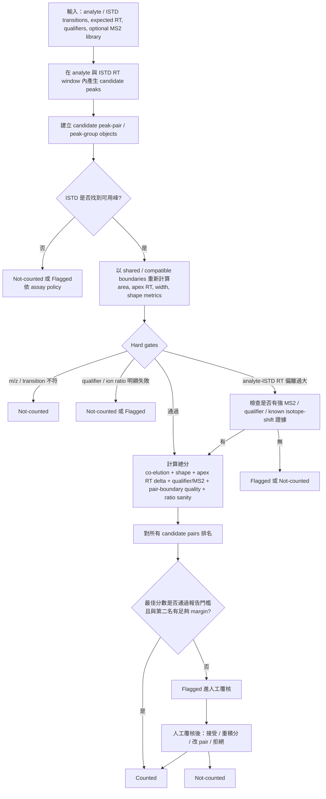

# LC-MS 以 Stable Isotope-Labeled Internal Standards 進行 Targeted Small-Molecule Quantification 時之 Analyte/ISTD 峰對選擇

## 執行摘要

在有 **stable isotope-labeled internal standards** 的 targeted LC-MS 定量裡，真正困難的問題通常不是「在各自的 XIC 裡找一個最高峰」，而是 **在同一個 retention-time window 內，為 analyte 與 ISTD 找到同一個化學事件所對應的正確 peak pair 或 peak group**。成熟工具與較可靠的已發表方法，整體上都指向同一件事：**應優先把峰選擇視為 peak-group ranking 問題，而不是兩條獨立 XIC 的 single-peak picking 問題**。這一點在 Skyline 的預設多特徵 peak picking / mProphet workflow、OpenMS 的 `MRMFeatureFinderScoring`／`TransitionGroupPicker`、Agilent MassHunter QTOF Screener 的 `PeakSelectionCriterion`，以及 Thermo、Waters、SCIEX 等 vendor 工具以 RT、qualifier/ion-ratio、peak quality 與 flagging rule 所建立的規則式框架中，都可以看到。citeturn20view4turn27view0turn19view0turn19view3turn20view3turn43search6

若只看「analyte 最大峰」與「ISTD 最大峰」，在 noisy 或多峰情境下極容易錯配；成熟作法通常至少會同時檢查以下幾類證據：**co-elution / apex RT delta、shared or compatible boundaries、chromatographic shape consistency、qualifier 或 MS2 evidence、以及 area-ratio / response-ratio 的合理性**。其中，最像真正 peak-group scoring 的公開實作，OpenMS 最明確：它先在 transition group 層級形成 consensus/meta-peaks，再以 shape、coelution、RT、library、signal-to-noise、DIA/MS1/ion-series 等分數共同排名；Skyline 也明確說明其 peak picking 會考慮多個 peak 特徵，而不只是單一強度。citeturn27view0turn28view5turn21view0turn20view4

**成熟工具之間的差異，不在於是否重視 RT 與 confirmatory evidence，而在於它們把這些證據結合成什麼樣的決策器。** Skyline、OpenMS、Agilent QTOF Screener 比較接近「對多個候選 peak groups 做整體排名」；Thermo TraceFinder、Waters TargetLynx/QUAN Review、SCIEX Analyst/SCIEX OS、Agilent QQQ MassHunter 則更偏向「在 user-defined window 內找候選峰，再用 RT、qualifier、ion ratio、peak quality、flags 進行確認或例外處理」。XCMS 與 MZmine 則多半提供 **feature detection、deconvolution、alignment、annotation** 的積木，而不是原生的 analyte/ISTD pair selector；若要用於 SIL-IS 定量，通常必須額外實作 pairing 與 QC 規則。citeturn27view0turn19view3turn20view3turn43search2turn19view0turn34view0turn36view0turn31view3

對實務而言，本報告最重要的結論有三個。第一，**ISTD co-elution 應作為 hard prior，而不是可有可無的軟資訊**；只有在已知 isotope effect、deuterium RT shift、或 fragment/MS2 證據極強且可重現時，才應允許 analyte 偏離 ISTD RT 的候選峰進入人工覆核，而不宜直接自動接受。第二，**peak boundaries 最好在 pair/group 層級共享或至少相容**；若 analyte 與 ISTD 的邊界完全獨立，低訊號端很容易製造假 ratio。第三，**應建立 counted / flagged / not-counted 三層決策，而不是只有 integrated / not integrated 二元結果**，因為多峰與雜訊情境中，真正重要的是「是否可報告」與「是否必須人工覆核」。citeturn25search0turn22view4turn27view0turn28view5turn20view3turn43search2turn43search8

## 範圍與未明示前提

使用者明確指出 **sample matrix 未指定、instrument type 未指定、noise level 未指定**。因此，本報告不假設特定基質、極性模式、column chemistry、scan mode 或品牌平台；但也因此，任何「RT tolerance、shape-correlation threshold、ion-ratio window、minimum transition count」都不能被理解為放諸四海皆準的固定值。公開文件顯示，成熟工具幾乎都把這些條件設計成 **method-dependent / assay-dependent / user-configurable** 參數。citeturn19view3turn20view0turn34view0turn36view1turn43search7

這裡討論的「正確 analyte/ISTD 峰對」可操作地定義為：在 analyte 與其對應 ISTD 的量測通道中，從同一 chromatography event 所導出的 **一組互相一致的 peak boundaries、相近或可解釋的 apex RT、可接受的 transition/qualifier behavior，以及可報告的 area ratio / response ratio**。如果只有其中一部分成立，例如 analyte 有漂亮峰但是 ISTD 不在附近，或 ISTD 很強但 analyte 的 qualifier / MS2 嚴重不合，則該結果頂多應標記為 **flagged**，而非直接 **counted**。citeturn19view1turn19view3turn20view3turn43search5

另一個實務上很重要但經常被忽略的前提，是 **internal-standard chemistry 本身會影響 pairing 規則的剛性**。對多數 ^13C/^15N 標記內標，co-elution 通常是強假設；但對部分 deuterated ISTD，Skyline 官方 support 明確提到可能出現 deuterium retention-time shift，且在該情境下常建議 light/heavy 使用相同 integration boundaries。換句話說，**允許小的 RT 偏移** 與 **是否仍共享邊界**，其實是兩個不同層次的決策。citeturn25search0

## 核心維度分析

**Co-elution constraints between analyte and ISTD。**
在成熟 workflow 中，ISTD 並不是一般的「另一條色譜」，而是對 analyte 正確峰位的強約束。Thermo TraceFinder 在方法層級直接把 analyte 與 ISTD 的 peak detection strategy 分開設為 `Highest Peak` 或 `Nearest RT`，並可選擇是否使用 RT；這代表 vendor tool 已經明白區分「以訊號最高者為主」與「以接近預期 RT 者為主」兩種策略。Agilent QTOF Screener 更進一步，將候選峰的選擇明確寫成 `GreatestResponse`、`Close RT`、`Close RT with Qualifiers`、`Greatest Q-Value` 等演算法；這些都是在多峰情況下如何 ranking 候選峰的正式策略。Waters 的 TargetLynx/QUAN Review 也把 retention time、internal standard area、ion ratio、peak quality 與 rule-set 例外一併納入。citeturn19view3turn44view0turn19view0turn44view3turn43search0turn43search2turn43search6

Skyline 對 co-elution 的處理最值得注意，因為它既強大又容易被誤用。Skyline support 明確指出：若把 `Internal Standard Type` 設成 heavy，Skyline 在某些情況下會**實際上主要依 heavy chromatograms 做 peak picking**；如果 heavy transition 很少、heavy 本身不強、或文件裡有不存在的 heavy chromatograms，反而更容易選錯峰。Skyline 官方建議在這種情境把 `Internal Standard Type` 改成 `None` 後重新 `Rescore`，讓所有 chromatograms 共同參與 peak picking；另外，在 deuterium RT shift 的案例中，官方又建議 light/heavy 仍使用相同 integration boundaries。這些訊息合起來的意思是：**Skyline 很重視 internal-standard prior，但前提是 heavy channel 本身要資訊充足且設定正確；否則 ISTD prior 會變成 bias**。citeturn22view4turn22view3turn21view2turn25search0

OpenMS 的設計則更接近理想化的 peak-pair / peak-group 邏輯。`MRMFeatureFinderScoring` 先在 transition group 層級尋找 **co-eluting peaks**，再建立 consensus / meta-peaks（`MRMFeatures`）來進行後續評分；其文件直接說明此工具的工作對象是「共洗脫的 transition 群」，而不是獨立 transition。對小分子 SIL-IS workflow 而言，這種設計概念比傳統「每條 transition 各自找峰」更接近你要的行為。citeturn27view0

MZmine 與 XCMS 的情況則不同。MZmine 的 `Targeted feature detection` 會在 user-defined m/z–RT window 內找「最佳候選」，並在 RT 方向檢查峰形；其 `MRM aligner` 又允許只比對「相同 MRM」的 feature，若有多個匹配列則以 RT 決定最佳匹配。但它沒有像 Skyline/OpenMS 那樣公開的 analyte–ISTD 專屬 pairing scorer。XCMS 更偏向 general feature detection / correspondence analysis：`groupChromPeaks` 是在同一個 `XChromatograms` row 裡做跨樣本 grouping，而不是 native 地在 analyte 與 ISTD 之間建立 pair object。因此，用 XCMS/MZmine 做 SIL-IS 定量時，**你需要自己在 feature row 之上再加一層 analyte/ISTD pairing 規則**。citeturn34view0turn36view0turn31view3turn31view4

**Peak-group scoring approaches。**
Skyline 官方 support 對其初始 peak finding 的說明非常關鍵：在第一層 peak finding 中，它不是只看單一峰高，而是看 **七種不同特徵**，其中包含 total intensity、共同洗脫 transition 的數量、與預測 RT 的差距、該時點是否有 MS2 IDs、與 spectral library intensities 的 dot product 等；若再加上 mProphet，則可用半監督學習把多個 peak score 線性組合，並產生 q-values。這正是典型的 **peak-group scoring** 思維。citeturn21view0turn20view4

OpenMS 把這件事寫得更完整。其 scoring 架構公開列出：shape score、coelution score、RT score、library score、elution-model score、intensity score、number-of-peaks score、total XIC score、SN score，並可再加入 DIA scores、MS1 correlation、MS1 full-scan、ion-series scores、MS2 isotope scores。重點不是分數名稱本身，而是它把候選峰視為 **多證據整合的 transition-group hypothesis**。對你關心的狀況——同一個 RT window 內出現多個 noisy 峰——這種設計天然比獨立 XIC picking 更穩健。citeturn28view5turn27view0

Agilent QTOF Screener 則提供一個很有啟發性的公開範例：它把 peak selection 明確變成可替換的 ranking algorithm。`GreatestResponse` 本質上是單純強度導向；`Close RT` 是預期 RT 導向；`Close RT with Qualifiers` 會先要求 qualifier ratio 滿足，再在合格候選裡選最接近 RT 的峰；`Greatest Q-Value` 則用 observed qualifier ratios 對 nominal ratios 的 goodness-of-fit 來排名。這種做法非常接近你要求的「不是 independent single-XIC peak picking，而是整體 peak-group / peak-hypothesis scoring」。citeturn19view0turn44view3

相對地，SCIEX、Thermo、Waters、Agilent QQQ 的公開文件，比較多暴露 **規則、門檻與 flags**，較少公開完整內部分數函數。這不代表它們不成熟；而是公開層面更偏向 method editor / review GUI，而不是演算法論文。對實作端的啟示是：如果你希望 fully automatic、可審核、可轉移，最佳策略常是 **把 vendor rule set 與一個額外的 pair-scoring layer 疊加**，而不要只依賴某個「largest peak」選項。citeturn19view3turn20view3turn43search2turn43search6turn20view1

**Shared or compatible peak boundaries。**
在定量角度，shared boundaries 比很多人以為的更重要。Skyline 官方文件說明，峰面積是以 peak boundaries 內的 raw-interpolated points 計算；自動邊界會使用多種平滑方法來放置 boundaries，但 area 本身仍在 raw-interpolated signal 上計。這意味著，如果 analyte 與 ISTD 用了不同的邊界，即使 apex 接近，ratio 仍可能嚴重偏離。更直接地，Skyline support 已出現 light/heavy peak boundaries 不一致的案例；官方給出的實務修正包括：清除沒有對應 raw chromatograms 的 transitions、重新 `Rescore`，以及在已知 deuterium RT shift 時使用相同 integration boundaries。citeturn9view0turn22view3turn22view4turn25search0

OpenMS 在這一點上最有工程化的公開參數。`TransitionGroupPicker:use_consensus` 預設就是 `true`，表示在 transition group picking 時使用 **consensus peak boundaries**；若不同 transition 的 boundaries 差異太大，`recalculate_peaks` 與 `recalculate_peaks_max_z` 還會用 median border 進一步收斂，`boundary_selection_method` 也可選 `largest` 或 `widest`。這些設計本質上就是在對抗「同一化學事件在不同通道被切出不同峰」的問題。citeturn28view5

XCMS 與 MZmine 也有邊界層的工具，但語義不同。XCMS 的 `refineChromPeaks` 可用 `MergeNeighboringPeaksParam` 把鄰近 peak 合併，以減少偵測 artifact；MZmine 的 `Local Minimum Resolver` 與 `ADAP resolver` 則會利用 local minima 或 CWT ridgeline 把肩峰與部分共洗脫特徵拆開。這些都很有用，但它們是 **feature-boundary engineering**，不是 analyte/ISTD 共享邊界規則；若直接拿來做 SIL-IS pairing，仍需在上游或下游再加「pair boundary compatibility」條件。citeturn31view1turn34view1turn34view2

**Chromatographic shape correlation、apex RT delta、area-ratio sanity checks。**
OpenMS 是公開文件中對這組指標最完整者：shape score、coelution score、RT score、SN score 等都可啟用，代表它直接把「峰形相似、共洗脫、RT 接近、S/N 合理」視為 ranking 的核心。MZmine 的 `Targeted feature detection` 也明白寫到：找到候選峰後，還要再檢查其 RT 方向的 shape；其 local DB search 也指出，在 complex samples 中僅靠 m/z 會失去區分度，因此 **強烈建議啟用 RT tolerance** 來提高 ranking resolution。citeturn28view5turn34view0turn36view2

Vendor 工具在 shape/RT/ratio 的表達，通常是經由 qualifier 與 acceptance rule 曝露出來。Agilent 的 Quantitative Analysis 教學範例清楚展示：amphetamine 的 qualifier area 必須落在 quantifier 的 26.5% ± 20% 範圍內，ISTD qualifier 也有其自身接受範圍；Agilent QTOF Screener 又提供 `Greatest Q-Value` 來衡量 observed qualifier ratios 對 nominal ratios 的擬合程度。Thermo TraceFinder 則可設定 confirming ions 的數量、`Ion Coelution (min)`、以及 ion ratio window type。Waters QUAN Review / TargetLynx 的 rule set 甚至把 **retention time deviation、peak area deviation、ion ratios、minimum peak area** 都正式納入規則；其官方 SANTE 範例列出 analyte RT 與 calibration standard 的 ±0.1 min、ion ratio 的 ±30% 作為示例要求。SCIEX OS 的 acceptance filters 亦公開列出 `Retention Time Delta (min)`、`Quality`、`Integration Acceptance`、`Total Width` 等欄位。citeturn19view1turn44view2turn19view0turn19view3turn20view3turn43search2turn43search9turn13view4

真正困難的是 **area-ratio sanity check** 應該如何用。公開文件顯示，多數 vendor tool 都會計算 analyte/ISTD response ratio 或用其做 calibration，但較少明講「自動 peak selector 直接以 area ratio 決定主峰」。Waters 會報告 `Response` 與 `Internal standard area`；SCIEX Analyst 在 calibration 層級使用 area/height ratios，並提供 `Relative Retention Time` 這類欄位。這些功能更像 **結果合理性檢查**，而不是第一層 picking engine。實務上這是正確的：**area ratio 應作為後驗 sanity check，而不是主要找峰依據**，否則容易把高雜訊樣本中的偶然 matching 當作真峰。citeturn43search4turn14view2

**當 MS2 / neutral-loss 類證據支持一個偏離 ISTD RT 的峰時如何處理。**
這一題的核心不是「可不可以接受」，而是「接受的證據階梯與處置層級是什麼」。Skyline support 明確表示其預設 peak picking 特徵之一，就是該時間點是否有 **MS2 IDs**；OpenMS 也公開支援 DIA scores、MS1 full-scan、ion-series 與 MS2 isotope scores。Agilent QTOF Screener 甚至提供 `Close RT with Qualifiers` 與 `Greatest Q-Value`，明確承認「有時最強的 fragment/qualifier 證據可能來自不是最高峰、甚至不是最接近預期 RT 的候選」。MZmine 的 spectral / local DB modules 也把 RT、spectra、isotope pattern 一起拿來打分。citeturn21view0turn28view5turn19view0turn36view2

但在有 SIL-IS 的小分子定量裡，**這種峰通常不應直接 counted，而應先被 flagged**。理由很簡單：如果 analyte 的 MS2 或 qualifier 看起來很像目標物，但它與 ISTD 不共洗脫，則至少存在三種風險：第一，sample 中有 isomeric / isobaric interference；第二，ISTD channel 本身被錯抓；第三，該 analyte 真正有 chromatographic behavior 差異，例如 deuterium shift、derivatization 異常、matrix-induced shift。成熟工具公開文件並未鼓勵在這類情況下無條件自動接受；反而都提供 qualifier、RT、rule set、manual review pane 等機制來做人工裁決。就工程實作而言，最穩健的規則是：**MS2/qualifier 可把「偏離 ISTD RT 的候選」從 not-counted 提升為 flagged，但不宜直接提升為 counted；除非該 assay 事先定義了可接受的 isotope-effect / chromatographic offset。** 這一點是基於公開工具設計邏輯作出的綜合推論。citeturn25search0turn19view0turn19view3turn20view3turn43search2turn43search8

**Manual review UIs / workflows for ambiguous pairs。**
在實務上，成熟工具的共同點不是「完全不需要人工」，而是 **把人工覆核做成可追蹤、可篩選、可批次處理的介面**。SCIEX OS 的 `Peak Review` pane 可以自訂 layout、顯示多個 chromatograms、調整 noise region、放大指定峰、手動重積分，還能把新參數套到同一 component 或 group 的其他樣本；它同時也提供 acceptance filters 與 confidence traffic lights（Pass / Marginal / Fail / N/A）。Agilent 提供 `Compounds-at-a-Glance` 與 `Compound Confirmation` 視圖，讓 quantifier/qualifier 以 normalized／non-normalized overlay 方式檢查 ion-ratio 視覺合理性。Waters QUAN Review 的官方應用範例強調 quantifier、qualifier、ISTD transitions 與 acceptance criteria 可在同一 integration review window 內一目了然。Skyline 則以 chromatogram pane + rescore / reintegrate / synchronized integration 之類操作為核心，並且官方站點同時提供英文與中文教程入口。citeturn20view2turn20view3turn44view1turn19view1turn44view2turn43search15turn8view3turn8view1

因此，好的 ambiguity-review surface 至少要同時展示四塊：**候選峰排名、analyte/ISTD/qualifier overlay、關鍵 QC 指標、以及操作後的 audit trail**。SmartPeak 雖然公開文檔較少直接描述 analyte/ISTD pair selector，但它在 audit trail、feature log、workflow preset、quantitation-method optimization 這些面向提供了非常接近 regulated workflow 的思路；其 2020 論文摘要也強調了 targeted quantitative metabolomics data processing automation 與處理效率的大幅改善。citeturn39view0turn37search0turn37search3

**Decision rules for counted / flagged / not-counted。**
Vendor 世界裡，這個維度最成熟。SCIEX OS 直接有 acceptance filters 與 confidence traffic lights；Waters QUAN Review / TargetLynx 以 rule set raise exceptions；TraceFinder 允許 compound-specific manual rejection，不必整支 sample 一起作廢；Agilent 也把未當選的候選峰明確視為 alternative hits。這說明真正成熟的系統並不把所有 integrated peak 都視為 equally reportable。citeturn20view3turn43search2turn11search20turn19view0

對你要建立的自動化系統，我建議把這三類狀態明確制度化。**Counted**：最佳 peak pair 通過 hard gates，且與第二名候選有足夠 margin；**Flagged**：可以算出濃度，但存在 RT / shape / qualifier / ISTD / alternative-hit 任何一項警訊，需要人工確認；**Not-counted**：找不到可信 analyte 或 ISTD、關鍵 confirmatory rule 失敗、或人工明確拒絕。這樣的設計既符合 vendor tool 習慣，也比單純「有積分就算」更接近法規與高通量實驗室的真實運作。citeturn20view3turn43search8turn43search5turn11search20

## 工具與方法比較矩陣

| 工具 / 方法 | 峰選擇基本單位 | 主要演算法 / heuristics | 與 analyte/ISTD 配對最相關的參數或規則 | 典型公開參數 / 示例門檻 | 優點 | 侷限 |
|---|---|---|---|---|---|---|
| **Skyline** | peak group across transitions；若設定 internal standard，heavy/light 關係會影響 picking | 預設先看多個 peak features；可再用 **mProphet** 線性組合分數並輸出 q-value。官方 support 指出初始 peak finding 會看 total intensity、co-eluting transitions、RT 與 prediction 差距、MS2 IDs、library dot product 等。citeturn21view0turn20view4 | `Internal Standard Type` 設定會影響是否主要依 heavy chromatograms 做 picking；錯誤時可改 `None` 後 `Rescore`。d-labeled RT shift 時官方常建議 light/heavy 用相同 integration boundaries。citeturn22view4turn25search0 | 無固定官方 RT delta 門檻；重點是模型分數、q-value、transition 完整性與 manual review。citeturn20view4turn22view3 | 真正 peak-group 導向；review 與 model training 成熟；可批次 rescore / reintegrate。citeturn20view4turn22view3 | 對 small-molecule SIL-IS pairing 的一些行為散見於 support 與實務經驗，公開文件不總是完整公式化；heavy 通道設定錯誤會造成 system-level bias。citeturn22view4 |
| **OpenMS `MRMFeatureFinderScoring`** | **transition group / MRMFeature** | 先找 co-eluting transitions，再形成 consensus/meta-peaks；整合 shape、coelution、RT、library、EMG、SN、DIA/MS1/ion-series 等分數。citeturn27view0turn28view5 | `use_consensus=true`、`recalculate_peaks`、`recalculate_peaks_max_z`、`rt_extraction_window`；最接近 explicit peak-group scoring。citeturn28view5 | 公開 defaults 例如 `use_consensus=true`、`recalculate_peaks_max_z=1.0`、`signal_to_noise=1.0`；多種 scores 預設開啟。citeturn28view5 | 公開演算法最完整；適合把 analyte/ISTD 配對當成 joint hypothesis。citeturn27view0turn28view5 | 對 small-molecule ISTD 專屬 workflow 需要方法與 library 設計配合；UI 不如 vendor GUI 直觀。 |
| **Thermo TraceFinder** | 每個 compound / ISTD 的 candidate peak | rule-based targeted peak detection；analyte 與 ISTD 可分別用 `Highest Peak` 或 `Nearest RT`；confirming ions 可加上 ion coelution 與 ion-ratio range。citeturn19view3turn44view0 | analyte/ISTD 分開選 strategy，是公開文件中少見明確分列者；可用 RT 或 no RT。citeturn19view3turn44view0 | `Ion Coelution (min)`、confirming peaks 數量 1–10、ion-ratio window type；RT 開關。citeturn19view3 | 對 routine quantitation 很實用；規則明確，review 容易標準化。 | 公開文件較少揭露多證據如何被整體排名；更像規則引擎而非 ML peak-group scorer。 |
| **Agilent MassHunter QQQ / QTOF Screener** | candidate peaks per target row | `GreatestResponse`、`Close RT`、`Close RT with Qualifiers`、`Greatest Q-Value`。QVALUE 以 observed qualifier ratios 對 nominal ratios 的良好度做 ranking。citeturn19view0turn44view3 | analyte 以 ISTD 指派關聯；qualifier 與 RT 一起決定主峰。`Close RT with Qualifiers` 很適合多峰情境。citeturn18view3turn19view0 | 官方教學示例：qualifier 26.5% ±20% 視窗；UI 可看 normalized / non-normalized qualifier overlay。citeturn19view1turn44view2 | 公開演算法與 review 視覺化都清楚；對 HRMS/MS2 evidence 特別有力。 | 配對仍偏 compound-centric，不是明講 analyte/ISTD shared-boundary scorer。 |
| **SCIEX Analyst / SCIEX OS** | analyte / internal standard peaks per component | Analyst 以 expected RT 視窗、noise / area threshold、bunching / smoothing、largest peak vs closest expected RT 等規則做 picking；SCIEX OS 強調 acceptance filters、traffic lights、Peak Review 與 manual integration。citeturn14view1turn20view1turn20view3 | 可查看 ISTD fields、relative retention time、integration acceptance、RT delta、quality；manual review very strong。citeturn13view0turn14view2turn20view3 | 官方公開欄位含 `Relative Retention Time`；acceptance filters 含 `Retention Time Delta (min)`、`Quality`、`Integration Acceptance`。citeturn14view2turn20view3 | 適合 regulated review 與批次 QC；manual override / audit 較成熟。 | 公開文件對內部「如何從多個 candidate 自動選最佳 pair」較少完整數學描述。 |
| **Waters TargetLynx / QuanLynx / QUAN Review** | compound-centric quantified result with rule-set checks | Peak Quality criteria、ion ratios、retention time、minimum peak area、system suitability、exceptions dashboard；會報告 internal standard area 與 response。citeturn43search0turn43search2turn43search6turn43search8 | per-analyte/per-ISTD system suitability；quantifier/qualifier/ISTD 與 acceptance criteria 可同窗檢視。citeturn43search2turn43search15 | 官方 / regulatory example：RT ±0.1 min、ion ratio ±30%（SANTE 範例）；中文 QuanLynx 應用資料亦提到 ApexTrack 改善 peak detection。citeturn43search9turn43search13 | 最接近 routine lab QC 與 exception management；rule-driven、好審核。 | 公開層面著重 confirmatory checks，較少完整公開內部 pair-ranking 算法。 |
| **MZmine** | feature / feature row；MRM 時可用 MRM aligner | `Targeted feature detection` 在 m/z–RT window 找最佳候選並檢查 RT shape；`Local Minimum Resolver` 與 `ADAP` 進行 boundary splitting；`MRM aligner` 可要求相同 MRM，若多個 match 只用 RT 選最佳。citeturn34view0turn34view1turn34view2turn36view0 | 若做 SIL-IS quant，建議用 MRM aligner + 自訂 pairing/QC 層，而非只靠 general feature detection。citeturn36view0 | RT tolerance、m/z tolerance、same MRM、peak duration、S/N、coefficient/area threshold 皆 user-defined。citeturn34view0turn34view2 | 開源、模組化、視覺化強；對 feature-level engineering 很彈性。 | 原生 analyte/ISTD pair scorer 不明確；很多定量規則需自行補上。 |
| **XCMS** | chromPeaks / features across samples | `findChromPeaks` 做 peak detection，`refineChromPeaks` 做 artifact 修正，`groupChromPeaks` 在同一 chromatogram row 內做跨樣本 correspondence。citeturn29search16turn31view1turn31view3 | 對 SIL-IS pairing 並非 native design；通常須在 `XChromatograms` / feature rows 上自行加入 analyte–ISTD matching 與 QC。citeturn31view3turn31view4 | vignette 示例 `snthresh=5, noise=100, peakwidth=3–30`；merge-neighboring peaks 預設 `expandRt=2, minProp=0.75`。citeturn29search16turn31view1 | 很強的 LC-MS preprocessing 基礎建設；R 生態整合佳。 | 不是為 SIL-IS pair selection 而設計；若直接拿來定量，必須自己加 pairing 與 decision layer。 |
| **SmartPeak** | workflow / features / quantitation methods | 2020 論文與文件強調 automation、workflow engine、audit trail、feature log、quantitation-method optimization；論文摘要提到對 RT shifts 與變異的 robustness。citeturn37search0turn37search3turn39view0 | 可作為 high-throughput review 與 provenance 層；適合疊加在 OpenMS 類演算法之上。citeturn39view0 | 公開文件重點在 workflow、calibration、audit trail，而非明確 SIL analyte/ISTD pair-selector 公式。citeturn39view0 | 適合建企業級自動化與追蹤；對大量樣本有吸引力。 | 關於 analyte/ISTD 自動配對的公開細節仍不完整。 |

## 自動化決策流程與人工覆核介面

下圖是我建議的 **automated selection + manual review trigger** 流程。這個流程的核心思想是：**先建立 pair hypothesis，再做 hard-gate + score ranking，最後才分流到 counted / flagged / not-counted。** 這比「先選 analyte 再去找 ISTD」或「先選 ISTD 再強迫 analyte 貼上去」都穩健。

人工覆核介面不需要花俏，但一定要把「候選峰排名」與「可報告性」分開。依據 SCIEX、Agilent、Waters、Skyline 的公開 UI 邏輯，一個成熟的 review surface 最好至少有以下四塊：左側是 **compound list + severity / flags / confidence**；中央是 **analyte quantifier、qualifiers、ISTD 的 overlay chromatograms**，最好能同時顯示 expected RT 與 alternative peaks；右側是 **QC metrics card**，包含 apex RT delta、qualifier ratio、shape / width / asymmetry、response ratio、是否有 MS2 / library match；底部是 **raw / spectrum / audit trail**。SCIEX Peak Review、Agilent Compound Confirmation、Waters QUAN Review 的公開畫面都可直接作為產品設計參考。citeturn44view1turn44view2turn43search15turn8view3

若要做 mockup 或操作面建議，我會優先做三種表面。其一是 **“Peak-pair review card”**：同一張卡片同時顯示 analyte、ISTD、qualifier、score breakdown 與 alternative-hit margin；這對高通量 triage 最有效。其二是 **“Compound confirmation overlay”**：借鑑 Agilent，把 qualifier 對 quantifier 做 normalized / non-normalized 兩種呈現，讓審查者一眼看出 ratio 是否只是被 normalization 美化。其三是 **“Rule-exception dashboard”**：借鏡 Waters / SCIEX，把 RT、ion ratio、minimum peak area、ISTD presence、manual edits 變成可篩選的 exceptions，而不是靠 analyst 逐個翻圖。citeturn44view2turn20view3turn43search2

## 建議、QC 與實作清單

最重要的 best practice 是：**把 analyte/ISTD 當成一個 pair object，而不是兩個獨立峰。** 如果你的實作仍是「先對 analyte XIC 做 peak picking，再對 ISTD XIC 做 peak picking，最後比 RT」，那麼在多峰與噪音條件下，系統幾乎必然會出現假配對。真正穩健的流程，應先定義 pair-level candidates，再用 co-elution、shape、shared-boundary quality、qualifier / MS2、與 response-ratio sanity 做整體排序。這個方向最符合 Skyline、OpenMS、Agilent QTOF Screener 等公開設計，也最容易與 vendor rule engines 對接。citeturn21view0turn27view0turn19view0

第二個建議是：**為 SIL-IS 建立 hard gates 與 soft gates 的分層。** Hard gates 應包含：ISTD presence、主要 quantifier/transition 合格、明顯不合理的 RT 偏離不可直接報告。Soft gates 則包含：shape correlation 偏低、qualifier ratio marginal、alternative candidate 分數太接近、analyte/ISTD area ratio 超出 calibration/QC 經驗分布但未完全失敗。這種分層最符合 SCIEX 的 Pass/Marginal/Fail、Waters 的 rule exceptions、以及 TraceFinder 的 compound-level rejection 思路。citeturn20view3turn43search2turn11search20

第三個建議是：**不要把 area ratio 當第一層 peak selector。** area ratio / response ratio 最適合當後驗 sanity check，尤其在 batch 中可結合 calibrators、QCs、system suitability injection 做趨勢監控；但若把它拿來直接選峰，很容易在雜訊或 shoulder peaks 下過度擬合。對應地，若 workflow 使用 HRMS / all-ion / DIA，則 **qualifier / library / MS2 evidence 應提高權重，但不應自動凌駕於 ISTD co-elution 之上**；一旦 analyte 與 ISTD 分離，理論上就應升級到 manual review。citeturn19view1turn43search4turn36view2turn19view0

第四個建議是：**對低 transition-count 的 assay 特別保守。** Skyline support 已清楚示範，若 heavy 只有一條有效 chromatogram、或 library/document 裡存在 raw file 中根本沒有的 transitions，peak picking 會明顯變差。這一點對 small molecules 同樣成立：若 assay 只有單一 quantifier，則 pairing 必須更依賴 ISTD co-elution、RT prior、與 batch-level QC，而不是假設單一漂亮峰就足夠。citeturn22view3turn22view4

實作與 QC 的簡明 checklist 如下：

- 建立 **assay table**：analyte、ISTD、transitions、qualifiers、expected RT、允許的 isotope-shift / RT offset、是否允許 MS2 override。citeturn19view3turn43search7
- 在資料層先產生 **candidate peak-pairs / peak-groups**，不要做雙獨立 XIC picking。citeturn27view0turn21view0
- 預設使用 **shared or compatible boundaries**；若 analyte/ISTD 邊界差很多，先 flag 再談定量。citeturn28view5turn25search0
- 分數至少包含：co-elution / apex RT delta、shape / width、一致性 qualifiers、optional MS2/library、pair-quality、alternative-hit margin。citeturn28view5turn19view0turn36view2
- 對結果建立 **counted / flagged / not-counted** 三態，而非純 integrated / missing。citeturn20view3turn43search2
- 批次層面追蹤：ISTD area、RT drift、qualifier ratio drift、manual edits、reintegrations。citeturn20view3turn43search2turn39view0
- 若使用 XCMS / MZmine，務必額外撰寫 **pairing 與 rule layer**；原生 feature detection 不等於可直接報告的 SIL 定量。citeturn31view3turn36view0
- 若使用 Skyline，確認 `Internal Standard Type`、transition 完整性、與 `Rescore` / `Reintegrate` 策略；若使用 deuterated ISTD，預先定義 RT shift 與 boundary policy。citeturn22view4turn22view3turn25search0

## 開放問題與限制

本報告最主要的限制，是 **部分 vendor software 的內部峰選擇數學公式並未在公開文件中完整揭露**。因此，對 Thermo TraceFinder、Waters TargetLynx/QUAN Review、SCIEX OS、Agilent QQQ MassHunter 的描述，主要基於它們公開揭露的 method parameters、review views、acceptance rules 與官方示例，而不是完整演算法白皮書。相對地，Skyline 與 OpenMS 的 peak-scoring 透明度較高；XCMS、MZmine 的 feature-level algorithm 也較透明，但它們不一定原生對應到 analyte/ISTD peak-pair 選擇。citeturn27view0turn20view4turn19view3turn20view3turn36view0turn31view3

第二個限制是，**sample matrix、instrument mode、noise regime 都未指定**。這使得任何門檻值都只能當作「官方預設值、公開示例、或 method-development 起點」，不能直接拿來作為 universal SOP。比如 Waters 的 ±0.1 min / ±30% 來自特定應用 / 法規情境；Agilent 的 26.5% ±20% 是教學示例；OpenMS、XCMS、MZmine 的參數預設也只是起始點，不是最終驗證標準。citeturn43search9turn19view1turn28view5turn31view1

第三個限制是，與 **neutral loss** 專門相關的公開小分子 pair-selection 文件不如 general qualifier/MS2 evidence 那樣豐富。公開資料大多把 neutral-loss 類訊號視為另一類 confirmatory transition / fragment evidence；因此本報告在該面向採取保守表述：**只要它不是與 ISTD 一致共洗脫，就應升級人工覆核，而非自動放行。** 這是基於成熟工具公開的 RT + qualifier + manual-review 架構所做的高可信綜合判斷。citeturn19view0turn19view3turn20view3turn43search2

## 主要參考資料

本報告主要依據以下類型的來源綜合而成：Skyline 官方 wiki 與 support threads（含 mProphet peak picking 教程、peak area/boundary 說明、heavy/light internal standard 行為與 Chinese tutorial 入口）、OpenMS 官方 documentation（`MRMFeatureFinderScoring`、`TransitionGroupPicker` 參數與 pyOpenMS chromatographic analysis）、XCMS 官方 manual / vignette、MZmine 官方 documentation（targeted feature detection、ADAP / Local Minimum resolver、MRM aligner、local DB search）、Thermo TraceFinder Lab Director User Guide、SCIEX Analyst 與 SCIEX OS User Guide、Agilent MassHunter Quantitative Analysis / QTOF Screener 文件、以及 Waters TargetLynx / QuanLynx / QUAN Review 官方應用與 help 文件；其中亦包含可取得的中文官方材料，例如 Skyline 官網的中文教程入口與 Waters QuanLynx 中文應用文件。citeturn8view1turn27view0turn30view0turn34view0turn19view3turn20view3turn17view0turn17view3turn43search13
