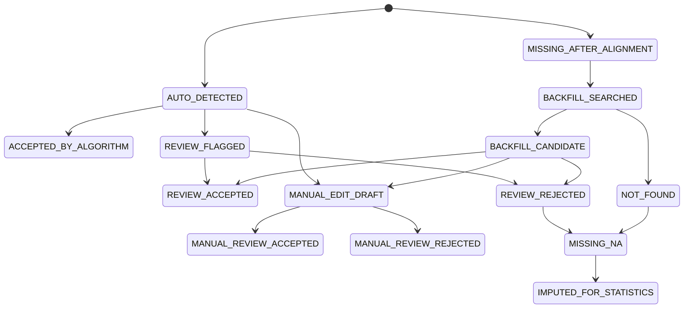
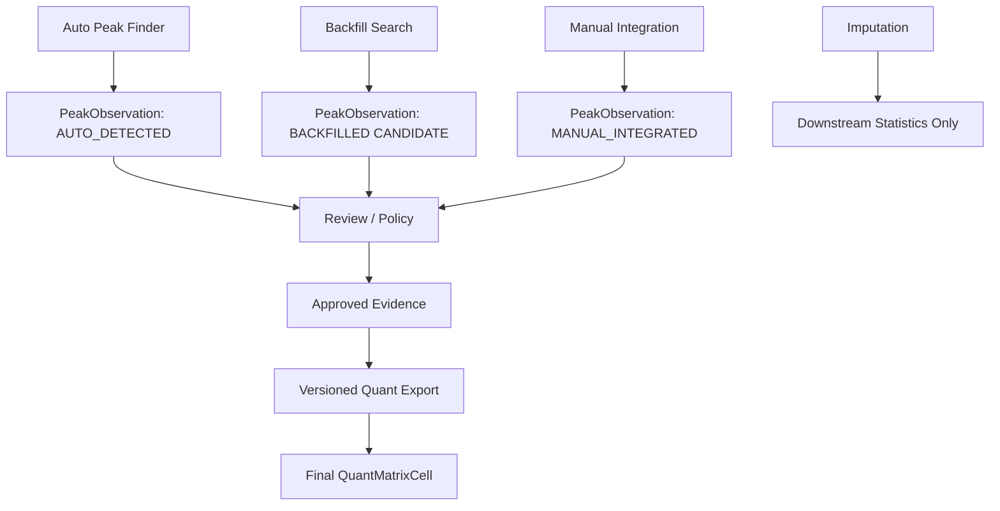

# LC-MS / Metabolomics Backfill Architecture RFC

> Purpose: 這份文件是給 Codex / 工程實作用的設計規格。
> 核心目標不是「把缺值補回 quantitative table」，而是建立一套可審計、可回退、可版本化的 **Peak Evidence Lifecycle**。
> 適用情境：LC-MS / metabolomics / targeted quant / untargeted feature table / peak picking / gap filling / manual integration / final quantitative matrix export。

---

## 0. 一句話結論

目前 backfill 架構最容易鬼打牆的原因是：

```text
把 Missing Handling、Backfill、Manual Integration、Imputation、Final Export 混成同一層。
```

成熟 LC-MS / metabolomics 工具的共同精髓是：

```text
Peak evidence layer 與 Quant export layer 必須分離。
```

也就是：

```text
candidate evidence 可以被產生
approved evidence 才能被採用
final quantitative matrix 只能由 versioned export policy 產生
imputed values 只能存在 statistics/downstream layer，不能偽裝成 peak area
```

---

## 1. Background

LC-MS quantitative table 中常見的缺值不一定代表真正的 0。可能原因包括：

- 原本 sample 中真的沒有該 compound / feature
- 有訊號但低於 peak picking threshold
- RT shift 導致 alignment 後未對上
- m/z shift 或 mass tolerance 過窄
- co-elution 造成 peak split / merge
- peak shape 太差被 filter 掉
- blank / QC rule 排除
- manual review reject
- downstream 統計過程產生 imputed value

因此，缺值不應該只是一格 empty cell。
它應該是有狀態、有原因、有 evidence、有後續任務的資料物件。

---

## 2. Design Goal

本 RFC 的目標：

1. 把 LC-MS quantitative backfill 從「補表格」改成「補 evidence」。
2. 建立 peak / missing / manual / export 四層分離。
3. 確保所有寫入 final matrix 的值都有可追溯來源。
4. 防止 candidate、heuristic、imputed value 污染 final quantitative matrix。
5. 支援 review queue，讓人類只審高風險、高影響的 cases。
6. 支援重跑、回退、expected diff、versioned export。
7. 讓 Codex 可以依照本文件拆 migration、model、service、CLI、test。

---

## 3. Non-Goals

以下不是本階段目標：

- 不是要讓所有 missing cell 都變成可寫值。
- 不是要用 heuristic threshold 硬挖更多 writer slice。
- 不是要把 imputed value 反寫回 peak table。
- 不是要讓 manual integration 覆蓋原始 auto peak。
- 不是要讓 gap filler 直接修改 locked final matrix。
- 不是要在缺少 raw chromatogram evidence 時產生 quantitative authority。

---

## 4. Mature Tool Lessons

### 4.1 xcms-style lesson

xcms 的核心精神可以抽象成：

```text
grouped feature
→ identify missing sample-feature pairs
→ use known feature mz/RT region
→ integrate raw chromatographic signal in missing samples
→ store filled peak as filled evidence
→ preserve process history
→ if no signal exists, keep NA
```

可借鑑重點：

```text
filled peak 是 peak evidence
但 filled peak 不是 native detected peak
```

因此你的系統也應該保留：

```text
source_type = BACKFILLED
is_filled = true
process_history = ...
```

---

### 4.2 MZmine-style lesson

MZmine 的 gap filling 不是統計補值，而是回到 raw / mass list / chromatogram 區域重新找 evidence。

抽象流程：

```text
aligned feature row has gap
→ define expected mz/RT search region
→ scan raw/mass-list evidence
→ validate peak shape and minimum scans
→ create estimated feature if evidence exists
→ keep empty if evidence does not exist
```

可借鑑重點：

```text
gap filling = evidence recovery
not imputation
not forced numerical fill
```

---

### 4.3 Skyline-style lesson

Skyline 最值得學的是 manual integration / audit / review。

抽象流程：

```text
auto peak exists or missing peak exists
→ user changes boundary / selects different peak / imports boundary
→ system creates manual override evidence
→ original evidence remains preserved
→ audit log records who / when / what / why
→ final report can choose manual accepted value
```

可借鑑重點：

```text
manual integration 不應該 update old area in-place
manual integration 應該新增一筆 new evidence version
```

---

### 4.4 OpenMS-style lesson

OpenMS 類工具的 export semantics 值得參考：
missing numeric fields 需要明確語意，例如 `nan`、`-1`、blank、或 meta value，而不是讓使用者猜。

可借鑑重點：

```text
0, NA, nan, rejected, below threshold, imputed
全部是不同語意
```

---

## 5. Core Architecture

### 5.1 Layered Model

```text
Raw Data Layer
    ↓
Peak Detection Layer
    ↓
Feature Alignment Layer
    ↓
Missing Call Layer
    ↓
Backfill Evidence Layer
    ↓
Manual Integration Layer
    ↓
Review / Approval Layer
    ↓
Versioned Quant Export Layer
    ↓
Downstream Statistics / Imputation Layer
```

### 5.2 Critical Rule

```text
Only Versioned Quant Export may create final quantitative matrix cells.
```

其他元件只能產生 evidence 或 review item：

```text
peak finder          -> peak evidence
gap filler/backfill  -> backfill candidate evidence
manual integration   -> manual evidence
reviewer             -> approval decision
exporter             -> matrix value selection
imputer              -> downstream derived value only
```

---

## 6. Entity Model

### 6.1 PeakObservation

代表一個有 chromatographic evidence 的 peak。

```text
PeakObservation
- peak_id: string
- project_id: string
- feature_id: string
- sample_id: string
- raw_file_id: string

- source_type: enum
    AUTO_DETECTED
    BACKFILLED
    MANUAL_INTEGRATED

- state: enum
    CANDIDATE
    ACCEPTED
    REJECTED
    SUPERSEDED

- mz_apex: float
- rt_apex: float
- mz_min: float
- mz_max: float
- rt_start: float
- rt_end: float
- area: float
- height: float
- baseline: float | null
- snr: float | null
- peak_shape_score: float | null
- integration_method: string

- parent_peak_id: string | null
- replaces_peak_id: string | null

- algorithm_name: string
- algorithm_version: string
- params_hash: string
- input_hash: string
- raw_data_checksum: string
- chromatogram_slice_ref: string | null

- created_by: string
- created_at: datetime
- reason_code: string | null
- comment: string | null
```

### Design Rule

```text
AUTO_DETECTED, BACKFILLED, MANUAL_INTEGRATED 可以共存。
```

不要用 update 覆蓋舊 peak。
如果 manual integration 取代 auto peak：

```text
new_manual_peak.parent_peak_id = auto_peak.peak_id
new_manual_peak.replaces_peak_id = auto_peak.peak_id
auto_peak.state = SUPERSEDED
```

---

### 6.2 MissingCall

代表某 feature-sample cell 為什麼沒有可用 peak。

```text
MissingCall
- missing_call_id: string
- project_id: string
- feature_id: string
- sample_id: string
- raw_file_id: string

- missing_state: enum
    NOT_DETECTED
    BELOW_THRESHOLD
    NO_SIGNAL_IN_EXPECTED_WINDOW
    FILTERED_OUT
    ALIGNMENT_FAILED
    REJECTED_BY_REVIEW
    NOT_APPLICABLE

- expected_mz: float | null
- expected_rt: float | null
- search_mz_min: float | null
- search_mz_max: float | null
- search_rt_start: float | null
- search_rt_end: float | null

- evidence_summary: string | null
- blocker_tokens: list[string]
- next_required_evidence: list[string]

- created_by_job_id: string
- algorithm_version: string
- params_hash: string
- input_hash: string
- created_at: datetime
```

### Design Rule

MissingCall 是 first-class object。
不要只用 `NULL` 表示缺值。

---

### 6.3 ReviewItem

代表需要人工審核的 cell / peak / backfill candidate。

```text
ReviewItem
- review_item_id: string
- project_id: string
- feature_id: string
- sample_id: string
- raw_file_id: string

- target_type: enum
    PEAK_OBSERVATION
    MISSING_CALL
    BACKFILL_CANDIDATE
    MANUAL_INTEGRATION
    EXPORT_DIFF

- target_id: string

- risk_score: float
- impact_score: float
- priority_score: float

- flags: list[string]
    LOW_SNR
    RT_SHIFT_OUTLIER
    MZ_SHIFT_OUTLIER
    PEAK_WIDTH_OUTLIER
    COELUTION_RISK
    ION_RATIO_MISMATCH
    QC_DRIFT
    BACKFILLED_LOW_CONFIDENCE
    MANUAL_AREA_DELTA_HIGH
    PREVIOUS_EXPORT_CHANGED

- review_question: string
- suggested_action: enum
    ACCEPT
    REJECT
    MANUAL_INTEGRATE
    REQUIRE_MORE_EVIDENCE
    KEEP_MISSING

- status: enum
    OPEN
    ACCEPTED
    REJECTED
    NEEDS_MORE_EVIDENCE
    CLOSED

- reviewer: string | null
- reviewed_at: datetime | null
- review_reason: string | null
```

---

### 6.4 QuantMatrixVersion

Final quantitative matrix 是一個 versioned artifact，不是主資料表。

```text
QuantMatrixVersion
- matrix_id: string
- project_id: string
- export_profile: enum
    DETECTED_ONLY
    ACCEPTED_WITH_BACKFILL
    ACCEPTED_WITH_MANUAL
    STATISTICS_WITH_IMPUTATION
    AUDIT_EXPORT

- source_peak_policy: string
- normalization_policy: string | null
- missing_policy: string
- imputation_policy: string | null

- created_by: string
- created_at: datetime
- locked_at: datetime | null

- params_hash: string
- input_hash: string
- code_version: string
- expected_diff_status: enum
    PASS
    FAIL
    NOT_RUN
```

---

### 6.5 QuantMatrixCell

```text
QuantMatrixCell
- matrix_id: string
- feature_id: string
- sample_id: string

- value: float | null
- value_type: enum
    DETECTED
    BACKFILLED_ACCEPTED
    MANUAL_ACCEPTED
    MISSING_NA
    BELOW_THRESHOLD
    REJECTED
    IMPUTED

- selected_peak_id: string | null
- missing_call_id: string | null
- imputation_id: string | null

- review_status: enum
    NOT_REQUIRED
    REVIEW_REQUIRED
    REVIEW_ACCEPTED
    REVIEW_REJECTED

- export_note: string | null
```

---

## 7. State Machine

### 7.1 Peak Evidence State Machine



### 7.2 Write Authority State Machine



---

## 8. Write Authority Rules

### 8.1 Global Rule

```text
No algorithm may directly update final quantitative matrix.
```

### 8.2 Authority Table

| Actor | May Write | Must Not Write |
|---|---|---|
| PeakFinder | `PeakObservation(source_type=AUTO_DETECTED)` | locked matrix |
| Alignment | feature groups / correspondence | final cell values |
| MissingDetector | `MissingCall` | fake zero values |
| BackfillEngine | `PeakObservation(source_type=BACKFILLED,state=CANDIDATE)` | final matrix |
| ManualIntegration | `PeakObservation(source_type=MANUAL_INTEGRATED)` | overwrite old peak in-place |
| Reviewer | review decisions / accepted state | raw evidence |
| Exporter | `QuantMatrixVersion`, `QuantMatrixCell` | raw peak evidence |
| Imputer | downstream imputed table | peak area / evidence layer |

---

## 9. Backfill Candidate Policy

Backfill candidate can be generated only when all required information exists:

```text
required:
- feature_id
- sample_id
- raw_file_id
- expected mz window
- expected RT window
- raw chromatogram or mass-list evidence
- algorithm parameters
- input hash
- code version
```

Backfill candidate is rejected or blocked when:

```text
- no raw signal in expected region
- RT window cannot be defined
- m/z window cannot be defined
- raw file missing
- sample mapping ambiguous
- feature group unstable
- expected_diff_status failed
- blocker token exists
```

---

## 10. Evidence Grade

Use evidence grade to gate write authority.

```text
A = native detected peak, clean QC, no review needed
B = backfilled/manual accepted, strong evidence, review passed
C = plausible candidate, review required
D = weak candidate, explanation-only
E = blocked / no evidence / rejected
```

### Export Rule

```text
Only A/B evidence can enter production quantitative matrix.
C/D/E cannot enter final matrix unless export_profile explicitly says AUDIT_EXPORT.
```

---

## 11. Review Queue Design

### 11.1 Review Priority

```text
priority_score =
    impact_score
  * risk_score
  * export_change_score
```

### 11.2 Risk Signals

```text
LOW_SNR
RT_SHIFT_OUTLIER
MZ_SHIFT_OUTLIER
PEAK_WIDTH_OUTLIER
PEAK_SHAPE_BAD
COELUTION_RISK
ION_RATIO_MISMATCH
QC_DRIFT
BLANK_CONTAMINATION
BACKFILLED_LOW_CONFIDENCE
MANUAL_AREA_DELTA_HIGH
PREVIOUS_EXPORT_CHANGED
```

### 11.3 Impact Signals

```text
high abundance
large fold-change impact
feature is in targeted panel
feature affects QC summary
feature affects group comparison
feature affects downstream biological interpretation
```

---

## 12. Export Semantics

### 12.1 Required Export Files

Exporter should generate at least two outputs.

#### A. Wide Quant Matrix

For statistics.

```text
feature_id | sample_1 | sample_2 | sample_3
F001       | 12345.6  | NA       | 11023.2
```

#### B. Long Evidence Table

For audit/debug/review.

```text
feature_id
sample_id
value
value_type
source_peak_id
parent_peak_id
missing_call_id
review_status
operator
algorithm_version
params_hash
raw_file_checksum
rt_start
rt_end
mz_min
mz_max
snr
peak_shape_score
export_profile
```

### 12.2 Value Type Semantics

```text
DETECTED
    Native algorithm-detected accepted peak.

BACKFILLED_ACCEPTED
    Missing cell was searched in raw evidence and accepted.

MANUAL_ACCEPTED
    Human/manual integration accepted.

MISSING_NA
    No accepted peak evidence.

BELOW_THRESHOLD
    Signal exists but below quantitative threshold.

REJECTED
    Evidence exists but rejected by rule or review.

IMPUTED
    Downstream statistical imputation only.
```

### 12.3 Critical Rule

```text
IMPUTED must never be indistinguishable from DETECTED.
```

---

## 13. Expected Diff / Regression Safety

Every export should support expected diff.

### 13.1 Expected Diff Checks

```text
- number of changed cells
- number of cells changed by value_type
- number of newly accepted backfilled cells
- number of rejected cells
- number of manual accepted cells
- total area delta per feature
- total area delta per sample
- high-impact feature delta
- QC sample delta
```

### 13.2 Pass Criteria Example

```text
expected_diff_status = PASS only if:
- changed cells are within approved scope
- no explanation-only evidence entered final matrix
- no C/D/E evidence entered production matrix
- all changed cells have source_peak_id or missing_call_id
- all manual cells have reviewer and reason
- all backfilled cells have params_hash and raw_data_checksum
```

---

## 14. Suggested Implementation Roadmap

### Phase 1: Read-only Audit Layer

Goal: 不改現有 final matrix，只建立可觀測性。

Tasks:

```text
1. Add value_status inference for existing cells.
2. Add missing cell classifier.
3. Emit MissingCall records.
4. Emit review flags.
5. Generate audit-only long evidence export.
6. Do not change production writer.
```

Acceptance:

```text
- Every missing cell has a MissingCall or explicit blocker.
- Existing matrix output unchanged.
- Audit report explains why each cell is empty or filled.
```

---

### Phase 2: Backfill Candidate Layer

Goal: gap filler 只產生 candidate，不寫 final matrix。

Tasks:

```text
1. Implement BackfillSearchTask.
2. Search expected mz/RT region.
3. Create PeakObservation(source_type=BACKFILLED,state=CANDIDATE).
4. Create blocker if evidence missing.
5. Add confidence/risk flags.
6. Add review queue item for risky candidates.
```

Acceptance:

```text
- No candidate directly enters final matrix.
- All candidates have params_hash/input_hash/raw_data_checksum.
- Candidates can be dropped without affecting original matrix.
```

---

### Phase 3: Manual Integration Layer

Goal: 人工整合產生新的 evidence version。

Tasks:

```text
1. Add manual integration API.
2. Store manual rt_start/rt_end/mz window/area.
3. Preserve parent_peak_id and replaces_peak_id.
4. Require reason_code.
5. Add audit log.
6. Mark old selected evidence as SUPERSEDED only by policy, not deletion.
```

Acceptance:

```text
- Manual integration never overwrites original auto peak row.
- Every manual value has operator, timestamp, reason.
- Export can include or exclude manual values by profile.
```

---

### Phase 4: Review / Approval Layer

Goal: 建立 write authority。

Tasks:

```text
1. Implement ReviewItem model.
2. Implement approve/reject endpoints.
3. Only reviewer or policy may set evidence_grade A/B.
4. Store review_reason and reviewer.
5. Add batch review for low-risk A/B cases.
6. Add guardrails against approving blocked evidence.
```

Acceptance:

```text
- C/D/E evidence cannot enter production matrix.
- Rejected evidence remains queryable but not exportable as accepted.
- Review queue sorted by risk × impact.
```

---

### Phase 5: Versioned Quant Export

Goal: final matrix 改成 versioned artifact。

Tasks:

```text
1. Implement QuantMatrixVersion.
2. Implement QuantMatrixCell.
3. Implement export profiles:
   - DETECTED_ONLY
   - ACCEPTED_WITH_BACKFILL
   - ACCEPTED_WITH_MANUAL
   - STATISTICS_WITH_IMPUTATION
   - AUDIT_EXPORT
4. Generate wide matrix + long evidence table.
5. Add expected_diff_status.
6. Lock matrix versions.
```

Acceptance:

```text
- Matrix is reproducible from evidence + export policy.
- Every non-NA value has selected_peak_id or imputation_id.
- Every matrix version has params_hash, input_hash, code_version.
```

---

## 15. Suggested Service Interfaces

### 15.1 BackfillEngine

```python
class BackfillEngine:
    def search_missing_cell(
        self,
        feature_id: str,
        sample_id: str,
        raw_file_id: str,
        expected_mz_window: tuple[float, float],
        expected_rt_window: tuple[float, float],
        params: dict,
    ) -> "BackfillResult":
        ...
```

### 15.2 ReviewService

```python
class ReviewService:
    def approve_evidence(
        self,
        evidence_id: str,
        reviewer: str,
        reason: str,
        evidence_grade: str,
    ) -> None:
        ...

    def reject_evidence(
        self,
        evidence_id: str,
        reviewer: str,
        reason: str,
    ) -> None:
        ...
```

### 15.3 QuantExporter

```python
class QuantExporter:
    def create_matrix(
        self,
        project_id: str,
        export_profile: str,
        params: dict,
    ) -> "QuantMatrixVersion":
        ...
```

---

## 16. Guardrails

Implement hard checks:

```text
- Do not export BACKFILLED CANDIDATE as final value.
- Do not export rejected evidence as final value.
- Do not export imputed value as detected/backfilled/manual.
- Do not overwrite original peak observation in manual integration.
- Do not create matrix cell without selected_peak_id/missing_call_id/imputation_id.
- Do not allow C/D/E evidence in production export.
- Do not allow explanation_only evidence to enter writer path.
```

---

## 17. Test Cases

### 17.1 Missing remains NA

```text
Given feature F001 missing in sample S001
And no raw signal exists in expected mz/RT window
When backfill search runs
Then MissingCall state = NO_SIGNAL_IN_EXPECTED_WINDOW
And no PeakObservation is accepted
And exported value_type = MISSING_NA
```

### 17.2 Backfill candidate requires review

```text
Given raw signal exists but LOW_SNR flag is present
When backfill search creates candidate
Then PeakObservation state = CANDIDATE
And ReviewItem status = OPEN
And production export does not include this value
```

### 17.3 Backfill accepted enters matrix

```text
Given BACKFILLED candidate has evidence_grade B
And review_status = REVIEW_ACCEPTED
And expected_diff_status = PASS
When export_profile = ACCEPTED_WITH_BACKFILL
Then QuantMatrixCell value_type = BACKFILLED_ACCEPTED
And selected_peak_id points to the backfilled peak
```

### 17.4 Manual integration does not overwrite original

```text
Given AUTO_DETECTED peak P1
When user manually changes boundary
Then create MANUAL_INTEGRATED peak P2
And P2.parent_peak_id = P1
And P1 remains queryable
```

### 17.5 Imputation stays downstream

```text
Given feature F001 sample S001 has no accepted evidence
When imputation runs
Then imputed value is stored in downstream layer
And QuantMatrixCell value_type = IMPUTED only in STATISTICS_WITH_IMPUTATION profile
And it is not exported as DETECTED
```

---

## 18. Recommended Codex Task Prompt

Use this prompt to ask Codex to implement incrementally:

```text
Refactor the LC-MS backfill system into a Peak Evidence Lifecycle.

Do not allow any backfill candidate, heuristic result, or imputed value to directly write final quantitative matrix cells.

Implement or adapt these layers:
1. PeakObservation
2. MissingCall
3. ReviewItem
4. QuantMatrixVersion
5. QuantMatrixCell

Add source_type, state, evidence_grade, review_status, params_hash, input_hash, code_version, and raw_data_checksum where applicable.

Implement guardrails:
- candidate evidence cannot enter production export
- rejected evidence cannot enter production export
- C/D/E evidence cannot enter production export
- imputed values cannot masquerade as peak area
- manual integration creates new evidence, never overwrites original peak

Implement export profiles:
- DETECTED_ONLY
- ACCEPTED_WITH_BACKFILL
- ACCEPTED_WITH_MANUAL
- STATISTICS_WITH_IMPUTATION
- AUDIT_EXPORT

Start with read-only audit layer and tests before enabling any writer path.
```

---

## 19. Final Architecture Principle

The backfill system should answer this question for every cell:

```text
Why does this cell have this value, and who/what had the authority to put it there?
```

If the answer is not mechanically traceable, the cell should not be production-writeable.

The final design principle:

```text
Backfill is not a value replacement mechanism.
Backfill is an evidence recovery mechanism.
Final matrix writing is a separate authority-controlled export process.
```
