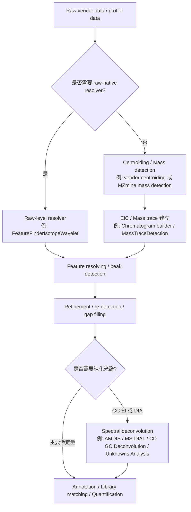

# 質譜數據分析中的 Resolver 定位、應用與工具比較

## 執行摘要

在質譜資料分析脈絡裡，**「resolver」不是單一、跨所有軟體都一致命名的標準術語**。MZmine 直接把色譜峰拆分模組稱為 *resolver*；XCMS 與 OpenMS 較常使用 *peak detection*、*feature finding*；Thermo、Waters、Agilent 則多以 *peak detection / integration* 或 *deconvolution* 來命名。若從功能而非名稱來看，這些工具都在做同一件核心工作：**把混合的原始訊號拆成較可解讀、可定量、可比對的單位**，例如單一 chromatographic peak、feature、component，或 pseudo-spectrum。citeturn21view0turn21view1turn21view3turn21view4turn28search1turn29search12turn26search2

在 MS 領域，resolver 的定位大致可分成三層。第一層是**色譜/質量軌跡層**，把共洗脫或肩峰拆成多個 feature，例如 MZmine 的 Local Minimum / ADAP resolver、XCMS 的 centWave、OpenMS 的 FeatureFinderMetabo。第二層是**光譜去卷積層**，把混合碎裂光譜還原為較乾淨的 pseudo-spectrum，例如 AMDIS、MS-DIAL 的 MS2Dec/CorrDec、Agilent Unknowns Analysis、Thermo Compound Discoverer 的 GC deconvolution。第三層才是較狹義的**去電荷/同位素或 feature 聚合**，例如 OpenMS 中把單質量軌跡組裝成 metabolite feature、或進一步做 adduct/decharge 的步驟。citeturn21view5turn21view6turn12search5turn35view1turn26search2turn28search8

必須特別區分的是：**resolver 幾乎總是演算法或軟體模組，不是質譜儀硬體元件**。硬體層真正對應的概念是 *mass resolving power*，也就是儀器分開相鄰 m/z 峰的能力；軟體 resolver 不會改變這個物理指標，但能提升**計算層面的可分離性、峰純度與定量穩定性**，例如把原本混在一起的肩峰拆開、降低 chimeric MS/MS 的污染、提高 library matching 的可用性。citeturn24search2turn24search5turn24search12turn21view0turn21view5turn17search2

若只給一句實務結論：**對弱訊號、重疊峰、GC-EI 共洗脫、DIA 混合 MS/MS，resolver 幾乎是必要步驟；但若資料已過度平滑或過度中心化，resolver 的分峰能力常會明顯下降。**因此，resolver 不應被視為「最後補救」，而應是 pipeline 中被明確設計的一個決策點。對 LC-HRMS untargeted workflow，通常建議在**mass detection / centroiding 之後、alignment 之前**做 feature-level resolving；對 GC-EI 或 DIA，則常在 feature/peak 定位後再做 spectral deconvolution。citeturn21view2turn25view2turn21view5turn12search5turn28search8

## Resolver 的定義與定位

若把「resolver」翻成中文，最接近的概念其實不是單純的「峰挑選」，而是**訊號分離、峰拆分與去卷積**。MZmine 的文件寫得最直接：在建立 EIC 的時候，重疊或部分共洗脫的 feature 可能先被保留成單一 feature；Local Minimum Resolver 的任務，就是利用 EIC 裡的局部谷底把 shoulder peaks 拆成個別 feature。ADAP resolver 則以連續小波轉換在不同尺度找峰，再用 ridgeline detection 和局部極小值決定峰位置與邊界。這說明 resolver 的核心任務是**將原本還混在一起的訊號拆開**，而不是單純把訊號從背景抹掉。citeturn21view0turn21view1

這個概念在其他軟體中雖然名稱不同，但本質一致。XCMS 的 centWave 是以高解析 LC/MS 的 centroid mode 資料為對象，先找連續 scans 中 m/z 變動很小的 mass traces，再用 CWT 去找色譜峰；OpenMS 的 FeatureFinderMetabo 以 centroided mzML 為輸入，透過 mass trace approach 組裝 feature，並在 metabolomics workflow 中對部分重疊色譜峰做 deconvolution；AMDIS 則把過程拆成 noise analysis、component perception、spectral deconvolution 和 compound identification 四步。也就是說，不同生態系對 resolver 的叫法不同，但都在執行**「由混合訊號到化合物級表示」**的中介轉換。citeturn21view3turn21view4turn35view1turn21view6

因此，若要更精準地定位 resolver，在 MS pipeline 中它通常位於這些位置之一：**原始訊號與 mass list 之間**、**mass list 與 feature list 之間**、或 **feature list 與去卷積 pseudo-spectrum 之間**。Thermo Xcalibur 的 ICIS / Genesis / Avalon 演算法甚至直接在「分析 raw data」時，同時做 smoothing、建 chromatogram、指派峰號、產生 peak list、決定峰起訖點；Waters ApexTrack 則在 chromatogram 層以二階導數曲率找峰；Agilent Unknowns Analysis 直接把複雜 chromatogram 中的成分去卷積，並根據 retention time 與 peak shape 抽出較乾淨的 spectra。這些都屬於 resolver 的廣義實作。citeturn28search1turn29search9turn26search2

## 輸入資料型態與方法差異

resolver 對不同輸入型態的行為差別很大。最重要的分野不是「有沒有 resolver」，而是**resolver 看見的是 raw trace / profile 級訊號，還是已經過中心化、平滑或去噪後的峰/質量列表**。MZmine 的 mass detection 明確說明，它會先為每個 scan 產生 mass list；對 profile raw data 會在此步驟同時 centroid，並以使用者設定的 noise threshold 做過濾。OpenMS 也明確區分：FeatureFinderMetabo 要 centroided mzML，而 FeatureFinderIsotopeWavelet 則是為 raw MS1 data 設計。XCMS 的 centWave 亦是以 centroid mode 為前提。citeturn21view2turn21view4turn25view3turn21view3

對 raw trace 而言，優勢是**保留最多訊號形狀資訊**。這對處理弱峰、肩峰、部分重疊峰、同位素包絡與共洗脫成分尤其重要。OpenMS 的 FeatureFinderIsotopeWavelet 明確定位為 raw MS data feature detection；Xcalibur 的 ICIS 則被官方文件描述為對低 MS signal level 有較佳 peak detection efficiency；Waters ApexTrack 以二階導數曲率法強調能在 noisy 或 sloping baseline 上更可靠地抓到 shoulder peaks 與 low-level peaks。這類 raw-或近 raw 的 resolver，通常**靈敏度與分離能力較高，但計算成本、參數敏感度與儀器相依性也較高**。citeturn25view3turn7search4turn29search14turn29search9

對已平滑/去噪/peak list 輸入而言，優勢是**速度快、結果穩、跨檔案一致性較好**，而且多數 untargeted workflow 都比較容易接到後續對齊、分群與統計分析。XCMS centWave、OpenMS FeatureFinderMetabo、MZmine 的 chromatogram builder + resolver 都屬於這一路線。不過代價是：如果 upstream centroiding 或 smoothing 太激進，局部谷底會被抹平、肩峰會被合併，resolver 只能在「資訊已經被壓縮過的表示」上做最佳化，常見後果是**低豐度 feature 消失、近鄰峰面積互相滲漏、或把複合峰視為單一化合物**。MZmine 甚至特別把 smoothing 模組放在「feature detection 之後」，並強調它是 optional；這個設計本身就反映出過早平滑可能傷害 feature resolving。citeturn25view1turn21view0turn21view2turn25view2

還要再補一個常被混淆的點：**resolver 可以改善的是資料分析層面的「有效分離」與 pseudo-spectrum purity，不是儀器的 mass resolving power**。硬體 resolving power 由質譜儀決定，IUPAC 將其定義為區分相近 m/z 離子的能力；Thermo 也強調高 resolving power 能降低 isobaric interference 對低濃度分析物的遮蔽。軟體 resolver 只是利用時間、峰形、相關性或資料庫先驗，讓你在後處理時更好地拆分重疊訊號。citeturn24search5turn24search2turn24search12

### Raw trace 與已平滑/去噪後峰的比較

| 面向 | Raw trace / profile 輸入 | 已平滑、去噪或 peak list 輸入 | 對定量/定性結果的典型影響 | 主要來源 |
|---|---|---|---|---|
| 代表形式 | 原始 profile spectra、未壓縮 EIC、原始 chromatogram | centroided mass list、已建好的 mass traces / EIC、已偵測 chrom peaks | 前者保留更多形狀資訊；後者更利於批量處理。 | citeturn21view2turn21view3turn21view4turn25view3 |
| 常見工具 | OpenMS FeatureFinderIsotopeWavelet、Xcalibur ICIS/Genesis、ApexTrack、AMDIS | XCMS centWave、OpenMS FeatureFinderMetabo、MZmine resolver、MS-DIAL feature/deconv | raw-native 工具較能保留弱峰與肩峰；peak-list 流程較穩定且快。 | citeturn25view3turn7search4turn29search9turn21view3turn21view4turn12search5 |
| 優點 | 對弱峰、共洗脫、局部谷底、同位素包絡更敏感 | 計算快、結果更可重現、對 alignment / group / statistics 友善 | 若 resolver 模型合適，raw 較容易把複合峰拆開；peak-list 較適合大量樣本。 | citeturn25view3turn7search4turn29search14turn25view2 |
| 缺點 | 噪音敏感、參數更難調、資料量與計算量較高 | 上游 centroiding / smoothing 若過強，肩峰與谷底可能被消掉 | 過度壓縮訊號後再 resolve，常導致低豐度峰遺失或共洗脫成分被合併。 | citeturn21view0turn25view1turn35view1 |
| 對定量 | 面積可更接近真實混合峰分配，但更容易受噪音與基線擾動 | 強調穩定與一致性，但可能出現面積 bleed-over 或 missing values | 定量時宜用 standards / QC 檢查 area bias、CV、missing rate。 | citeturn29search14turn25view2turn36search16 |
| 對定性 | 有利於提高 pseudo-spectrum purity 與 library match | 適合一般 feature annotation，但 chimeric spectrum 風險較高 | GC-EI、DIA、複雜基質中常需再做 spectral deconvolution。 | citeturn21view5turn17search2turn26search2 |

## 工具與實作比較

若從市場與學界的普遍使用情況來看，可以把 resolver 工具分成兩大類：**feature/peak resolver** 與 **spectral deconvolution resolver**。前者的主要目標是把色譜峰拆成 feature、算面積、建立 feature table；後者則強調產生較乾淨的 pseudo-spectrum 以便做 library match 或結構註解。直接把兩類放在同一排行榜比較並不公平，因此下表以「演算法類型、輸入支援、適用情境」做橫向整理。citeturn21view0turn21view5turn21view6turn17search2

| 工具 | 輸入類型支援 | 演算法類型 | 優點 | 缺點 | 適用場景 | 授權/價格 | 與常見 MS 軟體整合 | 主要來源 |
|---|---|---|---|---|---|---|---|---|
| **MZmine Resolver stack** | 以 mass detection 後的 mass list / EIC / feature list 為主；profile 可先在 mass detection 中 centroid。 | Local minimum、ADAP-CWT、baseline、noise amplitude、Savitzky-Golay resolver。 | 名稱最貼近「resolver」；模組化強；LC、GC、IMS 流程完整；GC-EI deconvolution 可接續 resolved features。 | 需要較多參數；如果上游 noise level 或 centroiding 設錯，後續 resolver 很難補救。 | LC-HRMS untargeted；GC-EI workflow；希望可視化調參者。 | 開源、MIT、免費。 | **MZmine 原生**；非 Xcalibur/MassLynx 原生。 | citeturn21view0turn21view1turn21view2turn21view5turn32view0 |
| **XCMS centWave / massifquant** | 主要為 centroid mode；原始 spectra 可 on-the-fly 載入，但 centWave 目標是 centroided LC/MS。massifquant 為 centroid mode 的 Kalman filter 方法。 | centWave：CWT + mass trace；massifquant：Kalman filter，可再接 wave refinement。 | 學界使用極廣；與 R/Bioconductor 生態整合良好；centWave 對 close / partial overlap 峰表現經典。 | 需熟悉 R；GUI 不如工作站直觀；參數優化要靠經驗。 | 大樣本 untargeted LC/GC-MS；統計與自動化分析。 | 開源，GPL 家族，免費。 | **Bioconductor / R 原生**；非 MZmine/OpenMS/Xcalibur/MassLynx 原生。 | citeturn21view3turn4search3turn25view2turn33view0turn14search0 |
| **OpenMS FeatureFinderMetabo** | centroided mzML；也可透過 MassTraceDetection / ElutionPeakDetection 組合流程操作。 | mass trace approach，組裝共洗脫單質量軌跡為 metabolite features，並可部分 deconvolute overlap。 | CLI、C++、Python、KNIME/Galaxy 生態完整；適合 reproducible workflow。 | 對初學者較工程化；前處理與參數檔較多。 | 高通量 LC-MS metabolomics；需 workflow engine 或腳本化者。 | BSD-3-Clause，免費。 | **OpenMS / pyOpenMS / KNIME 原生**；非 Xcalibur/MassLynx/MZmine 原生。 | citeturn21view4turn35view1turn34view0 |
| **OpenMS FeatureFinderIsotopeWavelet** | raw / uncentroided MS1 data。 | isotope wavelet；針對 averagine 型同位素圖形。 | 原生支援 raw data；對 profile MS1 與同位素包絡友善。 | 侷限於特定資料型態與假設；現代 metabolomics workflow 較常改用 FeatureFinderMetabo。 | profile-mode peptide/feature detection；希望保留 raw 資訊時。 | BSD-3-Clause，免費。 | **OpenMS 原生**。 | citeturn25view3turn6search2turn34view0 |
| **MS-DIAL MS2Dec / CorrDec** | 支援多廠牌 vendor 檔、netCDF、mzML；涵蓋 GC/MS、GC/MS/MS、LC/MS、LC/MS/MS、DIA。 | GC 與 DIA spectral deconvolution；CorrDec 以跨樣本 precursor/fragment abundance correlation 去卷積。 | untargeted metabolomics/lipidomics 社群非常常用；跨儀器支援強；內建資料庫與 GUI 友善。 | 主要強於光譜去卷積與 annotation，不是單純 chromatographic resolver；部分進階邏輯需理解其專案型 workflow。 | GC-EI、AIF/SWATH/DIA、跨廠牌 untargeted workflow。 | 開源原始碼，LGPL v3；GUI 發行版免費使用。 | **MS-DIAL 原生**；可讀 Thermo/Waters/Agilent 等資料，但非其 vendor GUI 內建。 | citeturn12search5turn12search8turn31view0turn30search3 |
| **AMDIS** | 完成的 GC/MS 或 LC/MS data file。 | noise analysis → component perception → spectral deconvolution → library ID。 | GC-MS 去卷積經典工具；與 NIST library workflow 關聯緊密。 | 主要面向 GC/MS；對重疊程度、scan rate、濃度比例敏感；參數較經驗化。 | GC-EI、目標篩查、NIST library search 前處理。 | NIST 提供，免費下載。 | **獨立工具**；常與 NIST MS Search 搭配，非 Xcalibur/MassLynx/OpenMS/MZmine 原生。 | citeturn21view6turn10search0turn10search12 |
| **Thermo Xcalibur / Compound Discoverer** | raw chromatogram、MS1 scans、GC deconvolution node 輸入檔。 | Xcalibur：ICIS / Genesis / Avalon peak detection；Compound Discoverer：GC deconvolution / feature detection / gap fill。 | 與 Thermo raw 檔與工作站整合最好；ICIS 對低 MS signal 敏感；CD 可把 deconvolution、grouping、gap filling 接成完整 workflow。 | 商業軟體；方法與結果較偏 Thermo 生態；跨平台開放性不如開源工具。 | Thermo 儀器原生工作站；routine quant；GC/LC unknown screening。 | 商業授權。 | **Xcalibur / Compound Discoverer 原生**。 | citeturn28search1turn28search4turn28search8turn28search6 |
| **Waters ApexTrack in MassLynx / QuanLynx / TargetLynx** | chromatogram traces；可搭配 smoothing 與 integration 參數。 | 二階導數曲率法 + baseline handling；肩峰與 fused peak 處理。 | 對 shouldered peaks、sloping baseline、低訊號峰偵測強；Waters quant workflow 很成熟。 | 本質較偏 integration algorithm，不是一般 untargeted feature finder；商業封閉。 | Waters LC-MS(/MS) 定量、routine review、雙峰/肩峰 integration。 | 商業授權。 | **MassLynx / QuanLynx / TargetLynx 原生**。 | citeturn29search9turn29search14turn29search12turn8search6 |
| **Agilent MassHunter Unknowns Analysis** | 複雜 GC/MS chromatogram；可搭配 cleaned spectra review。 | 依 retention time 與 peak shape 去卷積並抽取 clean spectra。 | 對 GC/unknown screening 很實用；與 Agilent library/Qual/Quant 生態相連。 | 主要是 GC unknown/deconvolution 型用途；商業授權；跨平台與批量自動化彈性較小。 | 工業與 routine GC/MS unknown analysis；coeluting GC peaks。 | 商業授權。 | **MassHunter 原生**。 | citeturn26search2turn27search8turn27search12 |

從實務角度看，**MZmine / XCMS / OpenMS 比較像「feature resolver」；AMDIS / MS-DIAL / Unknowns Analysis / Compound Discoverer GC deconv 比較像「spectrum resolver」；Xcalibur ICIS 與 Waters ApexTrack 則偏「工作站 peak detection / integration resolver」**。若你的終點是 feature table 與統計分析，前者更重要；若終點是 library search、結構註解、降低 chimeric MS/MS 影響，後者更關鍵。citeturn21view0turn21view5turn17search2turn26search2turn28search8

## 建議 Pipeline 與使用時機

對大多數 LC-MS untargeted workflow，resolver 最合適的位置是：**在合法且保守的 centroid / mass detection 之後、alignment 與 feature linking 之前**。MZmine 是先做 mass detection 產生 mass list，再進入 chromatogram builder 與 resolver；XCMS 的預設 workflow 也是先 `findChromPeaks()`，再視需要做 `refineChromPeaks()`，之後才 alignment、grouping、gap filling；OpenMS metabolomics 流程則是 MassTraceDetection → ElutionPeakDetection → FeatureFindingMetabo，再接 alignment、decharger、feature linking。這三個流程雖寫法不同，但邏輯高度一致。citeturn21view2turn25view2turn35view0turn35view1

若是 GC-EI 或 DIA，則常出現兩段式 resolver。第一段先定位化學成分或 feature；第二段再做 spectral deconvolution。MZmine 的 GC-EI spectral deconvolution 明確要求輸入必須是 **resolved features**，並建議先跑 Local Minimum Resolver；AMDIS 則直接把 component perception 與 spectral deconvolution 串在一起；MS-DIAL 則在 GC/MS 與 DIA workflow 中內建 deconvolution，並在多樣本條件下可用 CorrDec 提高 MS2 purity。citeturn21view5turn21view6turn12search5turn12search8

下面這條流程，適合作為**預設、可落地的 resolver 設計藍圖**。它的重點不是每個專案都照抄，而是把 resolver 放在「訊號仍保有足夠結構資訊、但又已去除明顯雜訊」的位置。對 profile 資料，若軟體原生支援 raw-native resolver，可直接在 raw 層處理；若不支援，則應先使用保守的 centroiding / mass detection，而不是先做重度 smoothing。citeturn25view3turn21view2turn35view1

參數上，最常決定成敗的是三類。**第一類是 noise threshold / S/N 門檻**：MZmine mass detection 與 OpenMS FeatureFindingMetabo 都把它列為核心變數；**第二類是 peak width / search window**：XCMS `peakwidth`、MZmine Local Minimum 的 search range、Waters ApexTrack 的 peak width 都直接影響分峰與 over-splitting；**第三類是演算法家族選擇**：低噪音且峰形漂亮時，局部極小值法通常簡潔有效；資料較吵、峰寬差異大或存在肩峰時，wavelet / curvature / correlation 類方法通常更穩。citeturn21view0turn21view1turn21view3turn35view0turn29search3

## 性能證據與實務建議

我有找到一些**代表性、但不完全可直接橫向比較**的性能資料。它們大多來自各工具的原始論文或官方文件，能證明 resolver 的價值，但**不是在同一個公共 benchmark 下做 apples-to-apples 比較**。因此，下表應被視為「可用案例證據」，而不是「絕對排名」。citeturn11search0turn12search0turn17search2turn20search10

| 工具/方法 | 找到的量化或半量化證據 | 解讀 | 來源 |
|---|---|---|---|
| XCMS centWave | 原始論文指出，centWave 能偵測 close-by 與 partially overlapping features，且相較 matchedFilter 與 MZmine centroidPicker 有最高 overall recall 與 precision。 | 證明 wavelet-based resolver 在重疊峰情境下具代表性優勢。 | citeturn11search0 |
| AMDIS | 在兩個共洗脫農藥案例中，當兩者 scan number 差異只有 1 scan 時，AMDIS 只能不完全抽出 purified spectra；差異達 3 scans 以上時可抽出完整正確光譜。當 scan rate 為 0.4–0.90 s/scan 且 target/interference 比大於 1/5 時，得到理想 deconvolution。 | AMDIS 對 scan density、重疊程度與濃度比十分敏感。 | citeturn20search10 |
| MS-DIAL | 2015 原始論文在 9 個 algae strains 的 reversed-phase LC-MS/MS 分析中，利用 enriched LipidBlast library 辨識到總計 1,023 個 lipid compounds。 | 顯示 deconvolution 對 untargeted annotation 的增益可非常大，但結果也受資料庫品質影響。 | citeturn12search1 |
| MS-DIAL CorrDec | CorrDec 論文摘要直接指出，它在 dilution series 與 224-sample urinary metabolome 中，明顯優於原始 MS2Dec 去卷積。 | 多樣本相關性可作為 resolver 的額外資訊來源。 | citeturn12search0turn12search8 |
| DecoID | DecoID 在 DDA 與 DIA MS/MS 資料中增加 metabolite ID 數量而不提高 FDR；對公開資料集與人血漿 DDA，與直接 spectral matching 相比，identified metabolites 增加超過 30%。 | 對 chimeric MS/MS，資料庫輔助去卷積可明顯提升定性能力。 | citeturn18view0 |

從這些證據可抽出四個實務規則。第一，**resolver 對定性與定量的提升常來自「減少訊號混雜」而非「增加儀器解析度」**。第二，**效能極度依賴資料條件**：scan rate、峰寬、濃度比、樣本多樣性、資料庫品質，都可能比演算法名稱更重要。第三，**多樣本資訊是很強的 resolver 資源**，MS-DIAL CorrDec 與 DecoID 都證明，跨樣本相關性或資料庫先驗能顯著改善 chimeric spectra 的拆分。第四，**沒有單一 resolver 適用所有 MS 任務**；peak resolver、spectral resolver、integration resolver 應按工作目標分開選。citeturn20search10turn12search0turn18view0turn24search5

實務上最值得注意的參數與陷阱如下。**噪音門檻設太低**，會讓 spectral grass 與基線波動進入 mass list，使 resolver 容易過分裂；**設太高**，則弱峰與低豐度同位素會直接消失。MZmine 文件甚至給出不同儀器常見 noise level 等級，並提醒 Orbitrap 與 TOF 所需閾值不同；OpenMS 也把 noise threshold 列為最重要參數之一。citeturn21view2turn35view1

**平滑不是越多越好。**MZmine 把 smoothing 視為 optional，並放在 feature detection 後；Waters 文件也指出 ApexTrack 的 peak width 會同時改變偵測與 smoothing，增大 width 會帶來更多 smoothing、通常整合到更少的 peaks，減小 width 則可能檢出更多 peaks。這代表如果在 resolver 前過度平滑，很容易把原本可用來分峰的局部谷底與形狀差異消掉。citeturn25view1turn29search3

**raw/profile 轉 centroid 的步驟必須保守，而且最好優先用 vendor software 完成。**UmetaFlow/OpenMS 論文明確建議，若需要做 centroiding conversion，應優先使用 vendor software 以維持資料完整性。這一點非常重要，因為很多人把「resolver 失敗」誤判成演算法問題，實際上失敗更可能發生在前一個 centroiding 或 thresholding 步驟。citeturn35view1

最後，**驗證 resolver 的方式不能只看 feature 數量**。更實際的驗證應包括：接近共洗脫的標準品是否被正確拆開、重複 QC 中的 area CV 是否下降、library match / spectrum purity 是否改善、同位素/加合物關係是否更一致、missing values 是否減少，以及手動抽查的 EIC 边界是否合理。最佳實務文件也特別把 ion suppression、peak misidentification、quantification 與 reporting quality 列為重點，這些正是 resolver 設定好壞最終會反映的地方。citeturn36search16turn25view2turn28search20

## 結論

若把問題收斂成一句話，**resolver 在質譜資料分析中的真正定位，是「把儀器產生的混合訊號，轉換成可定量、可比對、可註解的分析單位」的核心中介層**。它通常是演算法或軟體模組，而不是硬體；它可以發生在 chromatogram/EIC 層、mass trace/feature 層，或 image/chimeric MS/MS 的去卷積層。citeturn21view0turn21view6turn17search2turn24search5

如果你以日常工作選型來看，可以簡化成三個判斷。**想要強 untargeted feature table 與開放流程**，優先看 MZmine、XCMS、OpenMS；**想強化 GC-EI 或 DIA 的光譜純化與未知物註解**，優先看 MS-DIAL、AMDIS、DecoID、Unknowns Analysis、Compound Discoverer；**想在 vendor 工作站內完成 routine quant 與峰審核**，Thermo 的 ICIS/Genesis 與 Waters 的 ApexTrack 仍然是實務上很有力的 resolver。citeturn32view0turn33view0turn34view0turn12search5turn10search0turn18view0turn26search2turn28search8turn29search12

真正最關鍵的，不是哪個 resolver 名字最響亮，而是**你讓 resolver 接到什麼輸入、放在 pipeline 的哪個位置、再用哪些指標回頭驗證**。在這件事上，raw 与 peak-list 並不是二選一，而是可串接的兩層策略：先保守地保留訊號結構，再在最能分辨混合成分的層級上 resolve，通常才是兼顧定量與定性的做法。citeturn21view2turn25view2turn21view5turn35view1