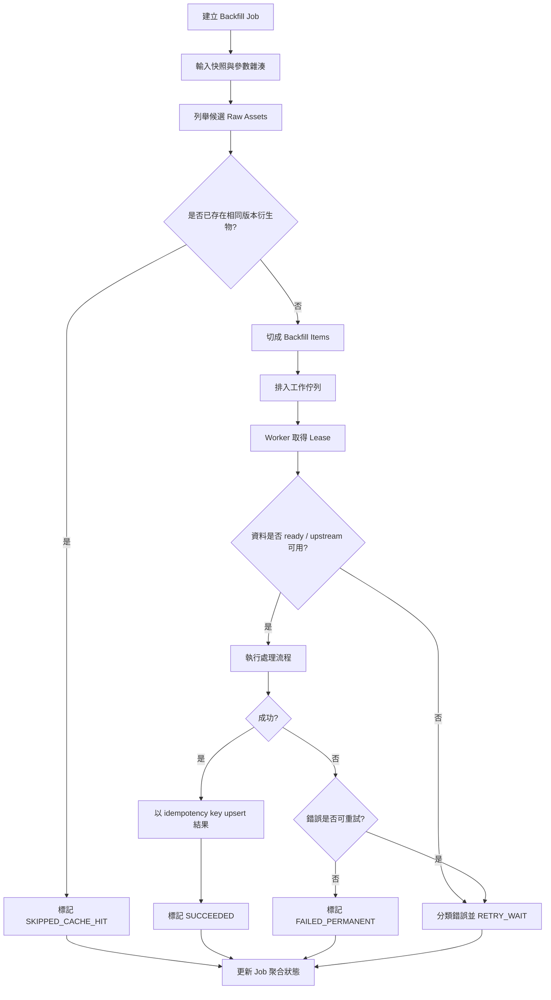

# 質譜數據處理產品的回填機制深度研究報告

## Executive Summary

本報告把「backfill／回填」界定為：**對既有或歷史質譜原始資料、已登錄但未完整處理的資料、以及需要以新規則重新計算的資料，進行補處理、重跑、增量匯入或快取重用**。因為在質譜產品原始碼中，明確使用 `backfill` 一詞的情況其實不多，所以本次調查納入了在工程上等價的實作：資料夾掃描重匯入、遠端資料盤點後批次重跑、Nextflow `-resume`/中介快取重用、資料庫重建與 autopopulate、以及針對失敗或晚到資料的 reimport queue。這些做法在公開原始碼中都能直接看到。citeturn7view0turn38view0turn18view0turn34view0turn32view0turn28view0

我最終整理出 **6 個可直接研究的公開案例**。若以「獨立可部署案例」計算，數量為 6；其中 **Skyline AutoQC** 與 **SkylineBatch** 來自同一個官方 repo `ProteoWizard/pwiz`，但它們是兩個獨立 executable、面向不同操作場景，因此在工程分析上分開討論是合理的。這 6 例分別是：**Skyline AutoQC、SkylineBatch、quantms、nf-skyline-dia-ms、nf-encyclopedia、ReDU-MS2-GNPS**。其中前 5 例的 backfill/重跑邏輯可直接從原始碼與官方文件高信心辨識；**ReDU** 的「autopopulate」內部重建細節公開較少，本報告會明確標註推論與不確定性。citeturn7view0turn38view0turn18view0turn34view0turn32view0turn28view0turn31view0turn31view1

整體結論很清楚：**成熟質譜產品的回填機制，很少做成一個單一的大型「歷史補跑按鈕」，而是拆成三層**。第一層是**來源發現**，例如資料夾 watcher、遠端伺服器盤點、PDC/Panorama 下載、GNPS metadata 拉取；第二層是**可重入執行**，例如 queue、resume cache、明確的 overwrite 檢查、資料快照、重新連線與 transient error retry；第三層是**結果一致性與可觀察性**，例如 WAL/單機資料庫、Nextflow trace/report/timeline、MultiQC/pmultiqc、配置 runner 狀態與 connection exception UI。這三層拆開之後，回填才會同時具備「可重跑、可恢復、可診斷」三個特性。citeturn42view0turn42view2turn42view5turn40view0turn40view2turn41view0turn22view0turn25view0turn25view1turn33view0turn33view1turn31view1

若你的目標是打造**可長期維運**的質譜 backfill 子系統，我最建議借鏡的不是單一產品，而是把幾種優勢混搭：用 **AutoQC** 的「檔案就緒檢查 + reimport queue + 網路磁碟重連」處理儀器端與共享資料夾；用 **SkylineBatch** 的「執行前凍結 input snapshot + overwrite preflight + per-config runner 狀態」處理批次工作；用 **quantms / nf-skyline-dia-ms / nf-encyclopedia** 的「content-based resume、resource escalation、標準化 execution artifacts」處理大規模再分析；再用 **ReDU** 的「最新 metadata per dataset 選擇 + SQLite WAL + 重建式 autopopulate」處理 catalogue 類型的資料庫重建。這樣組起來，會比單純加一個「重跑全部」穩定得多。citeturn42view1turn42view4turn40view0turn40view2turn41view0turn22view0turn25view0turn25view1turn33view0turn33view1turn31view0turn31view1

## 研究方法與範圍

本次研究優先使用**官方 repo、原始碼、官方文件**，其次才使用 issue 或操作文件。判定標準不是專案是否在文件裡直接寫出「backfill」，而是它是否公開了以下任一等價能力：**對歷史資料做增量補跑、對失敗資料做重試/重匯入、對既有中介產物做 resume/快取復用、對上游來源做重新掃描並補全缺口、或對既有資料庫做重建式重填**。這個判準與你要求的 API 設計、排程、監控、重試、idempotency 等系統向維度是一致的。citeturn7view0turn38view0turn17search3turn34view0turn28view0

需要先說明一個重要限制：不少成熟質譜工具把回填做成**產品行為**，但不一定以同名 class 或 module 呈現；例如 Nextflow 類 pipeline 會把回填體現在 `-resume`、中介 mzML 快取、或快取資料夾復用；UI 類產品則體現在 watcher、remote file verification、overwrite preflight、runner 狀態機。這代表本報告有些地方會用「**等價 backfill 實作**」來分析，而不是硬找 `BackfillManager` 這種名稱。凡是屬於這種推導，我都會明確註明。citeturn16search1turn25view0turn33view0turn42view3turn40view2

在證據強度上，**AutoQC、SkylineBatch、quantms、nf-skyline-dia-ms、nf-encyclopedia** 屬於高信心案例，因為可以直接從 README、設定檔或主要程式碼看到觸發、重試、資源控制與輸出報表；**ReDU-MS2-GNPS** 則屬於中等信心案例，因為 README 明確描述更新 runbook，`gnps_downloader.py` 與 `app.py` 也公開了「每個 dataset 取最新 metadata」與 SQLite WAL，但 autopopulate 的全流程不完全暴露在同一處程式碼中，因此我只會對能直接看到的部分做高信心陳述，其餘則以推論標示。citeturn7view0turn38view0turn22view0turn25view0turn25view1turn33view0turn33view1turn28view0turn31view0turn31view1

## 個案研究

**專案比較總表**

| 專案 | Repo | 主要回填型態 | 觸發 | 重試/恢復 | 一致性保證 | 監控/可觀察性 |
|---|---|---|---|---|---|---|
| Skyline AutoQC | ProteoWizard/pwiz | 增量匯入 + reimport queue | 資料夾新增檔案、watcher 重啟後補掃 | 60 秒輪詢檔案就緒、網路磁碟 1 小時內重連、reimport queue | queue 去重、檔案就緒檢查、watcher 重啟後以 `lastFileEvent` 補掃 | log4net、runner status、錯誤日誌 citeturn7view0turn42view0turn42view2turn42view3turn42view4turn42view5 |
| SkylineBatch | ProteoWizard/pwiz | 批次重跑 / 遠端資料補抓 | 使用者啟動或排程啟動 batch config | 伺服器連線前檢查、connection error UI、背景 async 執行 | `_startingRunOption` 防重入、busy config 禁止重跑、overwrite preflight、verified server file set | log4net、runner status、connection dialog、背景例外顯示 citeturn38view0turn40view0turn40view2turn41view0turn41view1turn37search1 |
| quantms | bigbio/quantms | 批次增量 / resume 重跑 | `nextflow run ... -resume`、SDRF 再分析 | exit-status 對應 retry、`task.attempt` 資源升級 | Nextflow cache、`pipefail`、`no clobber` shell、只用本地 OLS cache | pmultiqc、CI on AWS、Tower report artifact | citeturn17search3turn17search5turn18view0turn22view0turn21view0turn22view1 |
| nf-skyline-dia-ms | mriffle/nf-skyline-dia-ms | 批次增量 / cache reuse / 多批次重跑 | `-resume`、PDC/Panorama 輸入、msconvert-only | exit-status retry 3 次、雲端/本地 cache reused | mzML 與 Panorama cache、Bruker `.d.zip` 抽取後快取、report/trace/timeline | execution report/trace/timeline、QC report | citeturn24view0turn25view0turn25view1turn34view0 |
| nf-encyclopedia | TalusBio/nf-encyclopedia | 批次增量 / mzML 復用 / 聚合重算 | rerun、`msconvert.force=false/true`、aggregate mode | exit-status retry 3 次、資源隨 attempt 增加 | `mzml_dir` 中介層、`aggregate` 明確控制跨組 FDR | timeline/report/trace/dag | citeturn32view0turn33view0turn33view1 |
| ReDU-MS2-GNPS | mwang87/ReDU-MS2-GNPS | 資料庫重建式回填 / metadata 補拉 / autopopulate | 手動更新程序、啟動後 autopopulate | 公開碼中未見完整自動 retry；偏人工重跑 | 每 dataset 取最新 `create_time` metadata、SQLite WAL、local/server mapping TSV | unit test、scheduled integration test、manual validation checklist | citeturn28view0turn30view0turn31view0turn31view1 |

**Skyline AutoQC**

| 欄位 | 內容 |
|---|---|
| 專案名稱 | Skyline AutoQC |
| Repo | `ProteoWizard/pwiz`，`pwiz_tools/Skyline/Executables/AutoQC`。README 明確說明其用途是監看質譜輸出資料夾，自動用 SkylineRunner 匯入並做 QC。來源語言：英文。 citeturn7view0 |
| 相關檔案 / 模組 | `AutoQCFileSystemWatcher.cs`、`ConfigRunner.cs`、`ImportContext.cs`、`ResultFileStatus.cs`。citeturn6view1turn7view1 |
| 觸發條件 | `FileSystemWatcher` 監控新增/重新命名事件；設定可包含子資料夾；當 watcher 因網路或 buffer 問題重啟時，會重新列出既有檔案，將 `lastFileEvent` 之後建立的檔案補進 queue。citeturn7view0turn42view3 |
| 回填策略 | **增量為主，帶補掃與 reimport queue**。新檔進 `_dataFiles`；失敗或延後再試的檔案進 `_retryFiles`，並用 `_retryFilePaths` 去重。citeturn42view0turn42view1 |
| 錯誤處理 / 重試 | 先 `WaitForFileReady()`，每 60 秒輪詢一次；若超過 acquisition time，丟 `FileStatusException`。網路磁碟斷線則每分鐘重連，最多 1 小時，成功後重啟 watcher。citeturn42view2turn42view4turn42view5 |
| 資料一致性 | 不是 transaction 型設計，而是**best-effort idempotency**：用 queue + path dedupe 避免重複 reimport，並在重啟 watcher 時用 `lastFileEvent` 做時間界線。citeturn42view1turn42view3 |
| 性能考量 | 用 `ConcurrentQueue<string>` 處理新增檔；依儀器副檔名與 file filter 限縮掃描範圍；對大檔以 delayed ready-check 避免過早匯入。citeturn42view0turn8view0 |
| 監控 / 可觀察性 | README 指出依賴 log4net；程式內會記錄等待、重連、重啟 watcher 與錯誤狀態，也會切換 `RunnerStatus`。citeturn7view0turn42view4turn42view5 |
| 已知限制 | 比較偏 Windows 桌面/服務模式；queue 並非 durable queue；沒有資料庫 transaction，也沒有跨程序 lease/lock。這些屬於從可見原始碼推得的限制。citeturn7view0turn42view0turn42view1 |

依原始碼可還原出 AutoQC 的核心設計：先把符合副檔名與 filter 的檔案入列，再在真正匯入前檢查檔案是否完成寫入；如果 watcher 中斷或網路磁碟斷線，就靠 `Restart()` 與 `TryConnect()` 回補事件漏失，這就是一種很務實的**檔案系統層 backfill**。citeturn42view2turn42view3turn42view5

```text
on FileAdded(path):
  if passes_filter(path):
    enqueue(data_queue, path)

worker():
  path = dequeue(data_queue)
  wait_until_file_ready(path)   # 60s poll
  try import_into_skyline(path)
  except transient_or_late_issue:
    reimport_at = now + acquisition_time * 10%
    enqueue(reimport_queue, (path, reimport_at))

on watcher_restart():
  files = scan_existing_files()
  enqueue(files_created_after(lastFileEvent))
```

這個模式的精髓有三個：**事件驅動 + 時間窗補掃 + 二級重試佇列**。對儀器輸出資料夾型的 backfill，這是很值得直接借鑑的骨架。citeturn42view1turn42view3turn42view4

**SkylineBatch**

| 欄位 | 內容 |
|---|---|
| 專案名稱 | SkylineBatch |
| Repo | `ProteoWizard/pwiz`，`pwiz_tools/Skyline/Executables/SkylineBatch`。README 說明它是可設定、可儲存、可分享、可排程的無人值守 Skyline batch workflow。來源語言：英文。 citeturn38view0 |
| 相關檔案 / 模組 | `SkylineBatchConfigManager.cs`、`RemoteFileControl.cs`；另依賴 SharedBatch。citeturn38view0turn39view0turn39view1 |
| 觸發條件 | 使用者或排程啟動 batch configuration；在正式跑之前會先檢查是否已有 config 正在執行、是否將覆寫輸出、以及是否需要先連遠端伺服器抓資料。citeturn38view0turn40view0turn40view2 |
| 回填策略 | **批次重跑**。它不是 watcher，而是先做 preflight，再把本次需要的 server files 凍結到 `_runServerFiles`，之後用 `RunAsync` 依序跑各個 waiting config。citeturn40view2turn41view0 |
| 錯誤處理 / 重試 | 如果遠端連線有例外，會出 connection error form 讓使用者替換 configuration 或取消；真正執行時每個 config 的例外在 `RunAsync` 中 individually catch，runner 轉成 error。公開碼中未見明確自動 backoff retry，較偏人工介入。citeturn41view0turn40view2 |
| 資料一致性 | `_startingRunOption` 防止重入；若已有 configs busy 則不允許開新跑批；另外有 overwrite preflight，能在開始前就阻止誤覆寫。citeturn40view0turn40view1 |
| 性能考量 | 先批次盤點所有要下載的 server files，再進入 runner 流程；對 GUI 產品來說，這比邊跑邊查遠端更穩定。citeturn40view2turn41view0 |
| 監控 / 可觀察性 | README 指出依賴 log4net；config runner 有 waiting/running/error 狀態；背景工作使用 `CommonActionUtil.RunAsync`，近年 issue 也顯示開發者有在強化各 executable 的 exception reporting。citeturn38view0turn40view2turn37search1 |
| 已知限制 | GUI/桌面導向；伺服器錯誤處理多為 UI 介入；公開碼沒有看到 durable queue 或交易式 checkpoint。這點是原始碼可見範圍內的保守結論。citeturn40view0turn41view0 |

SkylineBatch 很值得借鏡的地方，不是它有多「自動」，而是它把 backfill 前的**準備動作**做成獨立階段：`CanRun()`、server verification、overwrite 檢查、busy-run 阻擋、凍結本次 `_runServerFiles`，然後才真正執行。這是製程穩定度比「立即開跑」高很多的原因。citeturn40view0turn40view2turn41view0

```text
start_batch(run_option):
  assert no_other_run_starting
  assert no_config_busy
  if outputs_will_overwrite:
    ask_user_confirm()

  snapshot = verify_and_freeze_remote_inputs()
  for config in enabled_configs:
    mark_waiting(config)

  for config in waiting_configs:
    try:
      run_config(config, snapshot)
    except Exception:
      mark_error(config)
```

如果你準備實作「歷史批次補跑」，**先快照輸入，再逐 job 執行**，是 SkylineBatch 給的最實用設計精髓。citeturn40view2turn41view0

**quantms**

| 欄位 | 內容 |
|---|---|
| 專案名稱 | quantms |
| Repo | `bigbio/quantms`。官方 repo 與官方文件都明確定位它為 quantitative MS 的 cloud-ready Nextflow pipeline。來源語言：英文。 citeturn18view0turn17search3 |
| 相關檔案 / 模組 | `nextflow.config`、`conf/base.config`、`main.nf`、`tower.yml`。citeturn18view0turn22view0turn22view1 |
| 觸發條件 | 典型觸發是 `nextflow run ... -resume`，官方文件也把 public SDRF 描述為可做「one-command re-analysis」；因此它的回填本質是**以 workflow cache 為核心的重跑/續跑**。citeturn16search1turn17search5 |
| 回填策略 | **批次 + 增量 resume**。利用 Nextflow 對相同輸入內容的 cache 重用，避免已完成步驟重算；輸入又可來自 SDRF，因此很適合針對既有資料集整批重分析。citeturn16search1turn17search5 |
| 錯誤處理 / 重試 | `conf/base.config` 定義 `errorStrategy`：特定退出碼使用 `retry`，否則 `finish`；預設 `maxRetries = 1`，而 `withLabel:error_retry` 可提高到 2 次。CPU、記憶體、時間都隨 `task.attempt` 增長。citeturn22view0 |
| 資料一致性 | `process.shell` 啟用 `-C`（no-clobber）、`-e`、`-u`、`pipefail`；又把 ontology 驗證改成 `use_ols_cache_only = true`，減少重跑時外部網路變動對結果穩定性的影響。citeturn21view0turn22view0 |
| 性能考量 | workflow 本身支援雲端/HPC/container；大量中介步驟依靠 Nextflow cache；預設資源會隨 attempt 升級，避免第一次資源估太小就整體失敗。citeturn18view0turn22view0 |
| 監控 / 可觀察性 | README 與論文都強調 pmultiqc；CI 會在 AWS 跑完整資料集；`tower.yml` 會展示 MultiQC HTML report。citeturn18view0turn17search8turn22view1 |
| 已知限制 | 它擅長「資料集級」再分析，不擅長 folder-level 即時補檔；resume 粒度主要是 process-level cache，而不是 item-level watermark。citeturn16search1turn22view0 |

quantms 的價值在於它把 backfill 做成**可重現的整體再分析流程**，不是做成 ad hoc script。對歷史資料重跑，它依賴的是 Nextflow 的輸入內容一致性與 task cache，而不是自行維護複雜的 per-file 狀態機。這種做法對公共資料集與大規模蛋白體分析尤其合適。citeturn16search1turn17search5turn18view0turn22view0

```text
for process in workflow:
  if cache_hit(inputs, params, container):
    reuse_previous_output()
  else:
    run_process()
    if exit_status in transient_codes:
      retry_with_more_resources()
```

如果你的場景是「同一批實驗資料，因版本升級/參數變更要重跑」，quantms 提供的是最成熟的 **resume-first** 參考實作。citeturn16search1turn22view0

**nf-skyline-dia-ms**

| 欄位 | 內容 |
|---|---|
| 專案名稱 | nf-skyline-dia-ms |
| Repo | `mriffle/nf-skyline-dia-ms`。官方文件明確說明這是從 RAW 到 Skyline document 的 DIA workflow。來源語言：英文。 citeturn24view0turn34view0 |
| 相關檔案 / 模組 | `nextflow.config`、`conf/base.config`、`resources/pipeline.config`，以及官方 Sphinx docs。citeturn25view0turn25view1turn23search4 |
| 觸發條件 | 文件直接示範 `nextflow run -resume ...`；另支援 `msconvert_only`、PDC study input、PanoramaWeb WebDAV input、以及 no-search mode。citeturn34view0turn25view0 |
| 回填策略 | **批次增量 + cache reuse + 多來源重放**。`mzml_cache_directory` 與 `panorama_cache_directory` 用於中介與 Panaroma/Bruker 抽取結果的重用；Bruker `.d.zip` 抽取後會被快取，下次直接跳過抽取。citeturn25view0turn34view0 |
| 錯誤處理 / 重試 | `conf/base.config` 對多個退出碼啟用 `retry`，`maxRetries = 3`；隨 `task.attempt` 提升 CPU、memory、time。AWS Batch 也啟用了 `retryMode = 'standard'`。citeturn25view0turn25view1 |
| 資料一致性 | `process.shell` 使用 `-euo pipefail`；文件強調同一批輸入檔案需共享副檔名，不允許 batch 內混格式；這是在上游就收斂不確定性的做法。citeturn25view0turn34view0 |
| 性能考量 | 標準 profile 可控制 queue size；有 AWS Batch / Slurm / local profile；`files_per_quant_batch` 與 `files_per_chrom_lib` 暗示可做批次切分。citeturn25view0turn25view1 |
| 監控 / 可觀察性 | 內建 `timeline`、`report`、`trace`，並可輸出 QC report；這讓回填不只是「跑完」，而是「跑完之後可診斷」。citeturn25view0turn34view0 |
| 已知限制 | 文件指出多批次支援主要落在 DIA-NN；混格式輸入不支援；本地標準 profile 會限制並行度。citeturn34view0turn25view0 |

這個案例最值得學的是：它不是只做 workflow `-resume`，而是把**中介物件的快取目錄也設成一級公民**。這和單純倚賴 task cache 不同，因為 mzML 與 Bruker 抽取物本身就是昂貴中間產物，能跨回合重用就能大幅降低 backfill 成本。citeturn25view0turn34view0

```text
if input is Bruker_d_zip:
  if cache_exists(panorama_cache, sample):
    reuse_extracted_directory()
  else:
    extract_and_cache()

if mzML_cache_exists(sample) and not force_reconvert:
  reuse_mzML()
else:
  msconvert(sample)

run_search_and_import_with_resume()
emit_timeline_report_trace()
```

對於你若要處理「雲端／共享儲存上的 DIA 歷史資料補跑」，這個 pattern 幾乎可以直接搬。citeturn25view0turn25view1turn34view0

**nf-encyclopedia**

| 欄位 | 內容 |
|---|---|
| 專案名稱 | nf-encyclopedia |
| Repo | `TalusBio/nf-encyclopedia`。README 明確說明它串接 MSconvert、EncyclopeDIA、MSstats。來源語言：英文。 citeturn32view0 |
| 相關檔案 / 模組 | `nextflow.config`、`conf/base.config`。citeturn33view0turn33view1 |
| 觸發條件 | rerun / resume；`msconvert.force=false` 可重用既有 mzML，設成 `true` 則強制重轉；`aggregate` 決定跨 group 聚合再估 FDR。citeturn33view0 |
| 回填策略 | **批次增量 + 中介 mzML 復用**。它把 `mzml_dir` 明確設定為中介輸出目錄，讓回填時不用從 RAW 重新開始。citeturn33view0 |
| 錯誤處理 / 重試 | `conf/base.config` 中 `errorStrategy` 與 `maxRetries = 3` 幾乎是典型 nf-core 風格；資源依 `task.attempt` 增長。citeturn33view1 |
| 資料一致性 | `aggregate=false/true` 清楚區分 group 內與 group 間的 FDR 估計方式；這是分析層一致性，不只是工程層一致性。citeturn33view0 |
| 性能考量 | `check_max()` 限住 `max_memory / max_cpus / max_time`，避免重跑時資源無限制膨脹。citeturn33view0turn33view1 |
| 監控 / 可觀察性 | 內建 `timeline`、`report`、`trace`、`dag`。citeturn33view0 |
| 已知限制 | repo 活躍度相對前幾例低一些；可見設計比較偏 workflow 回填，不含 durable queue、locking DB 或長駐 watcher。citeturn32view0turn33view1 |

nf-encyclopedia 是一個很乾淨的範例：如果你的產品不是儀器旁的長駐服務，而是**可重跑的分析 workflow**，那麼把 mzML 中介層固定下來，再用 `force` 參數控制是否重建，是非常實用的 backfill 設計。citeturn33view0turn33view1

```text
if msconvert.force is false and mzML exists:
  use_existing_mzML()
else:
  regenerate_mzML()

if aggregate:
  combine_groups_then_estimate_FDR()
else:
  estimate_FDR_per_group()

retry_transient_failures(max_retries=3)
```

它的 trade-off 也很明顯：簡潔、可重現，但對即時補檔與細粒度 item-level recovery 支援不如 watcher/queue 類產品。citeturn33view0turn33view1

**ReDU-MS2-GNPS**

| 欄位 | 內容 |
|---|---|
| 專案名稱 | ReDU-MS2-GNPS |
| Repo | `mwang87/ReDU-MS2-GNPS`。README 直接把自己定義為 Reanalysis of Data User Interface。來源語言：英文。 citeturn28view0 |
| 相關檔案 / 模組 | `code/gnps_downloader.py`、`code/app.py`，以及 README 的 Updating ReDU Data Procedure。citeturn30view0turn31view0turn31view1 |
| 觸發條件 | 以公開文件可見範圍來看，主要是**手動觸發的資料庫更新流程**：下載 batch template、跑 GNPS spectral library search、取 task TSV、清資料庫、重啟 ReDU，之後靠 autopopulate 補建。citeturn28view0turn29search1 |
| 回填策略 | **重建式回填**。`gnps_downloader.py` 會從 GNPS dataset cache 抓 metadata 清單，將 `create_time` 轉 datetime，按 dataset 分組後挑出最新 metadata，再下載並輸出 `file_paths.tsv` 對照表。citeturn31view0 |
| 錯誤處理 / 重試 | 公開腳本看得到 `requests.get()` 直接下載，但未看到完整自動 retry/backoff；README 更新程序也偏人工步驟。因此這一欄我保守判斷為**人工重跑主導**。這是推論，不是明文聲稱。citeturn31view0turn29search1 |
| 資料一致性 | `app.py` 使用 SQLite 並開 `journal_mode = wal`；`gnps_downloader.py` 採「每 dataset 取最新 create_time」避免多版本 metadata 混雜。citeturn31view1turn31view0 |
| 性能考量 | 先以 metadata 索引做 group-by，再只抓每個 dataset 最新檔，屬於很典型的**catalog-level 增量縮減**。citeturn31view0 |
| 監控 / 可觀察性 | README 公開了 unit test、production integration test 與 manual validation checklist。citeturn28view0turn30view0 |
| 已知限制 | autopopulate 內部細節在公開碼中不夠集中；更新 runbook 明顯仰賴人工操作；因此其 backfill 機制比較像「資料庫重建 runbook」，而非全自動 job framework。citeturn28view0turn29search1turn31view0 |

ReDU 的啟發點不在於它多自動，而在於它把「補資料」切成**metadata 差分選取**與**資料庫重建**兩段。對 catalog、索引與聚合型產品來說，這比硬做 row-level in-place migration 往往更省事。citeturn31view0turn31view1

```text
metadata = list_remote_metadata()
metadata = sort_by_create_time(metadata)
latest = pick_latest_per_dataset(metadata)

for item in latest:
  download(item)
  append_mapping(local_name, server_name)

rebuild_or_autopopulate_database()
```

若你的系統也有「public repository -> internal index DB」這種結構，ReDU 很值得當作**重建式 backfill**的參考。citeturn28view0turn31view0turn31view1

**補充說明**

若你偏好用「唯一 repo 數量」而不是「可部署案例數量」計算，上述 6 例中有 2 例來自同一個 `ProteoWizard/pwiz` repo；不過它們確實是不同 executable、不同操作模型，而且對你的系統設計啟發也不同：**AutoQC 比較像 ingestion backfill，SkylineBatch 比較像 orchestrated rerun**。因此我保留兩者分開分析。citeturn7view0turn38view0turn40view2

## 共通模式與差異比較

把這 6 個案例放在一起看，可以看到兩條主線。第一條是**檔案／來源導向**，代表是 AutoQC、SkylineBatch、ReDU。它們都先處理「我要抓哪些資料」：新檔、遠端 server file、最新 metadata。第二條是**工作流／中介產物導向**，代表是 quantms、nf-skyline-dia-ms、nf-encyclopedia。它們把回填交給 pipeline engine 與 cache，所以重點變成資源上限、重試策略、resume 粒度與執行報表。兩條路沒有誰絕對更好，只是適用場景不同。citeturn42view0turn40view2turn31view0turn22view0turn25view0turn33view0

從**觸發模型**看，AutoQC 是事件驅動；SkylineBatch 與 ReDU 偏人工/排程驅動；三個 Nextflow 案例則是命令式重跑，但藉由 `-resume` 與中介 cache 把成本降低。這意味著：若你的質譜資料是**持續進站**，要優先學 AutoQC；若你的需求是**週期性補算或版本升級重跑**，學 Nextflow 類專案會更直接；若你的產品本質是**公共資料目錄／索引站**，ReDU 的重建式回填更接近真實需求。citeturn7view0turn38view0turn16search1turn34view0turn33view0turn29search1

從**一致性模型**看，桌面/服務型工具多採 best-effort：queue 去重、凍結 server file set、overwrite prompt、SQLite WAL；workflow 型工具則把一致性往「**輸入決定輸出**」推，也就是 content-addressed cache、固定 shell safety、明確的中介資料夾。前者較容易做到人機互動與細緻補檔；後者在大規模 reanalysis 時可重現性更好。citeturn42view1turn40view0turn41view0turn31view1turn21view0turn22view0turn25view0turn33view0

從**重試策略**看，AutoQC 最像傳統資料處理服務：先確認檔案 ready，再對 network drive 做長時間重連；Nextflow 類則採 exit-code 分類重試，並在重試時增加資源；SkylineBatch 與 ReDU 則比較保守，對錯誤偏向讓使用者或 runbook 決策。這其實是很值得借鏡的 trade-off：**越靠近儀器或不穩定 I/O，越需要自動重試；越靠近結果覆寫與資料語意變更，越應該要求人工確認。**citeturn42view2turn42view4turn42view5turn22view0turn25view1turn33view1turn41view0turn29search1

**共通模式與差異比較表**

| 面向 | AutoQC | SkylineBatch | quantms | nf-skyline-dia-ms | nf-encyclopedia | ReDU |
|---|---|---|---|---|---|---|
| 主要型態 | watcher + incremental import | orchestrated batch rerun | dataset reanalysis pipeline | DIA pipeline with intermediate caches | DIA pipeline with mzML reuse | catalog rebuild |
| 來源發現 | 檔案事件 + 補掃 | 遠端伺服器盤點 | SDRF / workflow input | local/Panorama/PDC | CSV input | GNPS metadata list |
| 狀態保存 | 記憶體 queue | config state + runner state | Nextflow cache | Nextflow cache + cache dirs | Nextflow cache + mzML dir | SQLite WAL + TSV mapping |
| 自動重試 | 高 | 中 | 中高 | 高 | 高 | 低 |
| 人工介入 | 低到中 | 高 | 低 | 低 | 低 | 高 |
| 最適場景 | 儀器資料夾補檔 | 批次重跑與遠端抓檔 | 公開/內部資料集再分析 | 雲端 DIA 歷史補跑 | 以 mzML 為中心的重跑 | 索引/portal 全量重建 |
| 主要優點 | 即時、實用、接近儀器 | 開跑前把風險攔住 | 可重現、雲端友善 | cache 與 execution artifact 完整 | 設計簡潔、邏輯清楚 | metadata 差分選取有效 |
| 主要缺點 | durability 弱、交易性弱 | GUI 重、人工介入較多 | 粒度較粗 | 偏 workflow，不是常駐服務 | 活躍度較低 | 自動化程度不足 | citeturn42view0turn42view3turn40view0turn40view2turn22view0turn25view0turn25view1turn33view0turn33view1turn31view0turn31view1 |

## 可重用設計模式清單

下表整理出 **10 個** 我認為可以直接落地到你自己的質譜 backfill 系統中的設計模式。這些不是抽象口號，而是都能在上面案例中找到對應影子。citeturn42view1turn40view2turn22view0turn25view0turn33view0turn31view0

| 設計模式 | 核心做法 | 典型來源 | 為何值得借鏡 |
|---|---|---|---|
| 檔案就緒閘門 | 匯入前先輪詢 ready 狀態，避免寫入中檔案被過早處理 | AutoQC citeturn42view2turn42view4 | 對儀器輸出與網路磁碟特別重要 |
| 事件漏失補掃 | watcher 重啟後，用 `lastFileEvent` 或 watermark 做差量掃描 | AutoQC citeturn42view3 | 補上因 watcher 錯過的歷史檔案 |
| 二級回填佇列 | 新檔 queue 與 reimport queue 分離，避免一種錯誤拖垮整體 | AutoQC citeturn42view1 | 很適合晚到資料與暫時性失敗 |
| 執行前輸入快照 | 在正式跑前先凍結本次 server file set / input manifest | SkylineBatch citeturn40view2turn41view0 | 避免跑到一半來源改變 |
| 覆寫前置檢查 | 真正重跑前先把將覆寫的輸出明確列出並確認 | SkylineBatch citeturn40view0 | 對再分析系統尤其重要 |
| content-based resume | 任務快取以輸入內容而非檔名為核心 | quantms / Nextflow docs citeturn16search1turn22view0 | 同參數重跑可零成本跳過大量步驟 |
| 中介產物快取目錄 | 為 mzML、抽取出的 `.d`、下載檔設獨立 cache dir | nf-skyline-dia-ms / nf-encyclopedia citeturn25view0turn34view0turn33view0 | 比只靠 pipeline cache 更便於跨回合重用 |
| 退出碼分級重試 | 只對 transient exit codes 重試，且重試時升資源 | quantms / nf-skyline-dia-ms / nf-encyclopedia citeturn22view0turn25view1turn33view1 | 避免把邏輯錯誤當暫時錯誤重試 |
| 輕量級本地一致性層 | SQLite + WAL 或 mapping TSV 保存 catalog 狀態 | ReDU citeturn31view0turn31view1 | 對 portal / 索引型系統成本很低 |
| 標準化執行痕跡 | trace/report/timeline/MultiQC 作為回填後驗證材料 | quantms / nf-skyline-dia-ms / nf-encyclopedia citeturn22view1turn25view0turn33view0 | 沒有執行痕跡，就很難真的維運 |

## 具體實作建議與範例

如果你的目標是做一個**面向質譜原始檔與衍生結果的 backfill 子系統**，我建議把它拆成四個 API 面：**建立工作、列舉候選、執行單元、查詢狀態**。最小有用介面可以是：`POST /backfills` 建立工作、`GET /backfills/{id}` 查狀態、`POST /backfills/{id}/cancel` 中止、`GET /backfills/{id}/items?status=...` 查明細。每個 backfill job 在建立時就寫死一份 `input_snapshot`，例如 raw file 清單、版本、參數 hash、資料庫版本、spectral library 版本。這個設計直接借鏡 SkylineBatch 的 `_runServerFiles` 凍結，以及 Nextflow 系列對輸入穩定性的要求。citeturn40view2turn41view0turn16search1turn22view0turn25view0turn33view0

在資料模型上，我建議至少有五張表：`raw_asset`、`derived_artifact`、`processing_run`、`backfill_job`、`backfill_item`。其中 `backfill_item` 要保存 `asset_id`、`target_pipeline_version`、`target_param_hash`、`state`、`attempt_count`、`lease_owner`、`lease_until`、`last_error_code`、`last_error_class`、`idempotency_key`。這樣你就能同時支援 AutoQC 類的 per-file queue、SkylineBatch 類的 snapshot run、和 Nextflow 類的 resume/skip。若系統比較偏 catalog/portal，也可加上 `metadata_refresh_batch` 與 `source_manifest`，去吸收 ReDU 那種「每 dataset 取最新 metadata」的更新模式。citeturn42view1turn40view2turn31view0turn31view1turn22view0

在重試策略上，不要做單一 `retry=true`。我建議至少分成三類：**TransientIO**、**UpstreamUnavailable**、**DeterministicFailure**。TransientIO 走短退避，例如 1m/5m/15m；UpstreamUnavailable 走長退避，例如 10m/30m/1h；DeterministicFailure 直接標為 `FAILED_PERMANENT`，只允許人工 `requeue`。這個分級邏輯，正好對應 AutoQC 的檔案未 ready/網路磁碟重連、以及 Nextflow pipeline 對 transient exit codes 才 retry 的實作。citeturn42view2turn42view4turn42view5turn22view0turn25view1turn33view1

在排程上，我不建議「一個大 job 自己跑完整個歷史集合」。更穩定的做法是：`backfill_job` 只負責**規劃**與產生 `backfill_item`，真正執行由 worker pool 逐 item 取 lease。這樣做有三個好處。第一，單 item 失敗不會使整批報廢。第二，能天然做並行與資源分級。第三，容易做可觀察性。這一點本質上結合了 AutoQC 的 queue、SkylineBatch 的 config runner、和 Nextflow 的 per-process retry。citeturn42view0turn42view1turn40view2turn22view0turn25view1

**建議的 API 與狀態模型**

```text
POST /backfills
{
  "scope": {
    "source": "folder|dataset|catalog",
    "selector": "...",
    "watermark_from": "2026-01-01T00:00:00Z"
  },
  "pipeline": {
    "name": "dia-quant",
    "version": "2.3.1",
    "param_hash": "sha256:..."
  },
  "mode": "incremental|rerun|rebuild",
  "overwrite_policy": "forbid|prompt|versioned",
  "priority": "low|normal|high"
}
```

```text
backfill_job.state:
PLANNING -> READY -> RUNNING -> PAUSED -> COMPLETED
                        \-> FAILED_PARTIAL
                        \-> FAILED_PERMANENT

backfill_item.state:
PENDING -> LEASED -> RUNNING -> SUCCEEDED
                  \-> RETRY_WAIT
                  \-> FAILED_PERMANENT
                  \-> SKIPPED_CACHE_HIT
```

下面這段範例程式碼示範的是**lease-based worker + idempotent upsert**。它不是對任何單一專案的直接翻譯，而是把前述案例的精髓整合成一個更適合你自行實作的版本。其設計依據是：AutoQC 的 queue/reimport、SkylineBatch 的 run preflight、以及 Nextflow 類的 deterministic cache skip。citeturn42view1turn40view0turn40view2turn22view0turn25view0turn33view0

```python
from __future__ import annotations

from dataclasses import dataclass
from datetime import datetime, timedelta, timezone
from enum import Enum
from typing import Optional


class ItemState(str, Enum):
    PENDING = "PENDING"
    LEASED = "LEASED"
    RUNNING = "RUNNING"
    RETRY_WAIT = "RETRY_WAIT"
    SUCCEEDED = "SUCCEEDED"
    FAILED_PERMANENT = "FAILED_PERMANENT"
    SKIPPED_CACHE_HIT = "SKIPPED_CACHE_HIT"


@dataclass
class BackfillItem:
    id: str
    asset_id: str
    pipeline_version: str
    param_hash: str
    attempt_count: int
    idempotency_key: str
    state: ItemState
    lease_until: Optional[datetime] = None
    last_error_class: Optional[str] = None


def classify_error(exc: Exception) -> str:
    msg = str(exc).lower()
    if "timeout" in msg or "io" in msg or "network" in msg:
        return "TransientIO"
    if "unavailable" in msg or "connect" in msg:
        return "UpstreamUnavailable"
    return "DeterministicFailure"


def next_backoff(error_class: str, attempt: int) -> timedelta:
    if error_class == "TransientIO":
        schedule = [1, 5, 15, 30]
    elif error_class == "UpstreamUnavailable":
        schedule = [10, 30, 60, 180]
    else:
        return timedelta(0)
    minutes = schedule[min(attempt - 1, len(schedule) - 1)]
    return timedelta(minutes=minutes)


def process_item(item: BackfillItem) -> ItemState:
    # 先查衍生產物是否已存在且版本符合；若是，直接 cache hit skip
    if artifact_exists(item.asset_id, item.pipeline_version, item.param_hash):
        return ItemState.SKIPPED_CACHE_HIT

    # 這裡執行實際處理，並以 idempotency_key 做 upsert
    result = run_pipeline_for_asset(
        asset_id=item.asset_id,
        pipeline_version=item.pipeline_version,
        param_hash=item.param_hash,
        idempotency_key=item.idempotency_key,
    )
    upsert_artifact(result, idempotency_key=item.idempotency_key)
    return ItemState.SUCCEEDED


def worker_loop(worker_id: str) -> None:
    while True:
        item = lease_one_pending_item(worker_id, lease_seconds=900)
        if item is None:
            return

        mark_running(item.id, worker_id)

        try:
            final_state = process_item(item)
            mark_finished(item.id, final_state)
        except Exception as exc:
            error_class = classify_error(exc)
            attempt = item.attempt_count + 1

            if error_class == "DeterministicFailure" or attempt >= 5:
                mark_failed_permanent(
                    item.id,
                    error_class=error_class,
                    error_message=str(exc),
                )
                continue

            retry_at = datetime.now(timezone.utc) + next_backoff(error_class, attempt)
            requeue_with_retry(
                item.id,
                retry_at=retry_at,
                attempt_count=attempt,
                error_class=error_class,
                error_message=str(exc),
            )


# 以下函式留給實際儲存層實作
def artifact_exists(asset_id: str, pipeline_version: str, param_hash: str) -> bool: ...
def run_pipeline_for_asset(asset_id: str, pipeline_version: str, param_hash: str, idempotency_key: str): ...
def upsert_artifact(result, idempotency_key: str) -> None: ...
def lease_one_pending_item(worker_id: str, lease_seconds: int) -> Optional[BackfillItem]: ...
def mark_running(item_id: str, worker_id: str) -> None: ...
def mark_finished(item_id: str, state: ItemState) -> None: ...
def mark_failed_permanent(item_id: str, error_class: str, error_message: str) -> None: ...
def requeue_with_retry(item_id: str, retry_at: datetime, attempt_count: int, error_class: str, error_message: str) -> None: ...
```

對監控，我建議至少把指標拆成四層。**容量層**：`backfill_items_pending`, `leased`, `retry_wait`, `oldest_pending_age_seconds`。**成功率層**：`success_ratio_1h`, `permanent_failure_ratio_1h`, `cache_hit_ratio`。**延遲層**：`p50/p95 item_runtime`, `ready_to_start_lag`, `input_watermark_lag`。**品質層**：`duplicate_suppressed_count`, `overwrite_block_count`, `unexpected_exception_count`, `artifact_version_skew_count`。如果做得到，再加 `file_ready_wait_seconds` 與 `network_reconnect_attempts`，這些就是 AutoQC 類場景最有價值的指標。這些監控方向直接對應 AutoQC、SkylineBatch 與 Nextflow 三系統的可見行為。citeturn42view2turn42view5turn40view0turn41view0turn25view0turn33view0

**建議的回填流程圖**



總結成一句工程建議：**不要把 backfill 想成「重跑命令」，要把它設計成「有 snapshot、有 idempotency、有 lease、有 retry class、有 execution artifact 的子系統」**。AutoQC 告訴我們怎麼面對儀器與共享資料夾的現實世界；SkylineBatch 告訴我們要先凍結輸入、再跑；quantms 與兩個 Nextflow DIA pipeline 告訴我們怎麼把大規模重跑標準化；ReDU 則提醒你，對索引型系統，很多時候「重建式回填」比細粒度 patch 更實用。citeturn42view3turn40view2turn22view0turn25view0turn33view0turn31view0turn31view1