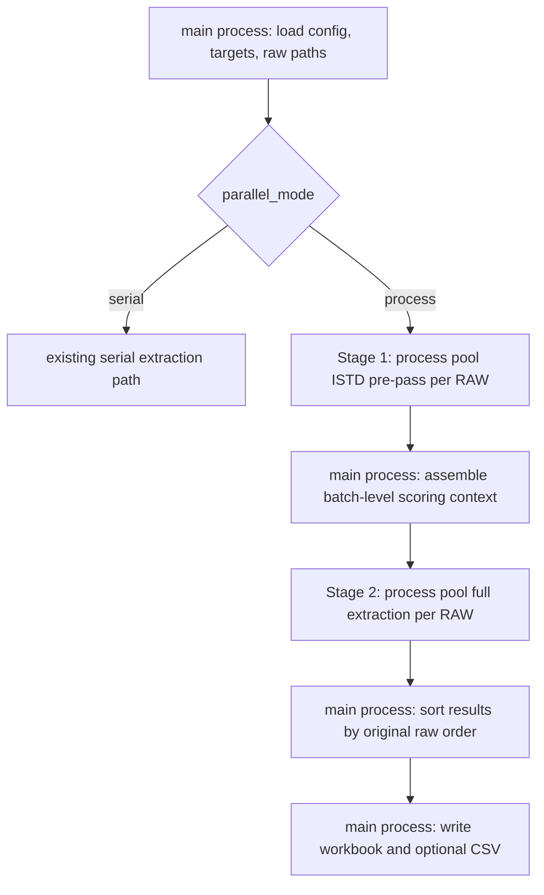

# Parallel RAW Processing — Spec

**日期**：2026-05-03  
**狀態**：Draft  
**對應計畫**：`docs/superpowers/plans/2026-05-03-parallel-raw-processing-implementation.md`

---

## 1. 背景

目前完整 tissue workflow 約 85 個 `.raw`，一次完整流程約 14 分鐘。這個時間對最終確認可以接受，但對方法調整、PR smoke、參數驗證太慢。

使用者已建立 8 個 `.raw` 的代表性 validation subset：

`C:\Xcalibur\data\20260106_CSMU_NAA_Tissue_R\validation`

此 subset 是後續非大型重構、方法可行性驗證與 PR smoke 的預設真實資料集。完整 85 `.raw` 只應在 PR 收斂或風險較高的分析行為改動時執行。

## 2. 目標

1. 在不改變 peak picking、NL confirmation、scoring、output schema 的前提下，加入 opt-in per-RAW parallel processing。
2. 保留既有 serial 行為作為 default，早期階段不改變一般使用者與 CI 的預設路徑。
3. 讓 8 `.raw` validation subset 成為日常性能與等價性驗證基準。
4. 對 parallel mode 建立可重現的 workbook compare，確認結果與 serial baseline 等價。
5. 為日後將 parallel mode 改成 default 預留明確 gate，但本階段不啟用。

## 3. 非目標

- 不做 target-level parallelism。
- 不改 peak detection、integration、NL anchor、RT prior、confidence 或 reason 規則。
- 不新增 XIC cache / MS2 cache / raw handle pool。
- 不把 process mode 設成 default。
- 不要求每個 PR 都跑完整 85 `.raw`。
- 不在本階段調整 Excel sheet schema 或欄位定義。

## 4. 目前流程模型

`extractor.run()` 的高層流程目前可視為：

1. 載入 settings / targets / raw paths。
2. 對所有 raw files 做 ISTD pre-pass，建立 batch-level ISTD RT evidence。
3. 主程序組裝 scoring context factory。
4. 對每個 raw file 做 full extraction。
5. 按 raw path 排序後輸出 Excel / CSV artifacts。

raw file 之間大多獨立；主要跨檔依賴是 Stage 2 前需要 Stage 1 的 ISTD pre-pass 結果。因此合理的 parallel boundary 是「raw file」，不是「target」。

## 5. 目標架構

### 5.1 Public API

保留 `xic_extractor.extractor.run()` 作為 public entry point。呼叫端不需要知道內部使用 serial 或 process executor。

新增 execution backend：

| 設定值 | 行為 |
|---|---|
| `serial` | 完全沿用既有單程序流程，預設值 |
| `process` | 使用 process pool 以 raw file 為單位平行處理 |

### 5.2 Process mode 兩階段流程



### 5.3 Worker boundary

Worker process receives only pickleable data:

- raw path
- raw index
- extraction config or a serializable config snapshot
- parsed targets
- Stage 2 scoring context inputs, not a callable factory

Worker process must open and close its own raw handle. A raw handle, pythonnet object, COM-like object, or Thermo reader object must never cross process boundaries.

Worker functions must be top-level importable functions so Windows `spawn` multiprocessing and PyInstaller frozen builds can import them.

The current scoring context factory is a nested closure. Process mode must not send it to workers. The main process sends only pickleable inputs such as injection order, ISTD RT maps, and RT prior library entries; each worker rebuilds its own scoring context factory inside the worker process.

### 5.4 Ordering and determinism

Process completion order is not output order. Main process must sort worker results by the original raw index before:

- wide result row emission
- long result row emission
- diagnostics aggregation
- score breakdown aggregation
- workbook sheet generation

Serial and process mode must produce equivalent analytical results for the same inputs.

### 5.5 Progress and cancellation

`extractor.run()` already accepts `progress_callback` and `should_stop`; process mode must preserve those contracts.

Progress contract:

- Stage 1 ISTD pre-pass may report coarse progress as `prepass: <raw name>` or may remain silent, but the GUI must not appear frozen.
- Stage 2 reports one progress event per completed raw file, using the same `(current, total, filename)` shape as serial mode.
- `total` is the number of raw files in the run, not the number of futures or targets.

Cancellation contract:

- `should_stop()` is checked before scheduling each job batch and while collecting completed futures.
- If cancellation is requested, pending futures are cancelled where possible.
- Already-running worker processes may finish their current raw file, but no new raw work is scheduled.
- Cancelled runs do not write workbook output.
- GUI Stop must keep the same user-visible behavior as serial mode: no success summary is emitted after cancellation.

## 6. Settings / CLI / GUI Contract

### 6.1 Settings schema

新增 settings keys：

| Key | Type | Default | Allowed | 說明 |
|---|---|---:|---|---|
| `parallel_mode` | string | `serial` | `serial`, `process` | execution backend |
| `parallel_workers` | int | `1` | `>= 1` | process mode worker count |

Validation rules：

- `parallel_mode` unknown value 應明確報錯。
- `parallel_workers < 1` 應明確報錯。
- `parallel_workers > os.cpu_count()` 不自動失敗，但可在 GUI / log 顯示 warning；本階段不做 hard cap。
- `parallel_workers=1` with `process` is allowed，便於測試 process code path。

### 6.2 CLI

新增 overrides：

```powershell
uv run python -m scripts.run_extraction --parallel-mode process --parallel-workers 4
```

CLI override 優先於 settings file。未指定時完全使用 settings file / default。

### 6.3 GUI

GUI Advanced settings 增加：

- `parallel_mode`
- `parallel_workers`

預設值仍是 `serial` / `1`。此功能屬於 Advanced，不應出現在 basic workflow 的主要操作區。

### 6.4 PyInstaller / Windows multiprocessing

Windows 使用 `spawn`，frozen executable 需要在 GUI / CLI entry point 早期呼叫：

```python
import multiprocessing

multiprocessing.freeze_support()
```

此項是 process mode 在打包版可用的必要條件，必須納入 implementation plan 與 smoke test。

## 7. Validation Contract

### 7.1 日常真實資料 validation subset

預設真實資料驗證使用：

`C:\Xcalibur\data\20260106_CSMU_NAA_Tissue_R\validation`

這個 subset 目前包含 8 個 `.raw`，用於：

- PR smoke
- process mode 初期驗證
- 非大型重構的 regression check
- performance comparison

### 7.2 Full dataset gate

完整 85 `.raw` 只在以下情況執行：

- PR 收斂前的最終確認
- 修改 peak detection / integration / NL / scoring 等分析行為
- validation subset 顯示接近邊界的差異，需要 full dataset 確認風險

### 7.3 Workbook compare

Serial baseline 與 process output 應比較 workbook，而不是只比 CSV。

比較範圍：

- `XIC Results`
- `Summary`
- `Targets`
- `Diagnostics`
- `Run Metadata`
- `Score Breakdown`（若該 workbook 有輸出）

忽略或正規化：

- `generated_at`
- elapsed time / runtime metadata（若未來新增）
- output file path / absolute path（若未來新增）

數值欄位比較應允許極小浮點誤差，但不應允許峰選擇、NL、confidence、reason、area、RT 出現非預期差異。

### 7.4 Performance report

PR description 應包含至少一次 validation subset timing：

| Mode | Workers | RAW count | Elapsed | Speedup | Workbook compare |
|---|---:|---:|---:|---:|---|
| serial | 1 | 8 | TBD | 1.00x | baseline |
| process | 2 | 8 | TBD | TBD | pass/fail |
| process | 4 | 8 | TBD | TBD | pass/fail |

完整 85 `.raw` timing 只在 PR 收斂時補一次。

## 8. Risk Controls

| Risk | Control |
|---|---|
| Windows process spawn 造成 worker import failure | worker functions 放在 top-level module；entry points 呼叫 `freeze_support()` |
| pythonnet / Thermo DLL 在多 process 下初始化不穩 | 每個 worker 自己 open/close raw；真實 8 raw subset smoke 必跑 |
| process completion order 導致 workbook row order drift | 所有 worker result 帶 `raw_index`，main process 排序後寫出 |
| process worker exception 被吞掉 | worker result 必須回傳 structured error；fatal worker exception 讓 run fail loudly |
| nested scoring_context_factory 無法 pickle | worker payload 不含 callable；worker 內重建 factory |
| GUI Stop 在 process mode 失效 | process collector polling `should_stop()`，取消 pending futures，取消後不寫 workbook |
| memory / IO contention 讓 workers 過多反而變慢 | default workers=1；PR report 比 2/4 workers；不自動切 default |
| serial 與 process path 行為分叉 | serial path 保留為 baseline；process path 走同一個 per-file extraction primitive |
| full dataset validation 太慢導致日常驗證被跳過 | 8 raw subset 寫入 plan 作為日常 gate，full dataset 只作 final gate |

## 9. GStack Review Summary

### 9.1 Design Review

**Score：9 / 10**

已修正的設計風險：

1. **Default 行為風險**：parallel mode 不設 default，避免早期 process 問題影響一般使用者。
2. **Validation 成本風險**：明確指定 8 raw subset 作為日常 gate，full dataset 僅作 final gate。
3. **Windows/PyInstaller 風險**：把 `freeze_support()` 與 top-level worker boundary 寫入 contract。
4. **Output drift 風險**：要求 workbook compare，而不是只相信測試或 CSV。

剩餘風險：

- 真實 speedup 取決於 Thermo raw reader、磁碟 IO 與 pythonnet 初始化成本；spec 不承諾特定倍速，只要求量測與等價性。

### 9.2 Engineering Review

**Score：9 / 10**

計畫可執行，但 implementation 必須避免以下陷阱：

- 不要在 tests 內依賴真實 Thermo DLL 才能驗證 ordering / error propagation；unit tests 應使用 injectable runner 或 fake workers。
- 不要讓 process mode 複製整個 output writer；parallel boundary 應在 per-file extraction result 層，而不是 workbook writer 層。
- 不要把 benchmarking script 變成 production dependency；它應是 scripts/tooling。
- 不要把 nested scoring context factory 傳進 worker；worker 只接收 pickleable inputs。
- 不要讓 process mode 破壞 GUI Stop/progress contract。

## 10. Acceptance Criteria

此 spec 對應的 implementation 完成時，必須同時滿足：

1. `parallel_mode=serial` default 下，既有測試通過且日常輸出不改變。
2. CLI 與 GUI 可設定 `parallel_mode=process`、`parallel_workers=N`。
3. Process mode 在 8 raw validation subset 可完成 extraction。
4. 8 raw serial baseline 與 process output workbook compare 通過。
5. PR description 記錄 8 raw serial / process 2 / process 4 timing。
6. Process mode preserves progress and cancellation behavior in GUI/CLI callers.
7. PR 收斂時至少跑一次完整 85 raw 或明確記錄未跑原因與剩餘風險。
8. Merge decision gate:
   - If process mode is equivalent but slower on the 8 raw subset, it may merge only as experimental with serial default retained.
   - If process mode is faster on the 8 raw subset but not validated on the full dataset, it may merge as opt-in only.
   - Changing the default away from `serial` requires both validation subset and full dataset to show stable speedup with workbook-equivalent output.
