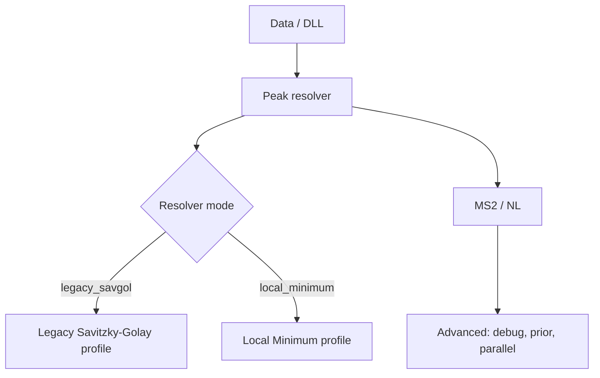

# Resolver Profile GUI — Spec

**日期**：2026-05-04
**狀態**：Draft
**對應計畫**：`docs/superpowers/plans/2026-05-04-resolver-profile-gui-implementation.md`

---

## 1. 背景

XIC Extractor 目前支援兩種 peak resolver：

| Resolver | 主要用途 | 主要參數族 |
|---|---|---|
| `legacy_savgol` | 目前預設、最接近既有人工積分基準 | Savitzky-Golay smoothing、prominence、relative peak height |
| `local_minimum` | 面對低豐度、高複雜度基質時的候選方向 | chromatographic threshold、minimum search range、top/edge ratio、peak duration |

目前 GUI 的 Advanced section 已有 `resolver_mode` combo，但所有 resolver 參數混在同一區塊。這造成兩個問題：

1. 使用者不容易發現 GUI 可以切換 resolver。
2. `legacy_savgol` 與 `local_minimum` 的參數看起來像同時生效，容易造成方法設定污染。

近期真實資料與人工積分比較顯示：

- `legacy_savgol` 仍應維持預設。
- `local_minimum` 需要獨立 profile 與更合理的 MZmine-inspired preset。
- 單純把所有參數放在 Advanced 不足以支援後續方法開發。

## 2. 目標

1. 讓 GUI 明確呈現目前使用的 peak resolver。
2. 將 resolver-specific 參數分成兩個 profile panel，避免 Savitzky-Golay 與 local minimum 參數互相污染。
3. 保留 `settings.csv` 的單一 canonical config contract；CLI、GUI、打包範例仍使用同一組 key。
4. 維持 `legacy_savgol` 為預設 resolver。
5. 在切換到 `local_minimum` 時提供經人工 truth set 初步驗證的 local preset。
6. 不改 peak picking 演算法、不改 output schema、不改 workbook 欄位。

## 3. 非目標

- 不建立兩個獨立 app window。
- 不拆成兩份 settings file。
- 不移除 `legacy_savgol`。
- 不把 `local_minimum` 設成預設。
- 不改 `resolver_chrom_threshold` 的實作語意。
- 不在本階段新增完整參數 sweep GUI。
- 不改 CLI flag；CLI 仍透過 settings/config 使用 resolver keys。

## 4. 目標 UX

### 4.1 Settings layout

GUI Settings 應維持單一流程：

`Peak resolver` 必須移出 Advanced，放在 Data/DLL 後、MS2/NL 前。Advanced 只保留 debug flags、RT prior、injection order、parallel、NL RT windows 等進階設定。

這是刻意的產品決策：resolver choice 會改變 peak boundary 與 area，因此它不是 debug-only 設定。使用者應在執行前清楚看見目前方法。

### 4.2 Legacy Savitzky-Golay profile

當 `resolver_mode=legacy_savgol`：

顯示：

- `smooth_window`
- `smooth_polyorder`
- `peak_rel_height`
- `peak_min_prominence_ratio`

隱藏或停用：

- `resolver_chrom_threshold`
- `resolver_min_search_range_min`
- `resolver_min_relative_height`
- `resolver_min_absolute_height`
- `resolver_min_ratio_top_edge`
- `resolver_peak_duration_min`
- `resolver_peak_duration_max`
- `resolver_min_scans`

### 4.3 Local Minimum profile

當 `resolver_mode=local_minimum`：

顯示：

- `resolver_chrom_threshold`
- `resolver_min_search_range_min`
- `resolver_min_relative_height`
- `resolver_min_absolute_height`
- `resolver_min_ratio_top_edge`
- `resolver_peak_duration_min`
- `resolver_peak_duration_max`
- `resolver_min_scans`

隱藏或停用：

- `smooth_window`
- `smooth_polyorder`
- `peak_rel_height`
- `peak_min_prominence_ratio`

Local Minimum panel 應標示其定位是方法開發/複雜基質用，而不是目前預設。

### 4.4 Local Minimum preset

當使用者從 GUI 切換到 `local_minimum`，GUI 應提供一個明確動作來套用 local preset。

本階段採用較安全的行為：

- 載入既有 `settings.csv` 時，不覆蓋使用者已存在的 local minimum 參數。
- 使用者切換 resolver mode 時，不自動覆蓋 inactive profile 參數。
- `Local Minimum` panel 提供 `Apply Local Minimum Preset` button。
- 只有使用者點擊 preset button 時，才套用 local preset。
- 若使用者再手動修改任一 local 參數，`get_values()` 應保留修改值。

Local preset：

| Key | Value |
|---|---:|
| `resolver_chrom_threshold` | `0.05` |
| `resolver_min_search_range_min` | `0.08` |
| `resolver_min_relative_height` | `0.0` |
| `resolver_min_absolute_height` | `25.0` |
| `resolver_min_ratio_top_edge` | `1.7` |
| `resolver_peak_duration_min` | `0.0` |
| `resolver_peak_duration_max` | `10.0` |
| `resolver_min_scans` | `5` |

### 4.5 Validation changes for zero-valued local preset

Local preset 中的兩個 key 必須允許 `0.0`：

| Key | 新 validation |
|---|---|
| `resolver_min_relative_height` | `0 <= value <= 1` |
| `resolver_peak_duration_min` | `0 <= value` 且 `<= resolver_peak_duration_max` |

GUI spinbox range 也必須同步：

| Control | Minimum |
|---|---:|
| `resolver_min_relative_height` | `0.0` |
| `resolver_peak_duration_min` | `0.0` |

原因：MZmine local minimum presets 允許 minimum relative height 與 minimum peak duration 為 0；本 repo 的人工 truth set 參數矩陣也使用這兩個 0 值。

這組 preset 來自人工 truth set 參數矩陣：

`output/local_minimum_param_matrix_20260504_115632/local_minimum_param_matrix_summary.xlsx`

矩陣結果：area within ±20% 從目前 local default 的 `70/100` 提升到 `92/100`，但仍不超過 `legacy_savgol` 的 `95/100`，因此不應改 default resolver。

## 5. Settings / Config Contract

`settings.csv` 仍保留全部 resolver keys。原因：

- CLI 與 GUI 使用同一 canonical config。
- `Run Metadata` 需要能重現完整方法狀態。
- 使用者可能從 CLI 執行 `local_minimum`，即使 GUI 沒顯示所有 inactive profile 參數。

GUI 的責任是降低誤用，不是改變 config schema：

- inactive profile 的值仍 round-trip。
- inactive profile 的值不因 resolver mode 切換而被清空或覆蓋。
- preset button 是明確覆蓋動作；只有按下 button 才改寫 local minimum profile values。
- `config_hash` 仍由完整 `settings.csv` 與 `targets.csv` 決定。

## 6. Validation Contract

### 6.1 Unit / GUI tests

必須測試：

1. GUI 載入 `legacy_savgol` 時，legacy panel visible，local panel hidden。
2. GUI 載入 `local_minimum` 時，local panel visible，legacy panel hidden。
3. 使用者切換到 `local_minimum` 時不覆蓋既有 local values。
4. 使用者切回 `legacy_savgol` 時，不清空 local preset values。
5. `get_values()` 保留 inactive profile values。
6. Advanced field key list 仍包含所有 canonical resolver keys。
7. 點擊 `Apply Local Minimum Preset` button 後才套用 local preset。
8. GUI 可輸入並 round-trip `resolver_min_relative_height=0.0` 與 `resolver_peak_duration_min=0.0`。

### 6.2 Config / docs tests

必須測試或檢查：

1. `CANONICAL_SETTINGS_DEFAULTS` 與 `config/settings.example.csv` 的 local preset key 同步。
2. config parser 接受 `resolver_min_relative_height=0.0`。
3. config parser 接受 `resolver_peak_duration_min=0.0`。
4. README 或相關設定文件說明 resolver profiles。
5. 不改 workbook sheet schema。

### 6.3 Manual visual check

GUI layout 變更後，應至少啟動 GUI 或用現有 Qt tests 確認：

- profile 切換不造成 layout 明顯跳動或欄位重疊。
- Advanced 的 debug flags、parallel、RT prior、NL windows 仍可操作。

## 7. Acceptance Criteria

此變更完成時：

1. `legacy_savgol` 仍是 default。
2. GUI 中 resolver selection 可明確看見。
3. `legacy_savgol` profile 不顯示 local minimum 專用參數。
4. `local_minimum` profile 不顯示 Savitzky-Golay 專用參數。
5. `local_minimum` panel 提供明確 preset button，點擊後可得到經 truth set 初步驗證的 preset。
6. settings round-trip 不丟失 inactive profile values。
7. `uv run pytest tests/test_settings_section.py tests/test_settings_section_advanced.py -v` 通過。
8. 相關 config tests 通過。

## 8. Open Decisions

### 8.1 切換 local_minimum 時是否自動套用 preset

決策：不自動套用。使用 explicit `Apply Local Minimum Preset` button。

理由：

- 使用者可能已經在 inactive local profile 中保存過自訂參數。
- 切換 resolver mode 是選方法，不應暗中覆蓋方法參數。
- preset button 讓覆蓋行為可見、可理解、可測試。

### 8.2 Legacy panel 是否留在主 Settings

決策：建立新的主 Settings `Peak resolver` group，把 mode 與兩個 profile 都集中。

理由：

- 目前 `resolver_mode` 在 collapsed Advanced 裡，discoverability 已經失敗。
- resolver choice 影響輸出面積與 RT，不應被視為 debug-only。
- 測試可以直接 assert profile visibility，不需要先展開 Advanced。
