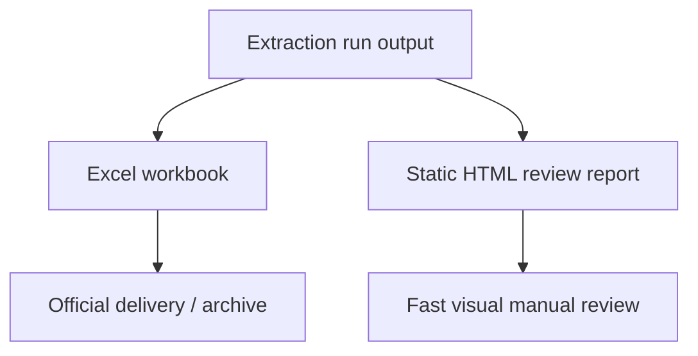

# Excel Review Semantics And Visual Report Spec

## Summary

The workbook remains the primary delivery artifact. The next improvement is not to replace Excel, but to make the Excel vocabulary less ambiguous and add an optional static visual companion report for faster manual review.

This spec has two layers:

1. Rename confusing workbook review-health fields so developers and users can tell detection from review workload.
2. Add a static HTML visual report beside the workbook, using existing workbook/CSV/run output data, without changing extraction, scoring, peak selection, or result values.

## Problem

The current workbook is complete, but some names imply stronger conclusions than the data supports:

- `Review Items` is a count of sample-target rows that need manual attention, not a count of chemical problems.
- `Problem Rate` can be confused with `Detection %`.
- `NL Problems` sounds like confirmed NL failure, but it currently counts MS2/NL-related flags, including missing or warning evidence.
- `Score Breakdown` exists for technical audit, but its role is not obvious from the workbook surface.

This makes the workbook harder to trust even when the underlying values are correct.

## Goals

- Preserve Excel as the official delivery file.
- Keep workbook sheet names stable unless there is a clear user-facing benefit.
- Clarify summary field names so `Detected %` and review burden are not conflated.
- Keep `Score Breakdown` optional and clearly technical.
- Add a lightweight visual report that helps users see batch health, target/sample patterns, and review priorities quickly.
- Use one shared review-metrics layer for Excel and HTML so both artifacts report the same counts.
- Avoid new runtime dependencies for v1 unless the existing environment already provides what is needed.

## Non-Goals

- No peak selection changes.
- No scoring weight changes.
- No area integration changes.
- No CSV schema changes.
- No new CLI flag in v1. CLI users enable the report through settings.
- No interactive web server.
- No raw XIC thumbnail rendering in v1.

## Workbook Semantics

### Summary Field Rename

Rename the target-health fields:

| Current Field | New Field | Meaning |
|---|---|---|
| `Review Items` | `Flagged Rows` | Number of sample-target rows that appear in `Review Queue` |
| `Problem Rate` | `Flagged %` | `Flagged Rows / Total` |
| `NL Problems` | `MS2/NL Flags` | Count of rows with `NL_FAIL`, `NO_MS2`, or `WARN_*` |
| `Low Confidence` | `Low Confidence Rows` | Count of rows with `LOW` or `VERY_LOW` confidence |

`Detection %` answers: "How often did this target produce a detected quantitative result?"

`Flagged %` answers: "How often does this target need manual review?"

These two fields are intentionally separate. A target can have high detection and high flagged rate when it is detected but evidence is weak or ambiguous.

### Overview Copy

The Overview sheet should add a short "How to read" section:

```text
Detected % = rows with usable RT and area.
Flagged Rows = rows sent to Review Queue for manual attention.
Flagged % is review workload, not detection failure.
Score Breakdown is a technical audit sheet when enabled.
```

No formulas are needed. This is static explanatory text.

### Score Breakdown Role

`Score Breakdown` is a technical audit sheet. It explains why scoring produced a confidence level by exposing signal severities, quality flags, prior metadata, and selection rationale.

It is not a daily review sheet and remains gated by `emit_score_breakdown=true`.

## Static Visual Report

### Shared Metrics Contract

Excel and HTML must not calculate target health independently.

Add a shared output metrics module:

```text
xic_extractor/output/review_metrics.py
```

Both `scripts/csv_to_excel.py` and `xic_extractor/output/review_report.py` should use the same metrics helpers for:

- detected row count
- `Detected %`
- `Flagged Rows`
- `Flagged %`
- `MS2/NL Flags`
- `Low Confidence Rows`
- heatmap cell state

The detection policy must receive `count_no_ms2_as_detected`. This prevents HTML from disagreeing with the workbook when `NO_MS2` rows are treated as detected.

### Artifact

When enabled, produce:

```text
output/review_report_YYYYMMDD_HHMM.html
```

The report should be static HTML. It should open by double-clicking, require no server, and use only local embedded CSS/JS or no JS.

### v1 Sections

The report order is fixed:

1. Batch Overview
   - Sample count
   - Target count
   - Flagged rows
   - Diagnostics count
   - Detected row count

2. Top Flagged Targets
   - Top targets by `Flagged Rows`
   - Helps the user decide where to look first

3. Detection / Flag Heatmap
   - Rows: targets
   - Columns: samples
   - Cell state and CSS class:
     - `clean-detected`: detected and not flagged
     - `flagged-detected`: detected and flagged
     - `not-detected`: no usable RT/area
     - `error`: extraction or file error

4. Target Health Table
   - Target
   - Detected %
   - Flagged %
   - MS2/NL Flags
   - Low Confidence Rows
   - Review Queue priority distribution

5. Review Queue Summary
   - Same semantic rows as workbook `Review Queue`
   - Grouped or sortable only if simple static behavior is available without adding dependencies

The report must include a visible legend with the four heatmap states above.

### Future Sections

These are explicitly not v1 unless later validated:

- Per-target XIC thumbnails
- MS2 spectrum thumbnails
- Interactive filtering
- Embedded Plotly dashboard
- Multi-run comparison report

## Data Flow



The report must use the same in-memory rows or CSV rows as the workbook. It must not recalculate extraction or scoring.

## Config Surface

Add one optional setting:

```text
emit_review_report=false
```

Default remains `false` in v1 to avoid surprising users with extra files.

Expose it in GUI Advanced as:

```text
輸出 Review Report HTML
```

Do not add a CLI flag in v1. CLI users can enable the report by editing `config/settings.csv` or `config/settings.example.csv`.

## Testing Contract

Unit tests:

- Summary headers use renamed fields.
- Overview includes "How to read" copy.
- Score Breakdown remains optional and absent by default.
- Review metrics helpers are shared by Excel and HTML.
- Detection metrics honor `count_no_ms2_as_detected`.
- HTML report writer escapes formula-like and HTML-like sample/target names.
- HTML report contains batch counts, target health rows, heatmap cells, and a visible legend.

Integration tests:

- Excel output still has stable sheet order and active `Overview`.
- Workbook compare catches renamed Summary header drift.
- Report generation does not change workbook values.
- GUI settings round-trip preserves `emit_review_report`.

Real-data validation:

- Rerun tissue 8-raw validation.
- Generate workbook and optional report.
- Confirm workbook opens on `Overview`.
- Confirm report opens as a local file and shows the same flagged row count as workbook Overview.

## Acceptance Criteria

- Users can distinguish `Detected %` from `Flagged %` without developer explanation.
- `Score Breakdown` is documented as technical audit, not a manual review entry point.
- Default workbook remains the official delivery artifact.
- Static report is optional and does not affect extraction output values.
- Workbook and HTML report use the same review metrics and agree on flagged row counts.
- Existing Excel tests remain green.
