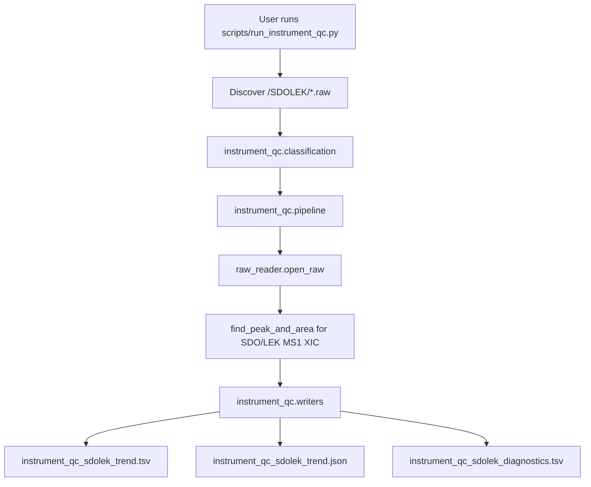

# Instrument-Only QC Trend Module Spec

**Date:** 2026-05-20
**Status:** Implementation-ready contract, revised after user review
**Branch:** `codex/instrument-qc-trend`
**Worktree:** `.worktrees/instrument-qc-trend`
**Source material:** `20260105 中研院分析.docx`, method file docs, and verified 20260105 batch folder layout

## Summary

Build an opt-in instrument-only QC sub-pipeline for LC-MS/MS batches. The first
production-sized step is deliberately narrow: discover `SDOLEK` RAW files, extract
SDO/LEK MS1 trend evidence, and emit machine-readable TSV/JSON outputs. This
must not change targeted extraction, untargeted alignment, `xic_results`, sample
grouping, workbook schemas, scoring, reliability, or matrix identity.

The long-term goal is to turn instrument-only injections that are currently
manually isolated in subfolders into a reusable instrument health evidence layer:
SDO/LEK sensitivity and RT trend first, then Mix STDs, Blank TIC, MS2 fragment
ratios, sequence metadata normalization, and cross-batch lifecycle accumulation.

## Background

The 20260105 method/sequence documentation and batch folder layout show four
non-biological or QC-like injection classes:

| Injection class | Role | Current observed placement | Phase 1 handling |
|---|---|---|---|
| `SDOLEK` | instrument-only sensitivity / RT ruler for SDO 311.0814 and LEK 556.2771 | `/SDOLEK` subfolder | in scope |
| `Mix STDs` | STD/ISTD reference mixture | `/STDs`, sometimes duplicated under `/Pairs` | deferred |
| `Blank` | background / carryover monitor | filenames such as `Blank*`; `/except sample` is a mixed bucket | deferred |
| Pooled QC | sample-prep + acquisition QC | mixed with main biological RAWs | remains main pipeline QC |

The important distinction is responsibility:

- pooled QC is sample-level QC and should keep flowing through the main
  extraction pipeline as `QC`;
- SDOLEK / Mix STDs / Blank are instrument-level QC and must not become regular
  biological rows in `xic_results`.

## Problem

Instrument-only RAW files currently contain useful acquisition evidence but are
not represented in the project outputs:

1. SDO/LEK injections can show instrument sensitivity and RT drift across
   injection order, but they are manually isolated and unused.
2. Pooled QC trend alone cannot separate sample-prep variability from
   instrument-only drift.
3. Later cross-batch instrument lifecycle analysis needs per-batch SDO/LEK
   summaries, but no stable dataset exists yet.
4. Previous `SampleInfo` files are downstream-derived artifacts. They are useful
   for validation, but the source of truth for sequence / method logic should be
   method file docs and directly derived sequence metadata.

## Goals

1. Add an isolated `instrument_qc` domain module for instrument-only RAW
   classification and SDOLEK trend extraction.
2. Keep `sample_groups.classify_sample_group()` unchanged for biological and
   pooled QC sample grouping.
3. Implement Phase 1 as SDOLEK-only TSV/JSON output, not workbook-first.
4. Make the pipeline opt-in. No existing run should scan subfolders or emit
   instrument QC artifacts unless explicitly requested.
5. Preserve a clean path for future method-doc / sequence metadata ingestion
   without depending on downstream `SampleInfo` as the authoritative source.

## Non-Goals

- No change to `xic_results.csv` / `xic_results.xlsx` schemas.
- No change to workbook sheet names, order, hidden state, or selected RT/area.
- No change to targeted reliability, peak scoring, NL logic, or resolver mode.
- No change to untargeted alignment, backfill, production gate, or matrix identity.
- No recursive scanning in the existing main extraction pipeline.
- No Mix STDs, Blank TIC, ddMS2 fragment ratios, lifecycle dataset, or sequence
  converter in Phase 1.
- No hidden writes to user home such as `~/.xic_extractor` in Phase 1.

## Product Contract

### Opt-In Entry

Phase 1 adds a separate diagnostic/utility entry point:

```powershell
uv --cache-dir .uv-cache run python scripts\run_instrument_qc.py `
  --raw-dir C:\Xcalibur\data\20260106_CSMU_NAA_Tissue_R `
  --output-dir output\instrument_qc\20260105_sdo_lek `
  --mode sdolek
```

Accepted names can be adjusted during implementation, but the contract is:

- instrument QC is not executed by default in `scripts/run_extraction.py`;
- no `--skip-instrument-qc` default-off behavior in Phase 1;
- any future main-pipeline integration must be explicit opt-in, for example
  `--emit-instrument-qc`.

### Classification Contract

Add `xic_extractor.instrument_qc.classification`, independent of
`xic_extractor.sample_groups`.

`sample_groups.classify_sample_group(sample_name: str)` remains responsible only
for biological/sample-level labels:

```text
Tumor / Normal / Benignfat / QC / Other
```

Instrument-only classification accepts path context:

```python
def classify_instrument_qc_raw(raw_path: Path, data_root: Path) -> InstrumentQCClass | None:
    ...
```

Phase 1 only classifies SDOLEK:

| Class | Rule | Notes |
|---|---|---|
| `SDOLEK` | RAW path is under a directory named `SDOLEK`, or filename starts with `SDO` / `SDOLEK` | Classification is path-aware and pure with respect to RAW contents; no Thermo API required |

Deferred rules:

- `MixSTDs`: `/STDs` primary, filename contains `Mix_STDs`; duplicate handling
  with `/Pairs` deferred until MixSTDs phase.
- `Blank`: filename starts with `Blank`; do not trust `/except sample` as a
  class because it is a mixed bucket.

### RAW Discovery Contract

Main extraction keeps current behavior and only reads root-level `*.raw` unless
an existing caller already passes a specific RAW path.

Instrument QC discovery may inspect expected subfolders, but only from the
instrument QC entry point:

```text
<raw-dir>/SDOLEK/*.raw
```

Phase 1 does not deduplicate Mix STDs or Pairs. If duplicate SDOLEK filenames
are encountered, the pipeline reports `DUPLICATE_RAW_STEM` in diagnostics and
keeps the first stable sort order entry.

### SDOLEK Target Contract

Add `xic_extractor.instrument_qc.targets` with fixed Phase 1 target constants:

| Compound | Precursor m/z | Phase 1 metric |
|---|---:|---|
| SDO | 311.0814 | MS1 area, apex RT, base width |
| LEK | 556.2771 | MS1 area, apex RT, base width |

Phase 1 uses existing MS1 XIC extraction and `find_peak_and_area`. It does not
compute ddMS2 fragment ratios yet.

The original Method-3 `20260105 SDOLEK` method includes `ddMS2 OT (wHCD)` and
the method document lists CID/wHCD product ions for SDO/LEK. That information is
recorded as future evidence only. Phase 1 must not read MS2 scans, compute
HCD/wHCD product ratios, or add HCD-driven pass/fail labels.

Base width is defined as:

```text
peak_end_rt - peak_start_rt
```

This is not Gaussian FWHM. FWHM can be added later if SOP or external literature
comparison requires it.

### SDOLEK MS1 Identity / Trend Semantics

Phase 1 is an MS1-channel trend report, not a full chemical identity
confirmation report.

The output may label rows as `SDO` / `LEK`, but every Phase 1 row must carry:

```text
identity_evidence = MS1_ONLY
```

and must not claim `identity_confirmed`.

Use the user's NoSplit SDOLEK reference record as the first RT/width prior,
because it is the preferred reference over the Split method record:

| Compound | Reference m/z | NoSplit reference RT | NoSplit peak height | NoSplit base width |
|---|---:|---:|---:|---:|
| SDO | 311.0814 | 6.26 min | 1.07e7 | 0.83 min |
| LEK | 556.2772 | 6.40 min | 2.03e6 | 0.85 min |

The reference is a prior, not the sole ground truth. It should guide review and
outlier labeling, while batch-level medians from current SDOLEK injections should
also be reported once enough injections are available.

The Split reference record is secondary context only. It can explain why weak or
split peaks are risky, but it must not override NoSplit as the initial prior.

### Phase 1 Output Contract

Phase 1 emits machine-readable outputs only:

```text
instrument_qc_sdolek_trend.tsv
instrument_qc_sdolek_trend.json
instrument_qc_sdolek_diagnostics.tsv
```

`instrument_qc_sdolek_trend.tsv` columns:

| Column | Meaning |
|---|---|
| `sample_name` | RAW stem |
| `raw_path` | source RAW path |
| `injection_order` | integer if available, blank otherwise |
| `compound` | `SDO` or `LEK` |
| `precursor_mz` | target precursor m/z |
| `identity_evidence` | `MS1_ONLY` in Phase 1 |
| `reference_rt_min` | NoSplit prior RT if known |
| `rt_delta_to_reference_min` | apex RT minus NoSplit prior RT |
| `apex_rt_min` | selected MS1 peak apex RT |
| `area` | selected MS1 peak area |
| `base_width_min` | `peak_end_rt_min - peak_start_rt_min` |
| `reference_base_width_min` | NoSplit prior base width if known |
| `base_width_ratio_to_reference` | selected base width divided by NoSplit prior width |
| `peak_start_rt_min` | selected boundary start |
| `peak_end_rt_min` | selected boundary end |
| `trend_confidence` | `clean`, `warning`, or `low` |
| `trend_flags` | semicolon-separated labels such as `RT_OUTLIER`, `WIDTH_OUTLIER`, `LOW_PEAK_CONFIDENCE` |
| `status` | `detected`, `not_detected`, or `error` |
| `reason` | concise diagnostic reason |

`instrument_qc_sdolek_trend.json` stores:

- batch summary;
- counts by compound/status;
- ordered trend rows;
- diagnostics summary;
- metadata source status.

`instrument_qc_sdolek_diagnostics.tsv` columns:

```text
sample_name,raw_path,issue,detail
```

Workbook output is Phase 2/3. The first implementation must establish the TSV
and JSON contract before adding XLSX presentation.

## Sequence / Method Metadata Contract

Phase 1 accepts an optional injection-order file that already matches
`injection_rolling.read_injection_order()`:

```csv
Sample_Name,Injection_Order
SDOLEK-pretest,4
SDO-posttest,114
```

If the file is missing, Phase 1 still runs and leaves `injection_order` blank,
with a diagnostic issue:

```text
INJECTION_ORDER_MISSING
```

Important contract clarification:

- Previous `SampleInfo.xlsx` files are downstream-derived and should not be the
  authoritative source for sequence logic.
- The future source of truth should be method file docs / sequence docs, parsed
  or normalized into the existing `Sample_Name,Injection_Order` contract.
- `scripts/sequence_to_injection_order.py` is deferred. When implemented, it
  should map method-doc human names to RAW stems, not blindly copy display names.
- Thermo `.sld` parsing remains future work.

## Module Design

Phase 1 adds:

```text
xic_extractor/
└── instrument_qc/
    ├── __init__.py
    ├── classification.py
    ├── targets.py
    ├── models.py
    ├── pipeline.py
    └── writers.py

scripts/
└── run_instrument_qc.py
```

Responsibility split:

| Module | Responsibility |
|---|---|
| `classification.py` | path-aware instrument-only RAW classification; no RAW IO |
| `targets.py` | SDO/LEK constants |
| `models.py` | typed result rows / diagnostics / summary |
| `pipeline.py` | discovery, RAW extraction orchestration, result assembly |
| `writers.py` | TSV/JSON writers only |
| `scripts/run_instrument_qc.py` | CLI argument parsing and error handling |

No domain module may import workbook rendering, GUI, or alignment code.

## Data Flow



The existing extraction pipeline remains outside this flow.

## Implementation Checkpoints

### Checkpoint 0: Spec And Worktree Guard

- Worktree: `.worktrees/instrument-qc-trend`
- Branch: `codex/instrument-qc-trend`
- Base: latest `origin/master` after PR #57.
- Commit this revised spec before production code.

Review gate:

- Confirm no implementation change is mixed into the spec commit.
- Confirm spec does not require changing `sample_groups`.

### Checkpoint 1: Classification And Models

- Add `instrument_qc.classification`, `targets`, and `models`.
- Unit tests:
  - SDOLEK folder + SDOLEK filename classifies as `SDOLEK`;
  - biological root RAW returns `None`;
  - `/RNA`, `/Pairs`, `/validation` are not whole-folder instrument QC classes;
  - `/except sample` does not classify as Blank in Phase 1;
  - classification is pure and works without RAW reader.

Review gate:

- Ensure no production pipeline imports `instrument_qc`.
- Ensure `sample_groups.py` is unchanged unless a later approved plan says otherwise.

### Checkpoint 2: SDOLEK Pipeline And Writers

- Add SDO/LEK extraction orchestration.
- Add TSV/JSON/diagnostics writers.
- Keep workbook output out of scope.
- Unit tests use fake RAW/XIC source; no Thermo RAW needed.

Review gate:

- Confirm output schema is stable and tested.
- Confirm missing injection order is diagnostic-only, not fatal.

### Checkpoint 3: CLI Entry

- Add `scripts/run_instrument_qc.py`.
- Validate required inputs and clear error messages.
- Keep main extraction CLI unchanged.

Review gate:

- `scripts/run_extraction.py` remains unchanged unless only docs/import smoke
  requires it.
- Unknown mode or missing SDOLEK folder fails clearly.

### Checkpoint 4: Real 20260105/20260106 Smoke

- Run the opt-in instrument QC CLI against the real batch folder.
- Verify:
  - trend TSV has SDO and LEK rows for SDOLEK RAWs;
  - no biological RAWs enter the SDOLEK report;
  - missing method/sequence metadata is reported clearly if not supplied;
  - existing `xic_results` artifacts are not touched.

Do not commit real-data output.

## Future Phases

### Phase 2: Workbook And Human Report

- Add `instrument_qc_trend_*.xlsx` only after TSV/JSON is stable.
- Include `Overview`, `SDOLEK Trend`, and `Diagnostics`.

### Phase 3: Mix STDs And Blank

- Add Mix STDs target extraction.
- Add Blank TIC support only after raw_reader capability is characterized.
- Add dedup for `/STDs` vs `/Pairs` when Mix STDs enters scope.

### Phase 3b: SDOLEK MS2 Fragment Evidence

- Add SDO/LEK CID or wHCD product-ion ratio extraction only after Phase 1 MS1
  trend output is stable.
- Keep this audit-only unless a separate production-quality gate is approved.
- Do not use HCD evidence to change SDO/LEK MS1 peak selection in the first MS2
  implementation.

### Phase 4: Method/Sequence Metadata Normalization

- Add method-doc or sequence-doc parser / converter.
- Output the existing `Sample_Name,Injection_Order` schema.
- Do not treat downstream `SampleInfo` as authoritative source.

### Phase 5: Cross-Batch Lifecycle Dataset

- Add explicit opt-in lifecycle append:

```powershell
--append-lifecycle --instrument-id <id> --lifecycle-root <path>
```

- No hidden writes to user home by default.

## Test Plan

Focused tests:

```powershell
uv --cache-dir .uv-cache run pytest tests\test_instrument_qc_classification.py -q
uv --cache-dir .uv-cache run pytest tests\test_instrument_qc_pipeline.py tests\test_instrument_qc_writers.py -q
uv --cache-dir .uv-cache run pytest tests\test_run_instrument_qc.py -q
```

Regression guards:

```powershell
uv --cache-dir .uv-cache run pytest tests\test_injection_rolling.py -q
uv --cache-dir .uv-cache run pytest tests\test_excel_pipeline.py tests\test_output_schema_contract.py -q
```

Final checks:

```powershell
uv --cache-dir .uv-cache run ruff check .
uv --cache-dir .uv-cache run mypy xic_extractor
```

Real-data smoke is explicit and not part of default CI.

## Acceptance Criteria

- Existing targeted/untargeted production behavior is unchanged.
- `sample_groups.classify_sample_group()` remains biological/sample-level only.
- Instrument QC can be run independently and produces SDOLEK TSV/JSON evidence.
- Missing injection order or method-doc metadata is visible in diagnostics.
- No workbook/lifecycle/user-home side effects are introduced in Phase 1.

## Phase 1 Real-Data Smoke Observations (2026-05-20)

Neutral observations from the first opt-in SDOLEK smoke against
`C:\Xcalibur\data\20260106_CSMU_NAA_Tissue_R\SDOLEK` (11 RAW files). These
record what the data showed; they do not change Phase 1 reference values or
trend-flag thresholds.

- The pipeline produced 22 trend rows (SDO and LEK for each of the 11 RAW
  files), all with `status = detected` and `identity_evidence = MS1_ONLY`. No
  biological RAW stems entered the SDOLEK report.
- No injection-order file was supplied, so all 11 RAW files reported
  `INJECTION_ORDER_MISSING`. That is expected in Phase 1 and does not fail the
  run.
- `WIDTH_OUTLIER` fired on 20 of 22 rows. Measured base width
  (`peak_end_rt - peak_start_rt`) was about 0.10-0.18 min, while the NoSplit
  prior base width is 0.83-0.85 min. The comparability of the NoSplit prior
  base width to the Phase 1 base-width definition is unresolved and is left as
  a method-level review item, not a code change.
- `RT_OUTLIER` fired on 9 of 11 LEK rows. LEK apex RT was systematically about
  0.4-0.96 min earlier than the 6.40 min prior, while SDO apex RT stayed close
  to its 6.26 min prior. Because Phase 1 is MS1-only, it cannot by itself
  confirm whether the selected LEK MS1 peak is the intended compound. This is
  an expected limitation of MS1-only evidence, not a Phase 1 defect; MS2
  fragment evidence (deferred Phase 3b) is the appropriate follow-up for LEK
  identity.
- Per the Shared Constants section, trend flags are review flags, not pass/fail
  identity gates, so a `warning`-heavy smoke is still a successful Phase 1 run.
