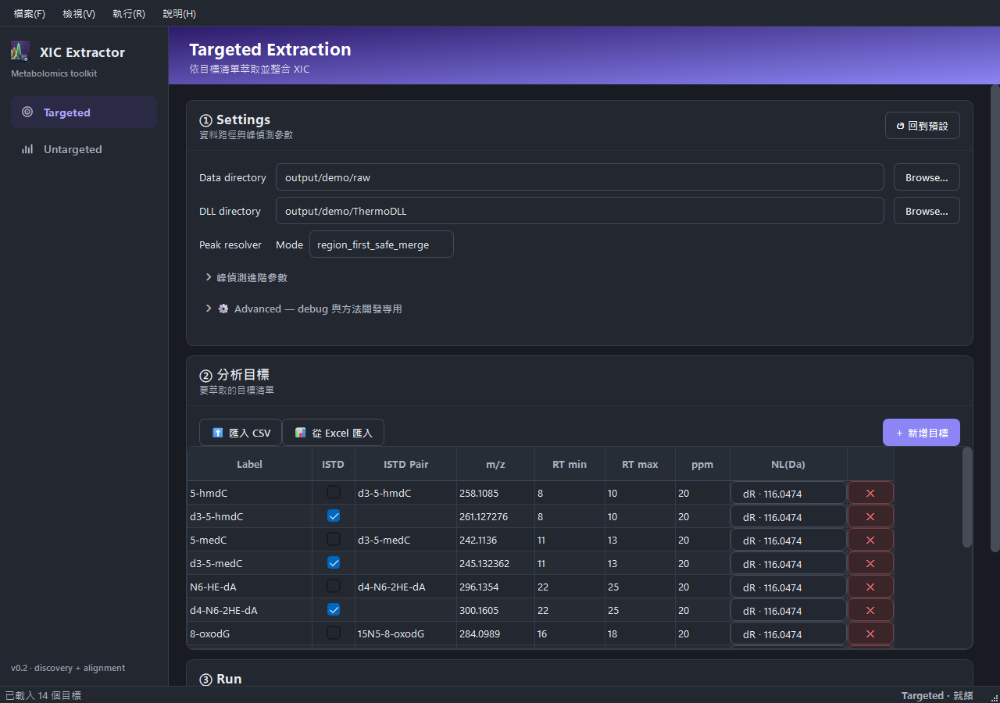

# Targeted Extraction

Use this workflow when you already know the compounds, m/z values, RT windows,
and optional internal-standard pairs you want to review.



## Workflow

1. Open `XIC_Extractor.exe`, or run `uv run python -m gui.main` in a developer
   checkout.
2. Select **Targeted Extraction**.
3. Set the RAW data directory and Thermo DLL directory.
4. Review or import the target table.
5. Press **Run**.
6. Start review from the generated workbook in `output/`.

The GUI and CLI use the same targeted pipeline. Packaged builds start from:

- `config/settings.example.csv`
- `config/targets.example.csv`

Runtime working copies are created after Save or Run:

- `config/settings.csv`
- `config/targets.csv`

Keep real machine paths in runtime files. Do not commit local RAW, DLL, or
private lab paths.

## Inputs

| Input | Role |
| --- | --- |
| RAW directory | Batch of Thermo `.raw` files to process |
| DLL directory | Folder containing Thermo RawFileReader DLLs |
| Target table | Labels, m/z, RT windows, ppm tolerance, NL mass, and ISTD pairing |
| Advanced settings | Resolver, scoring, debug output, and process-worker controls |

Target labels become public workbook and CSV identifiers. Rename them only when
downstream scripts and review expectations can tolerate the changed column
prefixes.

## Main Output

```text
output/xic_results_YYYYMMDD_HHMM.xlsx
```

Daily review should start from the workbook, not the debug CSV files.

| Workbook sheet | Purpose |
| --- | --- |
| `Overview` | Run summary, counts, and review priorities |
| `Review Queue` | Human worklist for sample-target rows needing attention |
| `XIC Results` | Sample-target RT, Area, NL status, confidence, and reason |
| `Summary` | Per-target detection, area, NL, RT, and confidence summaries |
| `Targets` | Snapshot of the target table used for the run |
| `Diagnostics` | Technical issue rows |
| `Run Metadata` | Reproducibility metadata and config hash |
| `Score Breakdown` | Optional technical audit sheet |

Intermediate CSVs are kept only when `keep_intermediate_csv=true` or the CLI
uses `--skip-excel`.

## Detection And Review

The `Overview` sheet reports two key percentages:

- **Detection %** — analytical inclusion rate. A row is detected when it has
  usable RT and area and an acceptable NL status. Rows with `NL_FAIL` are
  excluded from detected medians, ratios, and RT deltas.
- **Flagged %** — review workload. A detected row can still be flagged for
  manual inspection (e.g. low confidence, unusual RT shift).

The `NO_MS2` handling depends on the `count_no_ms2_as_detected` setting in
your config file — set it to `true` to count rows without MS2 data as
detected, or `false` to exclude them.

## CLI

Developer checkout:

```powershell
uv run python -m scripts.run_extraction --base-dir .
```

Installed entry point:

```powershell
uv run xic-extractor-cli --base-dir .
```

Useful overrides:

| Argument | Meaning |
| --- | --- |
| `--base-dir` | Directory containing `config/` and `output/` |
| `--data-dir` | One-run RAW directory override |
| `--parallel-mode` | `serial` or `process` |
| `--parallel-workers` | Worker count for process mode |
| `--skip-excel` | Keep CSV-only output and skip workbook conversion |

Tracked settings currently default to `parallel_mode=process`. Use serial mode
for diagnosis or environment isolation.

## Validation

After a run, review the `Overview` sheet for detection rates and the
`Review Queue` for rows that need attention. If detection rates or RT deltas
look abnormal, check the `Diagnostics` sheet before re-running.

For developer-level validation harness details, see
[docs/agent-parameter-settings.md](../agent-parameter-settings.md).

## Troubleshooting

| Symptom | Action |
| --- | --- |
| `settings.csv` or `targets.csv` format error | Fix the file, row, and column named in the error |
| `data_dir` does not exist | Point Settings to the folder containing `.raw` files |
| DLL load failure | Point Settings to the folder with Thermo RawFileReader DLLs |
| One RAW file fails | Continue the run and inspect the `FILE_ERROR` diagnostic row |
| Need debug CSVs | Enable `keep_intermediate_csv` or use `--skip-excel` |
| Need scoring details | Enable `emit_score_breakdown` and inspect `Score Breakdown` |
