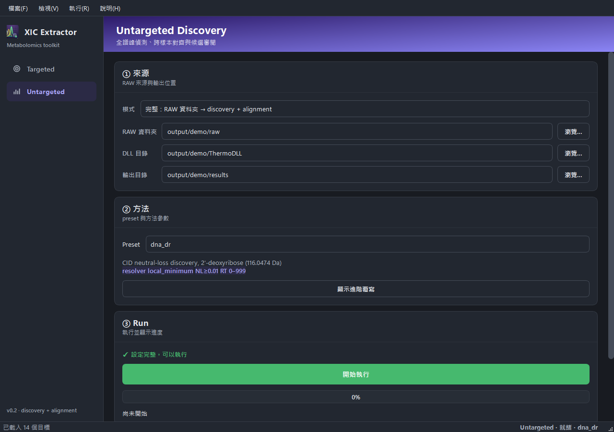

# Untargeted Discovery

Use this workflow when you want to discover candidate features from RAW files,
align them across samples, and open reviewable outputs from the GUI.

## Workflow

1. Open `XIC_Extractor.exe`, or run `uv run python -m gui.main` in a developer
   checkout.
2. Select **Untargeted Discovery**.
3. Choose a run mode.
4. Set RAW input, Thermo DLL directory, and output directory.
5. Choose a built-in preset.
6. Press **Run**.
7. Start review from the output directory.

The GUI stores local Untargeted settings in `config/discovery_gui.json`. This is
machine-local state and should stay untracked.

## Modes

| Mode | Use when | Input |
| --- | --- | --- |
| `full` | You want discovery plus cross-sample alignment | RAW directory |
| `discovery_only` | You want to inspect candidates from one RAW file | Single RAW file |
| `align_only` | Discovery was already run and you want to align existing outputs | RAW directory plus `discovery_batch_index.csv` |

For directory-level discovery-only batches, use the CLI discovery workflow. In
the GUI, use `full` when starting from a RAW directory.

## Inputs

| Input | Role |
| --- | --- |
| RAW directory or RAW file | Thermo data to discover or align |
| DLL directory | Folder containing Thermo RawFileReader DLLs |
| Output directory | Where candidate, matrix, review, and gallery artifacts are written |
| Preset | Built-in method bundle for the current evidence family |
| Advanced overrides | Optional per-run method changes layered on the preset |

## Outputs

Start with the file that matches your review question:

| Output | Content | Use it for |
| --- | --- | --- |
| `discovery_candidates.csv` | Per-sample candidate features with m/z, RT, area, seed evidence | Detailed candidate inspection per sample |
| `discovery_review.csv` | Compact subset of candidate fields with confidence | Quick review triage |
| `discovery_batch_index.csv` | Links each sample's candidate/review CSVs | Input for alignment (generated automatically) |
| `alignment_matrix.tsv` | Samples as columns, aligned features as rows, area values in cells | Cross-sample quantitative comparison |
| `alignment_review.tsv` | Alignment quality, owner identity, backfill status per cell | Reviewing which cells are detected vs. backfilled |
| Review / gallery HTML | Visual plots of candidate peaks and backfill context | Human inspection before accepting results |

The GUI can open output folders, matrix files, and gallery files after a run.

## Further Reading

For maintainer-facing product contracts behind this workflow, see:

- [Untargeted GUI contract](../product/untargeted-gui.md)
- [Discovery](../product/discovery.md)
- [Alignment](../product/alignment.md)
- [Presets](../product/presets.md)

## Troubleshooting

| Symptom | Action |
| --- | --- |
| Run button says settings are incomplete | Fill every visible path field and verify the files/folders exist |
| DLL load failure | Point the DLL directory to the Thermo RawFileReader install folder |
| No gallery opens | Check primary discovery/alignment outputs first; gallery generation is best-effort |
| Need only alignment | Use `align_only` with an existing `discovery_batch_index.csv` |
| Results look unexpected | Verify RAW files are valid and DLL version matches your Xcalibur install |
